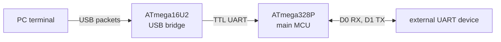

# Chapter 07. USB Serial Communication

# Arduino의 시리얼 통신 기능 이해

---

## 1. TL;DR

- UART는 TX와 RX 선으로 바이트를 주고받는 비동기 직렬 통신이다.
- USB와 UART는 전기 신호와 프로토콜이 다르다. PC에서 보이는 "시리얼 포트"는 USB 장치나 변환기가 제공하는 논리적 인터페이스일 수 있다.
- UNO R3에서는 USB 브리지와 외부 장치가 모두 메인 microcontroller unit(MCU)의 D0(RX), D1(TX)을 사용한다. 두 장치를 동시에 연결하면 통신이 충돌할 수 있다.
- Leonardo처럼 USB가 내장된 보드는 `Serial`과 물리 UART인 `Serial1`의 역할을 구분해야 한다.

---

## 2. 먼저 구분할 것: UART와 USB

**UART(Universal Asynchronous Receiver/Transmitter)** 는 송신선 TX(Transmit)와 RX(Receive)로 데이터를 비동기 직렬 방식으로 전달하는 하드웨어 인터페이스다. 별도 클록 선이 없으므로 송신기와 수신기는 보드레이트, 데이터 비트, 패리티, 정지 비트 같은 설정을 맞춰야 한다.

UART 한 바이트는 보통 유휴 상태의 높은 전압 뒤에 start bit, 데이터 비트, 선택적 패리티, stop bit 순으로 전송한다. 예를 들어 `8N1`은 데이터 8비트, 패리티 없음(None), stop bit 1개를 뜻한다. 수신기는 start bit를 기준으로 각 비트를 샘플링하므로 설정이 맞지 않으면 문자가 깨지거나 framing error가 발생할 수 있다.

**USB(Universal Serial Bus)** 는 호스트와 장치가 패킷으로 통신하는 버스다. USB 케이블을 꽂았다고 해서 곧바로 UART 신호가 흐르는 것은 아니다. 장치의 펌웨어와 운영체제 드라이버가 USB CDC ACM(Communications Device Class Abstract Control Model) 같은 통신 장치 클래스를 제공할 때, 운영체제는 이를 가상 직렬 포트로 보일 수 있다.

즉, "USB 시리얼"은 USB 자체와 UART가 같은 기술이라는 뜻이 아니라, USB 연결을 PC용 직렬 포트처럼 사용할 수 있게 만든 구성이다.

---

## 3. UNO R3의 USB 시리얼 경로

UNO R3의 주 MCU는 ATmega328P이며, 보드의 USB 브리지용 보조 MCU는 ATmega16U2다. Arduino 문서는 UNO R3의 D0을 RX, D1을 TX로 표기한다. USB 케이블을 통한 personal computer(PC) 연결은 ATmega16U2를 거쳐 ATmega328P의 하드웨어 UART로 이어진다.



이 연결 때문에 UNO R3에서 D0/D1에 GPS(Global Positioning System), Bluetooth 모듈, USB-UART 어댑터 같은 외부 장치를 연결하는 경우에는 다음을 확인해야 한다.

- USB 브리지와 외부 장치가 같은 RX/TX 선을 동시에 구동하지 않는지 확인한다.
- 외부 장치의 TX는 보드의 RX로, 외부 장치의 RX는 보드의 TX로 교차 연결한다.
- 외부 장치의 전압 레벨과 보드의 허용 전압을 확인한다.
- 업로드나 시리얼 모니터 사용 중에는 D0/D1 연결을 분리해야 할 수 있다.

`Serial.begin(9600)`은 UNO R3에서 ATmega328P UART의 데이터 전송률을 9600 bit/s로 설정한다. 이것은 USB 버스 자체의 전송 속도를 9600 bit/s로 바꾸는 호출이 아니다.

### 3.1. 전압과 접지는 별도 확인 대상이다

D0/D1의 UART 신호는 보드에 따라 5 V 또는 3.3 V TTL(Transistor-Transistor Logic) 전압 레벨을 사용한다. 두 장치는 TX와 RX를 교차 연결하는 것 외에 GND(ground)를 공통으로 연결해야 신호 전압의 기준을 공유한다. Arduino 공식 문서가 경고하듯이 TTL UART 핀을 RS-232 포트에 직접 연결하면 안 된다. RS-232는 다른 전압 범위를 사용하므로 변환기가 필요하며, 직접 연결하면 보드를 손상시킬 수 있다.

---

## 4. 가장 작은 에코 예제

아래 스케치는 시리얼 모니터에서 받은 바이트를 그대로 되돌려 보낸다. 시리얼 모니터의 보드레이트를 `9600`으로 맞춘다.

```cpp
void setup() {
  Serial.begin(9600);
}

void loop() {
  if (Serial.available() > 0) {
    const char received = static_cast<char>(Serial.read());
    Serial.write(received);
  }
}
```

`Serial.available()`은 읽을 수신 데이터가 있는지 확인하고, `Serial.read()`는 한 바이트를 읽는다. `Serial.write()`는 값을 문자로 형식화하지 않고 바이트로 보낸다. 사람이 읽을 메시지를 출력할 때는 `Serial.print()` 또는 `Serial.println()`을 사용한다.

UART는 바이트 스트림이지 "한 줄"이나 "한 메시지"를 보장하는 프로토콜이 아니다. 따라서 수신 측은 줄바꿈 문자, 고정 길이, 길이 필드처럼 메시지의 끝을 판단하는 규칙을 별도로 정해야 한다. `available()`이 1보다 크다는 사실은 읽을 바이트 수만 알려 줄 뿐, 한 번의 `read()`로 논리적 메시지가 완성됐다는 뜻은 아니다.

---

## 5. USB 내장 보드에서는 `Serial`과 `Serial1`을 구분한다

Leonardo의 ATmega32U4에는 USB 통신 기능이 내장되어 있다. 이 보드는 컴퓨터에 가상 CDC 직렬 포트뿐 아니라 키보드나 마우스 같은 USB 장치로도 보일 수 있다.

Arduino의 보드별 Serial 표에서 Leonardo는 다음과 같이 구분된다.

- `Serial`: 컴퓨터와의 USB 가상 직렬 통신
- `Serial1`: D0(RX), D1(TX)을 사용하는 물리 UART 통신

따라서 PC 로그와 외부 UART 장치를 동시에 써야 한다면, Leonardo에서는 보통 `Serial`을 PC용으로, `Serial1`을 외부 장치용으로 사용한다. UNO R3처럼 D0/D1이 USB 브리지와 공유되는 구조와는 차이가 있다.

USB CDC 포트인 Leonardo의 `Serial`에서는 `Serial.begin()`의 보드레이트와 형식 설정이 USB 전송에 적용되지 않는다. PC 프로그램이 포트를 열었는지 확인해야 하는 초기화 코드라면 `if (Serial)`의 의미도 보드별로 다르다. Arduino 문서에 따르면 native USB 보드에서는 연결 열림 상태를 나타내지만, 비 USB CDC UART에서는 항상 참이다. USB 연결을 기다리는 `while (!Serial)`은 PC 없이 독립적으로 동작해야 하는 장치의 시작을 멈출 수 있으므로 용도를 분명히 해야 한다.

---

## 6. 보드 선택 기준

| 요구 사항 | 확인할 점 |
| --- | --- |
| PC와 로그 또는 명령을 주고받기 | 보드가 USB 가상 직렬 포트를 제공하는지 확인 |
| 외부 UART 장치 하나를 연결 | D0/D1 핀의 UART를 사용할 수 있는지 확인 |
| PC 통신과 외부 UART를 동시에 사용 | USB 경로와 하드웨어 UART가 분리되어 있는지, 추가 UART가 있는지 확인 |
| 키보드 또는 마우스 같은 USB 장치 동작 | 보드와 펌웨어가 USB 장치 클래스를 지원하는지 확인 |

---

## 7. 자료 범위와 한계

이 글은 공식 UNO R3와 Leonardo 문서, Arduino Serial API 문서를 기준으로 한다. FTDI, CP210x, 단종 보드, 호환 보드는 제조사와 보드 리비전에 따라 USB 브리지 칩과 드라이버 구성이 달라 일괄적으로 단정하지 않았다. 실제 연결 전에는 사용하는 보드의 회로도, 핀아웃, 전압 조건을 확인해야 한다.

---

## 8. Reference

- [Arduino UNO R3](https://docs.arduino.cc/hardware/uno-rev3/)
- [Arduino Serial API](https://docs.arduino.cc/language-reference/en/functions/communication/serial/)
- [Arduino Serial.begin()](https://docs.arduino.cc/language-reference/en/functions/communication/serial/begin/)
- [Arduino Leonardo](https://docs.arduino.cc/hardware/leonardo)
- [USB-IF - Class Definitions for Communication Devices 1.2](https://www.usb.org/document-library/class-definitions-communication-devices-12)

<br><br>

> **궁금하신 점이나 추가해야 할 부분은 댓글이나 아래의 링크를 통해 문의해주세요.**  
> **Written with [KKamJi](https://www.linkedin.com/in/taejikim/)**  
{: .prompt-info}
