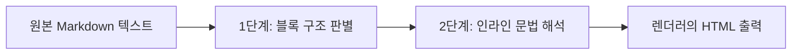

# Markdown

---

## 1. TL;DR

- Markdown은 읽기 쉬운 일반 텍스트에 간단한 표기법을 더해 구조화된 문서를 만드는 경량 마크업이다.
- CommonMark는 기본 문법의 동작을 정한 명세다. 표, 각주, 경고 상자, YAML front matter는 CommonMark 핵심 문법이 아니라 도구별 확장일 수 있다.
- 이 블로그는 Jekyll의 Kramdown 설정을 사용하므로, 배포 전에 실제 렌더러의 지원 범위를 확인해야 한다.

---

## 2. Markdown을 이해하는 방법

Markdown 문서는 먼저 블록(block) 구조로 해석되고, 그 안의 텍스트는 인라인(inline) 요소로 해석된다. 블록에는 제목, 문단, 인용, 목록, 코드 블록이 있고, 인라인 요소에는 강조, 링크, 인라인 코드가 있다.

CommonMark의 파싱 전략은 이 순서를 두 단계로 설명한다. 먼저 줄의 모양과 들여쓰기를 바탕으로 블록 경계를 정하고, 그다음 문단과 제목 안에서 강조나 링크 같은 인라인 문법을 해석한다. 그래서 같은 `-`나 `*`도 앞뒤의 빈 줄과 들여쓰기에 따라 목록, 구분선, 일반 문자로 달라질 수 있다.



표기법이 비슷해 보여도 문맥에 따라 결과가 달라질 수 있다. 예를 들어 `---`은 문단 뒤에 오면 Setext 제목의 밑줄이 될 수 있고, 빈 줄 뒤에 오면 구분선이 될 수 있다. 모호함을 줄이려면 제목에는 `#`, 코드에는 코드 펜스처럼 의도를 명확히 드러내는 표기법을 권장한다.

---

## 3. 자주 쓰는 기본 문법

### 3.1. 제목과 문단

`#`의 개수로 제목 수준을 정한다. 문단을 나누려면 빈 줄을 넣는다.

```markdown
# 문서 제목

## 큰 주제

문단 하나입니다.

다음 문단입니다.
```

제목 수준은 `#`부터 `######`까지 여섯 단계다. 문서에는 보통 하나의 `#` 제목을 두고, 그 아래를 `##`, `###` 순으로 구성하면 구조를 파악하기 쉽다.

한 번의 줄바꿈은 같은 문단 안의 soft line break다. CommonMark 호환 렌더러는 이를 공백이나 줄바꿈으로 출력할 수 있으므로, 줄이 분리된 문단을 원하면 빈 줄을 넣는다. 줄바꿈을 반드시 렌더링해야 한다면 줄 끝에 backslash(`\`)를 쓴다. 줄 끝 공백 두 개로도 hard line break를 만들 수 있지만 눈에 보이지 않아 유지하기 어렵다.

```markdown
같은 문단에서 줄을\
바꿉니다.
```

### 3.2. 강조와 인라인 코드

```markdown
*기울임* 또는 _기울임_
**굵게** 또는 __굵게__
`npm run build`
```

인라인 코드는 명령, 파일명, 변수명처럼 본문과 구분해야 하는 짧은 문자열에 사용한다. 여러 줄 코드에는 다음 절의 코드 펜스를 사용한다.

기호를 Markdown 문법이 아닌 일반 문자로 표시하려면 backslash로 escape한다.

```markdown
\*별표를 강조 기호가 아닌 문자로 표시합니다.\*
```

인라인 코드 안에서는 강조 문법이 해석되지 않는다. 코드 자체에 backtick이 들어가면 더 긴 backtick 묶음으로 감싸서 경계를 분명히 할 수 있다. 이처럼 문법 문자를 많이 보여 주는 설명에서는 escape보다 코드 span이 더 읽기 쉬운 경우가 많다.

### 3.3. 링크와 이미지

```markdown
[표시할 텍스트](https://example.com)

```

이미지의 대체 텍스트는 이미지를 볼 수 없을 때 의미를 전달한다. 장식용 이미지가 아니라면 파일명 대신 이미지의 내용을 설명한다.

반복하는 URL이 많거나 본문을 짧게 유지하고 싶다면 reference link를 사용할 수 있다. 링크 정의는 본문 어느 곳에 두어도 되지만, 가까운 위치나 문서 끝에 모아 두면 검토하기 쉽다.

```markdown
[CommonMark 명세][spec]

[spec]: https://spec.commonmark.org/
```

---

## 4. 문서 구조를 표현하는 블록 문법

### 4.1. 인용문

각 줄 앞의 `>`는 인용 블록을 만든다. 인용문 안에는 목록이나 코드 블록 같은 다른 블록도 넣을 수 있다.

```markdown
> 외부 문서의 설명을 인용합니다.  
>
> - 핵심 항목  
> - 근거 링크  
```

인용문은 출처를 대신하지 않는다. 외부 내용은 인용 뒤에 원문 링크를 함께 제공한다.

### 4.2. 목록

순서가 중요하면 숫자 목록을, 순서가 중요하지 않으면 `-`, `*`, `+` 중 하나를 사용한다. 하나의 목록 안에서는 표기법을 섞지 않는 편이 좋다.

```markdown
1. 첫 번째 단계
2. 두 번째 단계

- 설정 확인
- 배포 확인
```

하위 목록은 상위 항목 아래에 들여쓴다. 목록의 빈 줄과 들여쓰기는 렌더러마다 차이가 나기 쉬우므로, 복잡한 중첩은 실제 미리보기에서 확인한다.

### 4.3. 코드 블록

세 개 이상의 backtick(`)으로 감싼 **코드 펜스(fenced code block)** 를 사용하면 들여쓰기와 무관하게 여러 줄 코드를 표현할 수 있다. 시작 backtick 뒤에 언어 이름을 쓰면 문법 강조에 활용할 수 있다.

````markdown
```python
print("hello")
```
````

닫는 펜스는 시작 펜스와 같은 문자(backtick 또는 tilde)여야 하며, 시작 펜스보다 짧으면 안 된다. 코드 안에 세 개의 backtick이 그대로 필요하면 시작과 끝에 네 개 이상을 사용한다. 언어 이름은 CommonMark가 코드의 의미를 해석한다는 뜻이 아니라, 이 블로그처럼 Rouge 같은 문법 강조기가 활용할 힌트다.

### 4.4. 구분선

빈 줄 사이에 `---`, `***`, `___` 중 하나를 두면 구분선을 만들 수 있다.

```markdown
앞 문단입니다.

---

다음 문단입니다.
```

---

## 5. CommonMark와 블로그 확장 기능

CommonMark 0.31.2는 제목, 목록, 인용, 링크, 이미지, 코드 블록 등 공통 기반을 정의한다. 다음 기능은 자주 보이지만 CommonMark 핵심 명세에는 포함되지 않거나 구현마다 문법이 다르다.

| 기능 | 확인할 사항 |
| --- | --- |
| 표 | CommonMark 핵심 문법이 아니다. 렌더러의 확장 지원을 확인 |
| 각주 | 문법과 HTML 출력이 렌더러마다 다름 |
| 작업 목록 | GitHub Flavored Markdown 등 확장 문법일 수 있음 |
| YAML(YAML Ain't Markup Language) front matter | Jekyll이 게시물 메타데이터로 처리하는 영역이며 본문 Markdown과 구분됨 |
| `{:.prompt-info}` | 이 블로그 테마가 해석하는 Kramdown 속성 문법 |

이 저장소의 게시물에서 맨 앞 `---` 사이 영역은 Markdown 문단이 아니다. Jekyll이 먼저 front matter를 읽어 제목, 날짜, 레이아웃 같은 메타데이터로 사용하고, 그 뒤 본문을 Kramdown으로 렌더링한다. 따라서 CommonMark 예제를 복사할 때는 "명세에서 허용되는가"와 "이 블로그의 Kramdown 및 테마가 같은 HTML을 만드는가"를 나누어 확인해야 한다.

---

## 6. 작성 후 확인할 항목

1. 제목 수준이 건너뛰지 않고 문서 구조를 설명하는지 확인한다.
2. 목록, 인용, 코드 펜스 앞뒤의 빈 줄과 들여쓰기가 의도한 블록 경계를 만드는지 확인한다.
3. 링크 텍스트와 이미지 대체 텍스트만 읽어도 대상과 의미를 알 수 있는지 확인한다.
4. 표, 각주, 속성 문법 같은 확장을 썼다면 Jekyll 미리보기에서 실제 HTML을 확인한다.

---

## 7. 자료 범위와 한계

문법 설명은 CommonMark 0.31.2를 기준으로 한다. 이 저장소는 `_config.yml`에서 Kramdown을 설정하고 있으므로, 표나 속성 문법처럼 확장 기능을 사용할 때는 CommonMark 결과만으로 실제 게시 결과를 보장할 수 없다. 배포 대상 렌더러의 문서를 함께 확인해야 한다.

---

## 8. Reference

- [CommonMark Specification 0.31.2](https://spec.commonmark.org/0.31.2/)
- [CommonMark Reference](https://commonmark.org/help/)
- [Jekyll: Front Matter](https://jekyllrb.com/docs/front-matter/)
- [Kramdown Syntax](https://kramdown.gettalong.org/syntax.html)

<br><br>

> **궁금하신 점이나 추가해야 할 부분은 댓글이나 아래의 링크를 통해 문의해주세요.**  
> **Written with [KKamJi](https://www.linkedin.com/in/taejikim/)**  
{: .prompt-info}
