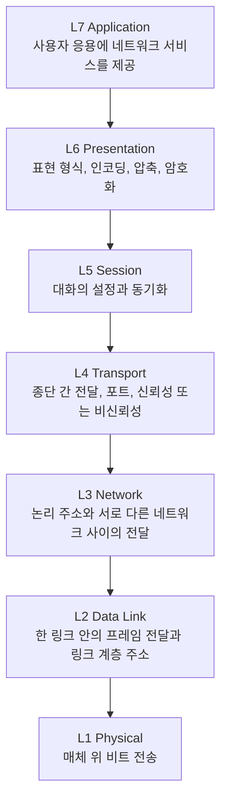
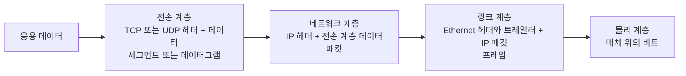

네트워크 문제를 설명할 때 "어느 계층의 문제인가"를 구분하면 원인과 책임 범위를 빠르게 좁힐 수 있습니다. **OSI(Open Systems Interconnection) 참조 모델**은 서로 다른 시스템이 통신할 때 필요한 기능을 일곱 계층으로 나눈 개념적 모델입니다. 실제 인터넷 프로토콜 묶음은 이 모델에 완전히 일대일로 대응하지 않지만, 통신 흐름을 공통 언어로 설명하는 데 유용합니다.

> **TL;DR**   
> - OSI 7계층은 구현 명세가 아니라 통신 기능을 나누어 설명하는 참조 모델입니다.   
> - 실제 인터넷에서는 보통 응용, 전송, 인터넷, 링크 계층 관점으로 구현되므로 OSI 계층과 완벽히 대응하지 않습니다.   
> - 송신 시에는 상위 데이터에 각 계층의 제어 정보가 붙는 캡슐화가, 수신 시에는 이를 벗기는 역캡슐화가 일어납니다.  
{: .prompt-info}

---

## 1. OSI 모델과 프로토콜

OSI는 Open Systems Interconnection의 약자로, 시스템 간 상호 연결을 위한 표준을 정리하기 위해 만든 기본 참조 모델입니다. 이 모델의 목적은 특정 장비나 소프트웨어 구현을 규정하는 것이 아니라, 통신에 필요한 기능을 일관되게 분류하는 데 있습니다.

**프로토콜(protocol)**은 통신 주체가 데이터를 교환할 때 따르는 형식, 순서, 의미, 오류 처리 규칙의 약속입니다. 예를 들어 HTTP는 웹 요청과 응답의 형식을, TCP는 종단 간 바이트 흐름의 전달 방식을 정합니다. 계층화하면 한 계층은 아래 계층의 서비스를 이용하고, 위 계층에는 필요한 기능을 제공하므로 각 기능을 독립적으로 이해하고 교체하기 쉬워집니다.

다만 OSI의 일곱 계층을 실제 제품의 경계로 그대로 해석해서는 안 됩니다. TCP/IP 기반 인터넷에서는 OSI의 세션, 표현, 응용 계층 기능이 흔히 하나의 응용 계층 프로토콜이나 라이브러리에 함께 구현됩니다. 반대로 TLS처럼 여러 계층에 걸쳐 보이는 기능도 있습니다. OSI는 문제를 분류하는 지도이지, 모든 통신을 정확히 나누는 설계도가 아닙니다.

---

## 2. 일곱 계층의 역할

| 계층 | 핵심 책임 | 대표적인 예 | 문제를 볼 때 확인할 지점 |
| --- | --- | --- | --- |
| 7. Application | 응용이 사용하는 네트워크 서비스 | HTTP, DNS, SMTP | 요청 형식, 인증, 응답 코드, 이름 해석 |
| 6. Presentation | 데이터 표현과 변환 | 문자 인코딩, 압축, TLS의 암호화 기능 | 인코딩 불일치, 인증서, 암호 모음 |
| 5. Session | 대화의 설정, 유지, 동기화 | 응용 수준 세션, 체크포인트 | 세션 만료, 재개, 상태 동기화 |
| 4. Transport | 프로세스 사이의 전달 | TCP, UDP | 포트, 재전송, 흐름 제어, 혼잡 제어 |
| 3. Network | 네트워크 간 전달과 경로 선택 | IP, ICMP, 라우팅 | IP 주소, 라우팅 테이블, 다음 홉 |
| 2. Data Link | 같은 링크 안의 프레임 전달 | Ethernet, Wi-Fi, PPP | MAC 주소, VLAN, 프레임 오류 |
| 1. Physical | 신호를 매체로 전송 | 구리선, 광, 무선 | 링크 상태, 속도, 신호 품질 |

장비를 한 계층에만 고정하는 것도 주의해야 합니다. 스위치는 주로 L2 기능을 수행하지만 L3 스위치는 IP 라우팅도 수행할 수 있고, 방화벽과 로드 밸런서는 여러 계층의 정보를 함께 사용할 수 있습니다. 장비 이름보다 실제로 어떤 헤더와 정책을 처리하는지를 확인하는 편이 정확합니다.

---

## 3. 캡슐화와 역캡슐화

응용이 만든 데이터는 네트워크로 내려갈수록 각 계층의 제어 정보와 결합합니다. 이를 **캡슐화(encapsulation)**라고 합니다. 수신 측은 반대 순서로 헤더와 트레일러를 해석하고 제거하여 응용 데이터까지 전달하는데, 이를 **역캡슐화(decapsulation)**라고 합니다.

PDU(Protocol Data Unit) 이름은 문맥에 따라 조금씩 다르지만, 전송 계층에서는 TCP 세그먼트 또는 UDP 데이터그램, 네트워크 계층에서는 IP 패킷, 링크 계층에서는 프레임이라고 부르는 것이 일반적입니다. 중요한 점은 목적지까지 가는 동안 모든 헤더가 그대로 유지되는 것은 아니라는 사실입니다.

라우터는 수신한 링크 계층 프레임을 해석한 뒤 IP 목적지 주소를 기준으로 다음 홉을 결정하고, 다음 링크에 맞는 새 프레임으로 다시 전송합니다. 따라서 Ethernet의 출발지와 목적지 MAC 주소는 홉마다 바뀝니다. IP 패킷도 전달 과정에서 홉 제한 값 같은 일부 필드가 바뀔 수 있습니다.

---

## 4. 계층 모델을 이용한 장애 분류

계층 모델은 정답을 자동으로 알려 주지는 않지만, 진단 순서를 정하는 데 효과적입니다.

1. 링크가 올라와 있는지와 IP 주소, 기본 경로가 올바른지 먼저 확인합니다.
2. 목적지 IP까지의 경로와 방화벽 정책을 확인합니다.
3. 필요한 전송 계층 포트가 열려 있고 프로세스가 수신 대기 중인지 확인합니다.
4. 마지막으로 DNS, TLS, HTTP 인증과 같은 응용 수준 동작을 확인합니다.

예를 들어 웹 요청이 실패했다고 해서 즉시 HTTP 문제로 단정할 수는 없습니다. DNS 이름 해석, 기본 게이트웨이, 라우팅, TCP 연결, TLS 검증, HTTP 응답을 순서대로 분리하면 같은 "접속 불가" 증상도 훨씬 작은 범위에서 조사할 수 있습니다.

---

## 5. Reference

- [ISO/IEC 7498-1:1994 - Open Systems Interconnection Basic Reference Model](https://www.iso.org/standard/20269.html)
- [RFC 1122 - Requirements for Internet Hosts: Communication Layers](https://www.rfc-editor.org/rfc/rfc1122.html)
- [RFC 8200 - Internet Protocol, Version 6 Specification](https://www.rfc-editor.org/rfc/rfc8200.html)

> **궁금하신 점이나 추가해야 할 부분은 댓글이나 아래의 링크를 통해 문의해주세요.**  
> **Written with [KKamJi](https://www.linkedin.com/in/taejikim/)**  
{: .prompt-info}
