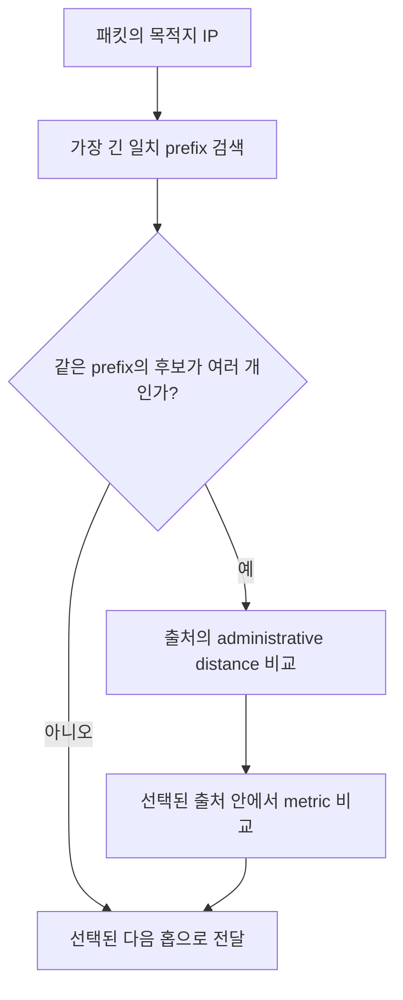

라우팅은 목적지 IP prefix에 맞는 다음 홉을 선택해 패킷을 전달하는 과정이다. 라우팅 프로토콜은 이 선택에 필요한 경로 정보를 라우터 사이에서 교환하는 규칙이며, RIP와 OSPF는 하나의 자율 시스템 안에서 사용하는 IGP다.

> **TL;DR**  
> - RIP는 이웃에게 목적지까지의 거리 벡터를 알리고, 기본 metric으로 hop 수를 사용한다.  
> - OSPF는 링크 상태 정보를 area 안에 배포하고 SPF 계산으로 누적 cost가 가장 낮은 경로를 구한다.  
> - administrative distance는 서로 다른 경로 출처를 비교하는 로컬 우선순위이고, metric은 같은 프로토콜 안에서 경로를 비교하는 값이다.  
{: .prompt-info}

---

## 1. 경로 선택에 필요한 세 가지 개념

1. **Routing protocol**: 라우터가 도달 가능한 prefix와 경로 특성을 학습하고 갱신하는 프로토콜이다. 정적 라우팅은 관리자가 경로를 직접 넣는 방식이며, 동적 라우팅은 프로토콜이 학습한 경로를 이용한다.
2. **Administrative distance**: 같은 목적지 prefix를 서로 다른 출처가 제시할 때, 어떤 출처를 더 신뢰할지 정하는 로컬 우선순위다. 낮은 값이 더 선호되는 모델이 일반적이지만, 이는 RIP나 OSPF 패킷이 광고하는 metric이 아니며 장비 구현과 정책에 따라 달라진다.
3. **Metric**: 같은 라우팅 프로토콜이 후보 경로의 좋고 나쁨을 비교하는 값이다. RIP의 metric은 일반적으로 hop 수이고, OSPF의 metric은 링크 cost의 합이다.

동일 prefix에 여러 경로가 있을 때의 개념적 흐름은 다음과 같다. 실제 장비의 세부 우선순위와 동등 경로 처리 방식은 구현과 설정을 확인해야 한다.

---

## 2. RIP: distance vector 방식

RIP는 Bellman-Ford 계열의 **distance vector** 라우팅 프로토콜이다. 각 라우터는 이웃에게 목적지와 그 목적지까지의 metric을 알리고, 수신한 정보에 자신의 이웃 링크 비용을 더해 후보 경로를 갱신한다. 라우터는 전체 토폴로지를 직접 보지 않고 이웃이 알려 준 거리와 다음 홉을 바탕으로 판단한다.

### 2.1. 동작 순서

1. 라우터는 직접 연결된 네트워크를 경로 정보로 초기화한다.
2. 이웃 라우터와 경로 업데이트를 주고받는다.
3. 수신한 각 경로의 metric에 이웃까지의 비용을 더하고, 더 작은 metric의 다음 홉을 선택한다.
4. 토폴로지가 바뀌면 업데이트를 다시 전파한다. split horizon, route poisoning, triggered update 같은 기법은 루프와 count-to-infinity 문제를 줄이기 위한 보조 장치다.

RIP의 일반적인 hop-count 구성에서는 가장 긴 경로가 15 hop으로 제한된다. 따라서 단순한 소규모 네트워크에는 관리 부담이 작을 수 있지만, 큰 토폴로지와 빠른 장애 수렴이 필요한 환경에는 제약이 크다. RIP의 "16"은 도달 불가를 나타내는 infinity로 취급된다.

---

## 3. OSPF: link-state 방식

OSPF는 **link-state** 라우팅 프로토콜이다. 라우터는 인접 관계를 만들고 LSA(Link-State Advertisement)를 교환해 area별 링크 상태 데이터베이스를 구성한다. 각 라우터는 그 데이터베이스를 입력으로 자신을 루트로 하는 SPF(shortest path first) 계산을 수행하고, 누적 cost가 낮은 경로를 라우팅 테이블에 반영한다.

### 3.1. 동작 순서

1. 인터페이스에서 Hello 패킷을 교환해 이웃을 발견하고 양방향 통신을 확인한다.
2. 인접 관계가 형성되면 라우터는 필요한 LSA를 교환해 area의 링크 상태 데이터베이스를 동기화한다.
3. 새 LSA가 설치되거나 토폴로지가 변하면 라우터는 SPF 계산을 수행해 경로와 다음 홉을 다시 결정한다.
4. 변경된 LSA는 인접 라우터로 flooding되며, 수신 라우터는 최신성 검사를 거쳐 데이터베이스를 갱신한다.

브로드캐스트와 NBMA 네트워크에서는 Hello 패킷이 멀티캐스트로 전송되지만, 모든 OSPF 네트워크 유형이 같은 방식으로 동작하는 것은 아니다. 또한 OSPF backbone은 Area 0이며 비-backbone area 사이의 경로 정보는 backbone을 통해 전달된다. Backbone은 연속되어야 하지만, 물리적으로 연속일 필요는 없고 virtual link를 사용할 수 있다. 따라서 모든 area가 물리적으로 Area 0에 직접 연결되어야 한다고 단정하면 안 된다.

---

## 4. RIP와 OSPF 선택 기준

| 항목 | RIP | OSPF |
| --- | --- | --- |
| 경로 정보 | 이웃이 알린 거리와 다음 홉 | area의 링크 상태 정보 |
| metric | hop 수 | 링크 cost의 합 |
| 토폴로지 관점 | 이웃 정보 기반 | area별 그래프 기반 |
| 규모 제약 | 일반적 구성에서 최대 15 hop | area와 backbone 설계로 확장 |
| 운영 초점 | 단순한 구성 | area 설계, 인접 관계, LSA 상태 |

프로토콜을 선택하기 전에 필요한 장애 수렴 시간, 네트워크 규모, 운영자가 관리할 area와 인증 정책을 먼저 정한다. 두 프로토콜의 default administrative distance 숫자를 외워서 선택하는 방식은 피해야 한다. 그 값은 표준 프로토콜의 metric이 아니라 장비의 로컬 정책이기 때문이다.

---

## 5. 최소 검증 순서

실습이나 운영 환경에서는 설정 명령보다 결과를 먼저 확인하는 편이 안전하다.

1. 각 링크의 IP 주소, prefix, 인터페이스 상태를 확인한다.
2. RIP에서는 이웃으로부터 학습한 prefix와 hop metric을 확인한다.
3. OSPF에서는 neighbor 상태, area, 링크 상태 데이터베이스, 계산된 route의 cost를 순서대로 확인한다.
4. 장애를 하나만 만들고 경로가 사라지거나 대체 경로로 바뀌는지 확인한다. 운영 환경에서는 변경 전후의 라우팅 테이블과 트래픽 영향을 함께 기록한다.

---

## 6. Reference

- [RFC 2453 - RIP Version 2](https://www.rfc-editor.org/rfc/rfc2453.html)
- [RFC 2328 - OSPF Version 2](https://www.rfc-editor.org/rfc/rfc2328.html)
- [RFC 8430 - RIB Information Model](https://www.rfc-editor.org/rfc/rfc8430.html)

  

> **궁금하신 점이나 추가해야 할 부분은 댓글이나 아래의 링크를 통해 문의해주세요.**  
> **Written with [KKamJi](https://www.linkedin.com/in/taejikim/)**  
{: .prompt-info}
