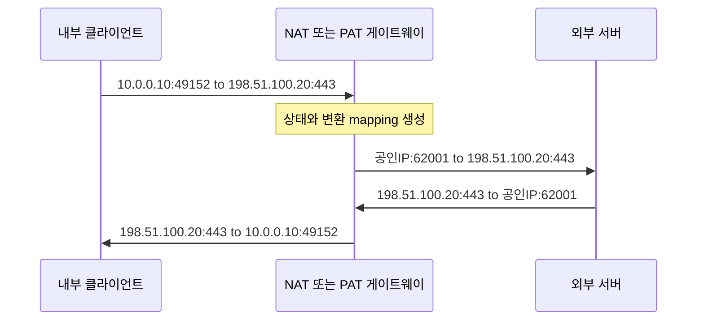

NAT(Network Address Translation)는 경계 장비가 패킷 헤더의 주소를 변환하고, 필요하면 전송 계층 식별자까지 바꾸어 서로 다른 주소 영역의 통신을 중개하는 기술이다. 가정용 공유기의 인터넷 접속에서 흔히 보는 형태는 NAT 중에서도 PAT 또는 NAPT다.

> **TL;DR**  
> - Basic NAT는 IP 주소만 변환하고, PAT 또는 NAPT는 IP 주소와 TCP/UDP 포트 또는 ICMP 식별자를 함께 변환한다.  
> - 변환 장비는 통신 상태를 기록해야 응답 패킷을 올바른 내부 호스트로 되돌릴 수 있다.  
> - NAT는 주소 변환 기능이지 방화벽이나 인증 통제가 아니다. inbound 허용 여부는 별도의 보안 정책으로 결정해야 한다.  
{: .prompt-info}

---

## 1. NAT와 PAT의 구분

**NAT**는 넓은 의미의 주소 변환을 말한다. RFC 3022의 traditional NAT는 다음 두 형태를 구분한다.

| 구분 | 변환 대상 | 사용 예 |
| --- | --- | --- |
| Basic NAT | IP 주소 | 내부 주소와 공인 주소 pool의 매핑 |
| PAT 또는 NAPT | IP 주소와 전송 계층 식별자 | 여러 내부 연결을 하나 또는 적은 수의 공인 주소로 중계 |

**PAT(Port Address Translation)**는 **NAPT(Network Address Port Translation)**와 같은 의미로 쓰이는 경우가 많다. TCP와 UDP에서는 보통 source port 또는 destination port까지 변환해 연결을 구분한다. ICMP echo 같은 query 패킷에서는 query ID가 구분자 역할을 할 수 있다.

정적 매핑은 특정 내부 주소를 특정 외부 주소에 고정해 두는 방식이다. 동적 Basic NAT는 외부 주소 pool에서 사용 가능한 주소를 연결에 할당한다. PAT는 주소만으로 연결을 구분할 수 없을 때 포트까지 포함한 mapping을 사용한다. 이 용어들은 mapping 방식의 설명이며, 장비별 설정 명령의 이름과 일대일로 대응하지 않을 수 있다.

---

## 2. outbound PAT의 패킷 흐름

다음은 내부 호스트 `10.0.0.10:49152`가 외부 웹 서버 `198.51.100.20:443`에 연결하는 예시다. 문서용 주소를 사용한 예시이며 실제 서비스 주소가 아니다.

동작 순서는 다음과 같다.

1. 내부 호스트는 목적지가 자신의 subnet 밖이면 기본 게이트웨이로 패킷을 보낸다.
2. 게이트웨이는 source address와 필요한 경우 source port를 외부에서 사용 가능한 값으로 바꾸고, 원래의 내부 tuple과 변환된 tuple을 mapping에 기록한다.
3. 외부 서버는 변환된 공인 주소와 포트로 응답한다.
4. 게이트웨이는 응답의 destination tuple을 mapping에서 찾은 뒤 내부 주소와 포트로 역변환한다.

IP 주소나 TCP/UDP 포트가 바뀌면 IP, TCP, UDP, ICMP checksum도 해당 프로토콜 규칙에 따라 조정해야 한다. NAT 처리 비용을 단순히 "주소 문자열 교체"로 보면 안 되는 이유다.

---

## 3. SNAT, DNAT, 포트 포워딩

운영 문서에서 **SNAT**는 보통 패킷의 source address를 바꾸는 변환을, **DNAT**는 destination address를 바꾸는 변환을 뜻한다. outbound PAT는 흔한 SNAT 사례다.

외부에서 내부 서비스를 제공하려면 정적 DNAT 또는 포트 포워딩 mapping을 둘 수 있다. 예를 들어 게이트웨이의 특정 공인 IP와 TCP 포트를 내부 서버의 IP와 포트로 연결한다. 이 mapping은 패킷을 어디로 보낼지 정할 뿐이다. 다음 항목은 별도로 확인해야 한다.

1. 방화벽과 security group이 해당 inbound 연결을 허용하는지 확인한다.
2. 내부 서버의 default route와 return path가 변환 장비를 거치는지 확인한다.
3. 외부에 공개할 서비스와 포트만 명시적으로 mapping한다.
4. 변환 상태의 timeout, 포트 고갈, 비대칭 경로가 장애 원인이 될 수 있으므로 관측 대상에 포함한다.

NAT 때문에 내부 주소가 외부 응답에 직접 나타나지 않을 수는 있지만, 이것만으로 서비스가 보호되는 것은 아니다. 접근 제어, TLS, 패치, 로그, rate limit 같은 보안 통제는 NAT와 독립적으로 설계해야 한다.

---

## 4. 문제를 확인하는 순서

1. 변환 전후의 source와 destination IP, port, protocol을 하나의 tuple로 기록한다.
2. 해당 tuple의 NAT 또는 PAT mapping이 생성됐는지 확인한다.
3. 외부로 나가는 패킷과 응답 패킷이 모두 변환 장비를 통과하는지 확인한다.
4. checksum 오류, timeout, 포트 고갈, 방화벽 차단을 구분한다.

---

## 5. Reference

- [RFC 3022 - Traditional IP Network Address Translator](https://www.rfc-editor.org/rfc/rfc3022.html)
- [RFC 1918 - Address Allocation for Private Internets](https://www.rfc-editor.org/rfc/rfc1918.html)

  

> **궁금하신 점이나 추가해야 할 부분은 댓글이나 아래의 링크를 통해 문의해주세요.**  
> **Written with [KKamJi](https://www.linkedin.com/in/taejikim/)**  
{: .prompt-info}
