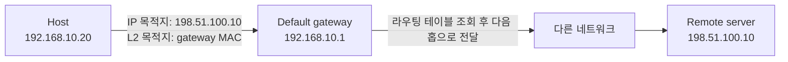

같은 서브넷 안의 장비와 통신할 때는 상대 장비로 프레임을 직접 보낼 수 있습니다. 그러나 목적지 IP 주소가 로컬 네트워크 밖에 있으면 호스트는 패킷을 다음 네트워크로 전달할 라우터를 찾아야 합니다. 이 글은 gateway라는 넓은 용어와 일상적으로 가장 많이 만나는 default gateway의 역할을 분리해 설명합니다.

> **TL;DR**   
> - gateway는 서로 다른 시스템이나 네트워크 사이의 통신을 중개하는 넓은 개념이며, 항상 OSI 3계층 장비만을 뜻하지는 않습니다.   
> - default gateway는 더 구체적인 경로가 없을 때 호스트가 외부 목적지로 패킷을 보내는 기본 다음 홉 라우터입니다.   
> - 일반적인 IP 라우팅에서 외부 목적지로 보낼 때 IP 목적지 주소는 원격 서버로 유지되고, 같은 링크의 Ethernet 목적지 MAC(Media Access Control) 주소만 기본 게이트웨이의 MAC 주소가 됩니다.  
{: .prompt-info}

---

## 1. Gateway와 라우터의 관계

**gateway**는 서로 다른 네트워크, 프로토콜, 시스템 사이를 연결하거나 변환하는 중개 지점을 뜻합니다. IP 네트워크 문맥에서는 흔히 패킷을 다른 네트워크로 전달하는 라우터를 가리키며, 이때 라우터는 IP 목적지 주소를 바탕으로 다음 홉과 출력 인터페이스를 선택합니다.

하지만 gateway를 무조건 OSI(Open Systems Interconnection) 3계층 장비라고 단정하면 범위가 너무 좁아집니다. 애플리케이션 gateway는 HTTP(Hypertext Transfer Protocol) 요청을 중계하거나 프로토콜을 변환할 수 있고, 보안 gateway는 인증과 정책 검사를 추가할 수 있습니다. 따라서 문서나 구성에서 gateway라는 말을 만나면 IP 라우터를 의미하는지, 응용 수준 중계 장치를 의미하는지 먼저 확인해야 합니다.

IP 네트워크에서 라우터는 라우팅 테이블을 사용해 다음 홉과 송신 인터페이스를 선택합니다. 반면 브리지나 스위치는 일반적으로 같은 링크 계층 네트워크 안에서 MAC 주소를 기준으로 프레임을 전달합니다. 따라서 브리지나 스위치 자체를 IP default gateway와 같은 의미로 볼 수는 없습니다.

---

## 2. Default gateway란 무엇인가

**default gateway**는 호스트의 라우팅 테이블에 더 구체적으로 일치하는 경로가 없을 때 사용하는 기본 다음 홉(next hop)입니다. "인터넷으로 가는 주소" 자체가 아니라, 현재 호스트와 같은 링크에서 도달 가능한 라우터 인터페이스의 IP 주소입니다. Internet Protocol version 4(IPv4)에서는 흔히 기본 경로 `0.0.0.0/0`와 함께 설정하고, Internet Protocol version 6(IPv6)에서는 Router Advertisement가 알린 기본 라우터나 정적 경로가 같은 역할을 수행합니다.

기본 경로는 최후의 경로입니다. 예를 들어 특정 사내망에 대한 정적 경로나 VPN(Virtual Private Network) 경로가 있으면 그 경로가 기본 경로보다 우선합니다. 실제 전송은 가장 구체적으로 일치하는 경로를 선택하는 라우팅 규칙에 따라 결정되므로, 기본 게이트웨이가 설정되어 있다고 해서 모든 트래픽이 그곳으로 가는 것은 아닙니다.

여기서 `/24` 같은 표기는 CIDR(Classless Inter-Domain Routing) 접두사 길이다. 숫자가 클수록 더 많은 앞부분 비트를 비교하므로 일반적으로 더 구체적인 경로다. 예를 들어 아래 라우팅 테이블에서는 `10.20.0.0/16`이 `0.0.0.0/0`보다 먼저 선택된다.

| 목적지 접두사 | 다음 홉 또는 인터페이스 | `10.20.30.40` 전송 시 |
| --- | --- | --- |
| `192.168.10.0/24` | 로컬 Ethernet | 일치하지 않음 |
| `10.20.0.0/16` | VPN 인터페이스 | 선택됨 |
| `0.0.0.0/0` | `192.168.10.1` | 더 구체적인 경로가 없을 때만 선택 |

---

## 3. 외부 목적지로 패킷이 나가는 과정

다음은 `192.168.10.20/24`인 호스트가 같은 링크의 기본 게이트웨이 `192.168.10.1`을 통해 원격 서버 `198.51.100.10`으로 보내는 개념적 흐름입니다.

1. 호스트는 목적지 `198.51.100.10`에 대해 로컬 서브넷 경로나 더 구체적인 경로가 있는지 라우팅 테이블에서 찾습니다.
2. 일치하는 경로가 없으면 기본 경로를 선택하고, 다음 홉을 `192.168.10.1`로 결정합니다.
3. 호스트는 기본 게이트웨이의 링크 계층 주소를 확인한 뒤 프레임을 만듭니다. IPv4 Ethernet에서는 ARP(Address Resolution Protocol), IPv6에서는 NDP(Neighbor Discovery Protocol)를 사용해 이 주소를 알아냅니다.
4. 프레임의 Ethernet 목적지 MAC 주소는 기본 게이트웨이가 되지만, 일반적인 IP 라우팅에서 안에 들어 있는 IP 패킷의 목적지 주소는 원격 서버 `198.51.100.10`으로 유지됩니다.
5. 라우터는 프레임을 벗기고 IP 목적지 주소를 라우팅 테이블에서 조회한 뒤, 다음 링크에 맞는 새 프레임으로 다시 전송합니다. IPv4 라우터는 전달할 때 Time To Live(TTL)를 줄이고 IPv4 헤더 체크섬을 다시 계산합니다. IPv6에서는 Hop Limit이 같은 역할을 하며 IPv6 기본 헤더에는 체크섬이 없습니다.

이 구분은 패킷 캡처를 읽을 때 특히 중요합니다. 첫 번째 링크에서 보이는 MAC 목적지는 gateway이지만, IP 목적지는 실제 통신하려는 서버입니다. MAC 주소는 링크마다 바뀌고 IP 목적지는 종단 간 전달의 기준으로 사용됩니다.

기본 게이트웨이가 같은 링크에 있다는 조건도 중요합니다. 호스트는 먼저 선택한 다음 홉의 MAC 주소를 알아내야 하므로, ARP 또는 NDP가 실패하면 기본 경로가 있어도 첫 프레임을 만들 수 없습니다. 이 단계는 "라우팅 문제"와 "이웃 주소 해석 문제"를 구분하는 기준이 된다.

---

## 4. 같은 서브넷 통신과의 차이

목적지 IP가 같은 서브넷에 있으면 호스트는 기본 게이트웨이를 거치지 않고 목적지 호스트의 링크 계층 주소를 확인해 직접 프레임을 보냅니다. 반면 목적지가 다른 서브넷이면 기본 게이트웨이의 링크 계층 주소를 확인해 라우터로 보냅니다.

| 구분 | 같은 서브넷의 서버 | 다른 서브넷의 서버 |
| --- | --- | --- |
| IP 목적지 | 통신할 서버 | 통신할 원격 서버 |
| 첫 프레임의 MAC 목적지 | 통신할 서버의 MAC 주소 | 기본 게이트웨이의 MAC 주소 |
| 호스트가 선택하는 경로 | 직접 연결 경로 | 더 구체적인 경로 또는 기본 경로 |
| 라우터 필요 여부 | 일반적으로 불필요 | 다음 네트워크로 가려면 필요 |

기본 게이트웨이 장애는 외부 통신 실패로 보일 수 있지만, 실제 원인은 하나로 정해져 있지 않습니다. 먼저 IP 주소와 CIDR 접두사, 목적지에 대해 선택된 경로, gateway까지의 링크 계층 주소 해석, gateway 인터페이스 상태, 그 이후 경로와 방화벽 정책을 차례로 확인해야 합니다. 같은 서브넷 통신은 되는데 외부 통신만 안 되는 경우에도 기본 경로만 수정하기 전에 이 순서를 따르는 편이 안전합니다.

---

## 5. Reference

- [RFC 1122 - Requirements for Internet Hosts: Communication Layers](https://www.rfc-editor.org/rfc/rfc1122.html)
- [RFC 1812 - Requirements for IP Version 4 Routers](https://www.rfc-editor.org/rfc/rfc1812.html)
- [RFC 826 - An Ethernet Address Resolution Protocol](https://www.rfc-editor.org/rfc/rfc826.html)
- [RFC 4861 - Neighbor Discovery for IP version 6](https://www.rfc-editor.org/rfc/rfc4861.html)
- [RFC 8200 - Internet Protocol, Version 6 (IPv6) Specification](https://www.rfc-editor.org/rfc/rfc8200.html)

> **궁금하신 점이나 추가해야 할 부분은 댓글이나 아래의 링크를 통해 문의해주세요.**  
> **Written with [KKamJi](https://www.linkedin.com/in/taejikim/)**  
{: .prompt-info}
