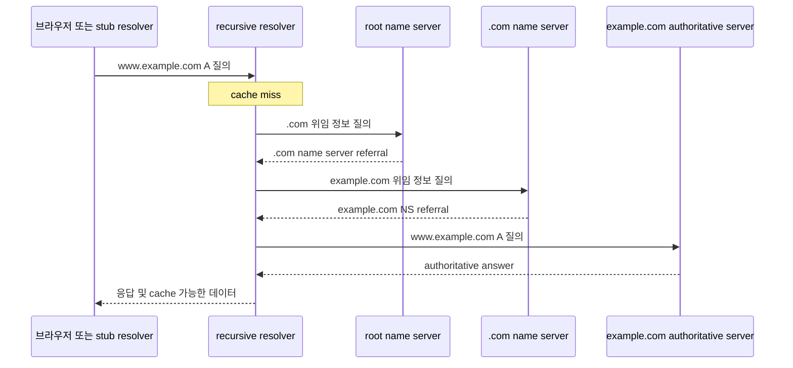

DNS(Domain Name System)는 도메인 이름을 IP 주소를 포함한 DNS resource record로 조회하는 계층형 분산 데이터베이스다. 브라우저가 이름을 IP 주소로 "바꾼다"는 설명만으로는 캐시, 위임, authoritative server의 역할을 설명할 수 없다.

> **TL;DR**  
> - authoritative name server는 자신이 맡은 zone의 데이터를 로컬 지식으로 응답한다.  
> - recursive resolver는 클라이언트 대신 필요한 질의를 수행하고, 일반적으로 결과를 cache한다.  
> - DNS record는 이름, type, Time To Live(TTL), value의 조합이며 Canonical Name(CNAME)과 zone apex에는 중요한 제약이 있다.  
{: .prompt-info}

---

## 1. DNS 구성 요소

**Domain name**은 사람이 읽는 계층형 이름이고, **zone**은 한 관리 주체가 제공하는 DNS 데이터의 범위다. 하나의 domain과 zone이 항상 같은 범위인 것은 아니다. 하위 domain을 별도 zone으로 위임할 수 있기 때문이다.

`www.example.com.`처럼 끝에 root를 나타내는 점까지 적은 이름을 FQDN(Fully Qualified Domain Name)이라고 한다. 사용자 인터페이스에서는 이 마지막 점을 생략하는 경우가 많다.

**Authoritative name server**는 자신이 제공하도록 구성된 zone의 내용을 로컬 데이터에서 알고 있어 다른 DNS 서버에 다시 묻지 않고 응답한다. 반면 **recursive resolver**는 stub resolver나 애플리케이션의 요청을 받아 cache를 확인하고, 답이 없으면 다른 name server에 질의해 최종 응답을 만든다. stub resolver는 운영체제나 애플리케이션에 있는 가벼운 DNS 클라이언트다. 둘 다 흔히 "DNS 서버"라고 부르지만 역할은 다르다.

위임(delegation)은 부모 zone이 자식 zone의 name server를 NS(Name Server) record로 알려 주는 방식이다. name server의 이름이 자식 zone 안에 있으면 resolver가 그 이름의 주소를 찾기 위해 다시 자식 zone을 물어야 하는 순환 문제가 생길 수 있다. 이때 부모 zone은 연결에 필요한 주소 record를 glue로 함께 제공한다. glue는 위임을 따라가기 위한 보조 데이터이며, 자식 zone의 authoritative 데이터 자체와 구분해서 다뤄야 한다.

---

## 2. cache miss에서의 이름 해석 흐름

`www.example.com`의 A record를 찾는 recursive resolver를 예로 들면 다음과 같다. TLD(Top-Level Domain)인 `.com`은 `example.com` zone의 위임 정보를 제공한다. 실제 질의는 cache, delegation, DNSSEC(DNS Security Extensions) 검증 정책, 장애 상태에 따라 일부 단계를 건너뛸 수 있다.



1. 클라이언트의 stub resolver는 보통 설정된 recursive resolver에 질의를 보낸다.
2. recursive resolver는 cache에 유효한 답이 있으면 바로 응답한다.
3. cache miss이면 root zone부터 delegation을 따라가며 TLD와 하위 zone의 authoritative name server 정보를 찾는다.
4. 대상 zone의 authoritative name server에서 해당 record를 받고, 응답과 delegation 정보를 cache한 뒤 클라이언트에 응답한다.

이 흐름에서 root, TLD, authoritative server는 각각 서로 다른 이름을 순서대로 "검색"하는 서버가 아니다. 상위 zone은 하위 zone을 맡은 name server를 가리키는 delegation 정보를 제공하고, resolver가 그 위임을 따라간다. 클라이언트는 recursive resolver에 최종 답을 기대하는 재귀 질의를 보내지만, resolver가 root와 TLD에 보내는 질의는 referral을 받아 다음 서버를 선택하는 반복적 해석의 일부다.

존재하지 않는 이름에 대한 NXDOMAIN(Name Error) 또는 이름은 있지만 요청 type이 없는 NODATA(No Data) 응답도 negative caching 대상이 될 수 있다. RFC 2308에서 negative cache의 수명은 응답 authority section의 SOA(Start of Authority) record에 있는 TTL과 SOA MINIMUM 값 중 작은 값으로 결정한다. 따라서 record를 추가하거나 삭제한 직후 일부 사용자는 이전 응답이나 NXDOMAIN을 잠시 볼 수 있다. 변경을 검증할 때는 record의 TTL뿐 아니라 resolver의 cache 상태와 negative cache TTL도 함께 확인해야 한다.

---

## 3. DNS record를 읽는 법

DNS의 기본 데이터 단위는 **resource record(RR)**다. 실무에서 record를 만들거나 읽을 때는 다음 항목을 함께 본다.

| 용어 | 의미 |
| --- | --- |
| Name | record가 적용되는 도메인 이름 |
| Type | 데이터의 종류. 예: A, AAAA, CNAME, MX, NS, SOA, TXT |
| TTL | resolver가 record를 cache할 수 있는 시간(초) |
| RDATA(Resource Data) 또는 Value | type에 따른 실제 값 |
| RRset(Resource Record Set) | 같은 name, class, type을 공유하는 record 묶음 |

- **A**와 **AAAA**는 이름을 각각 IPv4와 IPv6 주소에 연결한다.
- **CNAME**은 한 이름의 canonical name을 다른 도메인 이름으로 지정한다. CNAME owner name에는 A, MX 같은 다른 data를 함께 둘 수 없다. zone apex에는 SOA와 NS RRset이 필요하므로 CNAME을 둘 수 없다.
- **NS**는 zone을 제공하는 authoritative name server를 나타내며, 상위 zone의 delegation에 사용된다.
- **SOA**는 zone의 권한 정보와 zone 관리에 필요한 값을 담는다.
- **MX(Mail Exchanger)**는 메일 교환 서버를, **TXT**는 텍스트 데이터를 담는다. TXT의 의미는 DNS 자체가 아니라 이를 사용하는 애플리케이션 규격이 정한다.

TTL을 짧게 하면 변경을 더 빨리 반영할 가능성은 높아지지만 authoritative server로 가는 질의가 늘 수 있다. TTL을 길게 하면 cache 효율은 좋아지지만 변경 전 값이 더 오래 남는다. 배포 직전에만 TTL을 낮추려면 기존 TTL이 이미 cache된 resolver에는 즉시 적용되지 않는다는 점을 고려해야 한다. 변경과 검증 후 적절한 운영 값으로 되돌리는 방식이 일반적이다.

---

## 4. DNS 서버를 안전하게 운영하는 기준

authoritative service와 recursive service의 역할을 분리해서 설계한다. 인터넷에 공개하는 authoritative server가 모든 외부 클라이언트의 재귀 질의를 받아야 하는 것은 아니다. 공개 재귀 resolver가 필요하다면 허용 클라이언트, rate limit, cache, 로그, DNSSEC 검증 정책을 별도로 설계한다.

기존의 `allow-query { any; };` 같은 설정을 모든 DNS 서버에 그대로 적용하는 것은 안전한 기본값이 아니다. 제품별 설정 문서에서 authoritative 응답 범위와 recursion 허용 범위를 구분하고, 다음과 같이 결과를 검증한다.

```bash
# authoritative server가 zone 데이터를 응답하는지 확인
dig @<authoritative-server> <name> A +norecurse +noall +answer +authority +comments

# recursive resolver가 최종 답을 반환하는지 확인
dig @<recursive-resolver> <name> A
```

---

## 5. Reference

- [RFC 1034 - Domain Names: Concepts and Facilities](https://www.rfc-editor.org/rfc/rfc1034.html)
- [RFC 1035 - Domain Names: Implementation and Specification](https://www.rfc-editor.org/rfc/rfc1035.html)
- [RFC 2308 - Negative Caching of DNS Queries](https://www.rfc-editor.org/rfc/rfc2308.html)
- [RFC 2181 - Clarifications to the DNS Specification](https://www.rfc-editor.org/rfc/rfc2181.html)
- [RFC 9499 - DNS Terminology](https://www.rfc-editor.org/rfc/rfc9499.html)
- [BIND 9 Administrator Reference Manual - Configuration Reference](https://bind9.readthedocs.io/en/latest/reference.html)

<br><br>

> **궁금하신 점이나 추가해야 할 부분은 댓글이나 아래의 링크를 통해 문의해주세요.**  
> **Written with [KKamJi](https://www.linkedin.com/in/taejikim/)**  
{: .prompt-info}
