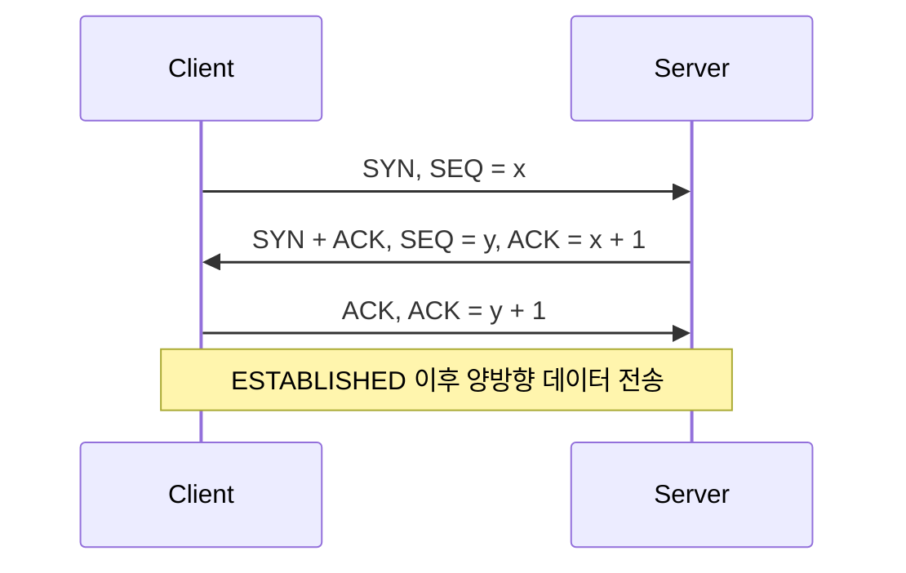

TCP와 UDP는 IP 위에서 응용 프로그램의 데이터를 전달하는 전송 계층 프로토콜입니다. 둘 중 하나가 항상 더 빠르거나 더 낫다는 뜻은 아닙니다. 필요한 전달 보장, 지연 시간, 메시지 경계, 혼잡 제어 책임을 기준으로 선택해야 합니다.

> **TL;DR**   
> - TCP는 연결 지향적인 신뢰성 있는 순서 보장 바이트 스트림을 제공하며, 손실을 감지해 재전송합니다.   
> - UDP는 최소한의 전송 메커니즘만 제공하는 데이터그램 프로토콜이며, 손실, 중복, 순서를 보장하지 않습니다.   
> - UDP를 선택해도 신뢰성, 순서, 혼잡 제어가 필요하다면 응용 프로토콜이 그 기능을 직접 설계해야 합니다.  
{: .prompt-info}

---

## 1. 전송 계층과 포트

**프로토콜(protocol)**은 통신 당사자가 데이터 형식과 처리 순서를 합의한 규칙입니다. 전송 계층은 한 호스트의 IP 주소에 도착한 데이터를 어느 응용 프로그램으로 전달할지 구분합니다. 이때 사용하는 **포트(port)**는 물리 장비의 포트가 아니라, 호스트 안의 전송 계층 통신 종점을 식별하는 16비트 번호입니다.

TCP 연결은 일반적으로 출발지 IP 주소와 포트, 목적지 IP 주소와 포트의 조합으로 구분됩니다. 따라서 하나의 서버 프로세스는 같은 수신 포트에서 많은 클라이언트 연결을 동시에 처리할 수 있습니다. UDP도 IP 주소와 포트를 사용해 데이터그램을 다중화하지만, TCP와 같은 연결 상태를 만들지 않습니다.

---

## 2. TCP의 전달 방식

TCP(Transmission Control Protocol)는 응용에 신뢰성 있는 순서 보장 바이트 스트림을 제공합니다. 송신 데이터는 TCP 세그먼트로 나뉘어 IP 데이터그램으로 전송되고, 수신 측은 이를 응용이 읽을 수 있는 바이트 흐름으로 재구성합니다.

| 기능 | TCP가 하는 일 | 주의할 점 |
| --- | --- | --- |
| 연결 설정 | 통신 전 양 끝점의 초기 시퀀스 번호를 동기화 | 연결 수립 자체에도 왕복 시간이 듭니다. |
| 신뢰성 | 시퀀스 번호와 체크섬으로 손실 또는 오류를 감지하고 필요 시 재전송 | "도착 보장"은 상대 응용이 데이터를 처리했다는 뜻은 아닙니다. |
| 순서 보장 | 수신 응용에는 순서가 맞는 바이트 스트림을 제공 | 중간 세그먼트가 손실되면 뒤의 데이터 전달이 지연될 수 있습니다. |
| 흐름 제어 | 수신 윈도로 수신 측이 받을 수 있는 양을 알림 | 수신 측 버퍼 보호가 목적입니다. |
| 혼잡 제어 | 네트워크 상태에 따라 전송량을 조절 | 알고리즘과 실제 성능은 운영체제와 구현에 따라 달라집니다. |

TCP는 메시지 경계를 보존하지 않습니다. 예를 들어 송신자가 두 번 쓴 데이터가 수신자의 한 번 읽기로 합쳐지거나, 한 번 쓴 데이터가 여러 번 읽기로 나뉠 수 있습니다. 길이 필드나 구분자처럼 응용 프로토콜이 메시지 경계를 정의해야 하는 이유입니다.

### 2.1. 3-way handshake

TCP 연결 수립에 흔히 쓰는 절차가 3-way handshake입니다. SYN은 초기 시퀀스 번호 동기화를 시작하고, ACK는 다음에 받을 시퀀스 번호를 확인합니다. 이 교환은 지연된 오래된 연결 요청이 새 연결로 오인되는 가능성을 줄입니다.

이 그림은 가장 일반적인 연결 수립 흐름입니다. 실제 환경에서는 재전송, 동시 연결 시작, 연결 거절, 보안 장비의 정책 등으로 패킷 흐름이 달라질 수 있습니다. 연결 종료도 별도의 상태 전이를 거치며, 항상 단순한 네 개의 패킷으로 끝난다고 가정해서는 안 됩니다.

---

## 3. UDP의 전달 방식

UDP(User Datagram Protocol)는 응용 프로그램이 적은 프로토콜 메커니즘으로 메시지를 보낼 수 있게 하는 데이터그램 프로토콜입니다. UDP 자체는 손실된 데이터그램의 재전송, 중복 제거, 순서 보장, 연결 설정, 혼잡 제어를 제공하지 않습니다.

UDP 헤더에는 출발지 포트, 목적지 포트, 길이, 체크섬이 있습니다. 체크섬은 전송 중 손상 탐지에 도움을 주지만, 손실되거나 순서가 바뀐 데이터그램을 복구하지는 않습니다. 신뢰성 있는 메시지 전달이 필요하면 응용 프로토콜이 확인 응답, 재전송, 순서 번호 같은 적절한 메커니즘을 마련해야 합니다.

| 관점 | TCP | UDP |
| --- | --- | --- |
| 전달 단위 | 바이트 스트림 | 데이터그램 |
| 연결 상태 | 연결 수립과 상태 유지 | 전송 계층 연결 상태 없음 |
| 순서와 재전송 | TCP가 제공 | 응용 프로토콜이 필요하면 구현 |
| 혼잡 제어 | TCP 구현이 수행 | 응용 또는 상위 프로토콜이 책임 |
| 메시지 경계 | 보존하지 않음 | 데이터그램 단위 유지 |

UDP의 헤더가 작고 연결 수립이 없다는 사실만으로 애플리케이션 전체가 더 낮은 지연이나 더 높은 처리량을 얻는 것은 아닙니다. 손실 복구, 순서 제어, 속도 조절을 응용이 구현하면 그 비용과 복잡성이 다시 생깁니다. 반대로 짧은 질의와 응답, 지연에 민감한 미디어, 자체 전송 제어를 가진 상위 프로토콜처럼 데이터그램 특성이 적합한 경우에는 UDP가 좋은 기반이 될 수 있습니다.

---

## 4. 선택과 운영 시 확인할 점

TCP와 UDP의 선택은 "신뢰성 대 속도"라는 한 문장으로 끝나지 않습니다. 다음 질문으로 요구사항을 확인하는 편이 안전합니다.

1. 데이터 하나라도 빠지면 안 되는가, 아니면 최신 데이터가 더 중요한가
2. 응용이 메시지 경계와 재전송 정책을 직접 정의할 수 있는가
3. 손실과 순서 변경이 생겼을 때 사용자 경험이 어떻게 달라지는가
4. 인터넷 경로에서 공정한 혼잡 제어와 전송량 제한을 어떻게 보장할 것인가

운영 중에는 프로토콜 이름만 보지 말고 실제 지표를 함께 봐야 합니다. TCP에서는 연결 실패, 재전송, 수신 윈도 제한, 연결 수를 살피고, UDP에서는 데이터그램 손실률, 순서 변경, 응용 수준 재시도, 송신율 제한을 관측합니다. UDP 트래픽도 인터넷의 안정성을 위해 적절한 혼잡 제어를 갖춰야 합니다.

---

## 5. Reference

- [RFC 9293 - Transmission Control Protocol](https://www.rfc-editor.org/rfc/rfc9293.html)
- [RFC 768 - User Datagram Protocol](https://www.rfc-editor.org/rfc/rfc768.html)
- [RFC 8085 - UDP Usage Guidelines](https://www.rfc-editor.org/rfc/rfc8085.html)

> **궁금하신 점이나 추가해야 할 부분은 댓글이나 아래의 링크를 통해 문의해주세요.**  
> **Written with [KKamJi](https://www.linkedin.com/in/taejikim/)**  
{: .prompt-info}
