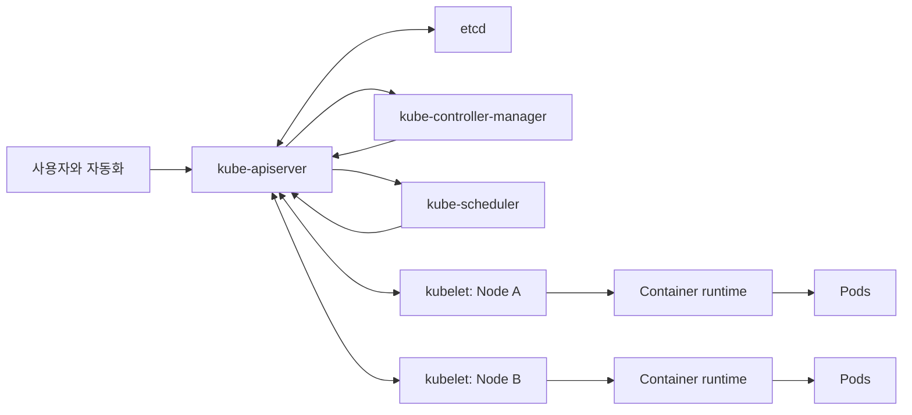

Kubernetes 클러스터는 컨테이너를 실행하는 머신의 묶음이 아니라, 선언한 상태를 실제 상태에 계속 맞추는 분산 제어 시스템이다. 사용자는 API에 원하는 상태를 기록하고, 컨트롤 플레인과 노드 구성 요소는 그 상태를 관찰하고 조정한다. 이 관점을 잡으면 Pod가 어느 경로로 생성되고, 장애 때 무엇을 먼저 확인할지 이해하기 쉬워진다.

> **TL;DR**  
> - 클러스터는 컨트롤 플레인과 하나 이상의 노드로 구성된다. 컨트롤 플레인은 API 상태를 관리하고, 노드는 Pod를 실제로 실행한다.  
> - `kube-apiserver`는 모든 제어 요청의 중심이며, `etcd`는 API 데이터의 일관된 저장소다. 스케줄러와 컨트롤러는 API를 통해 원하는 상태를 실제 상태로 수렴시킨다.  
> - `kubelet`은 노드에서 Pod 실행을 보장한다. `kube-proxy`는 선택 구성 요소이며 Service 네트워크 규칙을 구현한다.  
{: .prompt-info}

---

## 1. 전체 구조와 책임 경계

클러스터는 컨트롤 플레인(control plane)과 하나 이상의 노드(node)로 구성된다. 컨트롤 플레인은 클러스터 전반의 상태를 관리하고, 노드는 컨테이너 런타임을 통해 Pod를 실행한다. Pod는 Kubernetes가 배치하고 관리하는 가장 작은 배포 단위이며, 하나 이상의 컨테이너를 포함한다.

`kubectl`이나 CI 시스템이 리소스를 생성할 때 구성 요소끼리 직접 호출하는 구조가 아니다. 요청과 상태 변경은 API 서버를 중심으로 흐른다. 이 hub-and-spoke 구조에서 다른 컨트롤 플레인 구성 요소는 원격 API를 제공하지 않는다.

이 그림은 논리적 책임을 표현한다. 관리형 Kubernetes에서는 컨트롤 플레인의 프로세스가 사용자 노드와 다른 인프라에서 실행될 수 있으며, 구성 요소의 물리적 배치는 제품과 운영 방식에 따라 달라진다.

---

## 2. 컨트롤 플레인: 원하는 상태를 기록하고 조정하는 쪽

### 2.1. kube-apiserver

`kube-apiserver`는 Kubernetes HTTP API를 노출하는 핵심 서버다. `kubectl`, 컨트롤러, kubelet, 외부 자동화는 API 서버를 통해 리소스를 읽고 변경한다. 요청은 일반적으로 인증, 인가, 입력 검증과 정책 적용을 거친 뒤 API 데이터로 처리된다.

API 서버는 구성 요소 간의 계약 경계이기도 하다. 예를 들어 스케줄러는 Pod를 노드에 직접 전달하지 않고 API의 Pod 정보를 관찰한 뒤 바인딩 결과를 API에 기록한다. 따라서 API 서버의 가용성이나 인증 문제가 발생하면 새 배포, 스케줄링, 상태 조회 같은 제어 작업이 먼저 영향을 받는다.

### 2.2. etcd

`etcd`는 API 서버 데이터의 일관되고 고가용성인 키-값 저장소다. Pod, Deployment, Secret, RBAC 객체처럼 Kubernetes API로 관리하는 객체의 상태는 API 서버를 통해 저장되고 조회된다. 애플리케이션이나 운영 도구가 etcd에 직접 접근하는 방식은 일반적인 제어 경로가 아니다.

etcd는 제어면의 핵심 데이터이므로 백업과 복구 절차는 클러스터 구축 방식에 맞춰 검증해야 한다. 관리형 서비스에서는 공급자가 etcd 운영과 복구 책임을 맡을 수 있으므로, 사용자가 접근 가능한 범위와 복원 절차를 먼저 확인한다.

### 2.3. kube-scheduler

`kube-scheduler`는 아직 노드에 할당되지 않은 Pod를 찾고, 리소스 요청, 노드 제약, affinity, taint와 toleration 같은 조건을 고려해 적합한 노드를 선택한다. 스케줄러는 컨테이너를 실행하지 않는다. 선택 결과를 API에 기록하면 해당 노드의 kubelet이 Pod 명세를 보고 실행을 진행한다.

### 2.4. kube-controller-manager와 cloud-controller-manager

컨트롤러(controller)는 원하는 상태와 관찰된 상태의 차이를 계속 조정하는 제어 루프다. `kube-controller-manager`는 ReplicaSet, Node, Job 등 Kubernetes 기본 동작을 구현하는 여러 컨트롤러를 실행한다. 예를 들어 Deployment의 원하는 복제 수와 실제 Pod 수가 다르면 관련 컨트롤러가 API 상태를 바꿔 차이를 줄인다.

`cloud-controller-manager`는 선택 구성 요소다. 클라우드 공급자의 로드 밸런서, 노드, 라우트 같은 리소스와 Kubernetes를 연결할 때 사용된다. 클라우드 통합 방식은 배포판과 공급자마다 다르므로, 모든 클러스터에 이 프로세스가 있다고 가정하면 안 된다.

---

## 3. 노드: Pod를 실제로 실행하는 쪽

### 3.1. kubelet과 컨테이너 런타임

`kubelet`은 각 노드에서 실행되며, API에서 할당된 Pod 명세에 맞게 컨테이너가 실행 중인지 보장한다. kubelet은 컨테이너 런타임(container runtime)에 이미지 준비와 컨테이너 생명주기 작업을 요청하고, Pod와 노드 상태를 API 서버에 보고한다. 런타임은 컨테이너를 실제로 실행하는 소프트웨어이며, Kubernetes는 특정 구현 하나를 요구하지 않는다.

노드에서 API 서버와의 연결이 끊겨도 이미 실행 중인 컨테이너가 즉시 사라지는 것은 아니다. 다만 새 명세를 받거나 상태를 보고할 수 없으므로, 새 스케줄링과 정상적인 제어 루프는 진행되지 않는다. `/etc/kubernetes/manifests` 같은 static Pod 경로는 kubelet이 로컬 파일을 감시하는 별도 기능이며, 일반 워크로드의 장애 복구 수단으로 혼동하지 않아야 한다.

### 3.2. kube-proxy와 네트워크 Add-on

`kube-proxy`는 선택 구성 요소로, 각 노드에서 Service를 구현하기 위한 네트워크 규칙을 유지한다. Service의 가상 IP나 포트로 들어온 트래픽이 적절한 백엔드 Pod로 전달되도록 돕지만, 모든 Pod 간 네트워크를 단독으로 구성하는 구성 요소는 아니다.

Pod 네트워크, NetworkPolicy 구현, DNS 같은 기능은 CNI 플러그인과 CoreDNS 등 Add-on의 책임이다. 따라서 Service 연결 문제가 발생했을 때 kube-proxy만 점검하지 말고 EndpointSlice, CNI, DNS, NetworkPolicy, 애플리케이션 리스닝 상태를 함께 확인해야 한다.

---

## 4. Deployment가 Pod가 되기까지

다음 흐름은 Deployment를 적용했을 때의 대표적인 제어 경로다.

1. 사용자가 `kubectl apply`로 Deployment의 원하는 상태를 API 서버에 제출한다.
2. API 서버가 요청을 처리하고 API 데이터를 저장한다.
3. Deployment와 ReplicaSet 컨트롤러가 원하는 복제 수에 맞는 Pod 객체를 만든다.
4. 스케줄러가 아직 노드가 정해지지 않은 Pod를 선택해 노드에 바인딩한다.
5. 선택된 노드의 kubelet이 Pod 명세를 관찰하고 런타임으로 컨테이너를 실행한다.
6. kubelet과 컨트롤러가 상태를 API에 보고하고, 차이가 생기면 다시 조정한다.

핵심은 이 과정이 한 번만 실행되는 배포 스크립트가 아니라는 점이다. 노드 장애, 컨테이너 종료, 복제 수 변경처럼 실제 상태가 달라질 때 컨트롤러는 API에 선언된 상태로 다시 수렴하려 한다.

---

## 5. 운영 시 확인 순서

문제가 생기면 컴포넌트 이름을 나열하기보다 제어 경로를 따라 범위를 좁힌다.

- 새 Pod가 Pending이면 Pod의 이벤트, 스케줄링 조건, 노드 가용 자원과 taint를 먼저 확인한다.
- Pod가 노드에 배정됐지만 실행되지 않으면 해당 노드의 kubelet, 런타임, 이미지 pull, 볼륨과 네트워크 조건을 확인한다.
- Service로 트래픽이 전달되지 않으면 Pod Ready 상태와 EndpointSlice를 확인한 뒤 Service, kube-proxy 또는 데이터 플레인, DNS와 NetworkPolicy를 점검한다.
- API 조작이 실패하면 현재 인증 주체와 RBAC 권한, API 서버 연결, API 서버 감사 로그를 확인한다. kubelet과 API 서버의 통신은 TLS와 적절한 인증 및 인가 설정으로 보호해야 한다.

클러스터는 여러 구성 요소의 합이지만, 운영 판단은 API의 원하는 상태, 노드의 실제 상태, 그리고 둘을 연결하는 제어 루프를 기준으로 내리는 편이 정확하다.

---

## 6. Reference

- [Kubernetes Documentation - Kubernetes Components](https://kubernetes.io/docs/concepts/overview/components/)
- [Kubernetes Documentation - Nodes](https://kubernetes.io/docs/concepts/architecture/nodes/)
- [Kubernetes Documentation - Communication between Nodes and the Control Plane](https://kubernetes.io/docs/concepts/architecture/control-plane-node-communication/)

> **궁금하신 점이나 추가해야 할 부분은 댓글이나 아래의 링크를 통해 문의해주세요.**  
> **Written with [KKamJi](https://www.linkedin.com/in/taejikim/)**  
{: .prompt-info}
