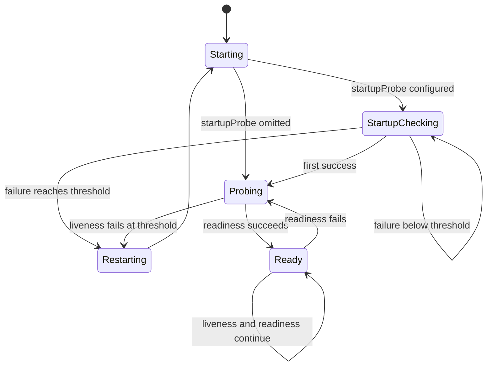

Pod의 `Running` 상태는 컨테이너 프로세스가 실행 중이라는 신호일 뿐, 요청을 안전하게 처리할 수 있다는 보장은 아니다. Kubernetes의 Probe는 kubelet이 컨테이너를 주기적으로 진단해 재시작이 필요한지와 Service 트래픽을 받을 준비가 되었는지를 별도로 판단하도록 한다.

> **TL;DR**  
> - Startup Probe는 느린 초기화를 보호한다. 성공하기 전에는 Liveness와 Readiness Probe가 실행되지 않는다.  
> - Liveness Probe 실패는 컨테이너 재시작의 신호다. 일시적 과부하나 외부 의존성 장애를 Liveness 실패로 만들면 재시작 연쇄를 일으킬 수 있다.  
> - Readiness Probe 실패는 컨테이너를 종료하지 않고, 일치하는 Service의 트래픽 대상에서 Pod를 제외한다.  
{: .prompt-info}

---

## 1. Probe가 답하는 세 가지 질문

Probe는 kubelet이 Pod 안의 **컨테이너**에 수행하는 주기적 진단이다. kubelet은 컨테이너에서 명령을 실행하거나, Pod IP의 HTTP, TCP, gRPC 엔드포인트에 요청해 결과를 판단한다. 세 Probe는 이름이 비슷해도 조치가 다르다.

| Probe | 질문 | 실패했을 때의 기본 효과 | 적합한 신호 |
| --- | --- | --- | --- |
| Startup | 애플리케이션의 기동이 끝났는가 | 컨테이너를 종료하고 restart policy를 적용 | 마이그레이션, 큰 캐시 적재처럼 기동 중인 상태 |
| Liveness | 더 진행할 수 없는 비정상 상태인가 | kubelet이 컨테이너 재시작 | 데드락처럼 재시작이 실제 복구가 되는 상태 |
| Readiness | 지금 트래픽을 받아도 되는가 | Pod를 Service의 일반 트래픽 대상에서 제외 | 연결 준비, 캐시 준비, 일시적 과부하 |

Liveness와 Readiness는 서로의 성공을 기다리지 않는다. 둘을 함께 정의해도 각 Probe는 독립적으로 판단한다. 단, Startup Probe를 정의하면 Startup Probe가 처음 성공할 때까지 두 Probe는 실행되지 않는다.

---

## 2. 컨테이너 기동부터 트래픽 수신까지



Readiness가 실패해도 프로세스는 계속 실행되고 kubelet은 이후에도 Readiness를 재시도한다. Ready 조건이 다시 참이 되면 Service의 EndpointSlice에 다시 포함될 수 있다. 반대로 Liveness나 Startup 실패가 임계값에 도달하면 해당 컨테이너는 재시작 대상이 된다.

종료 중인 Pod의 트래픽 배제는 별도 고려가 필요하다. Pod 삭제 시 Kubernetes는 EndpointSlice의 ready 조건을 갱신한다. 이를 이유로 Readiness만으로 모든 종료 드레이닝 문제를 해결하려고 하기보다, 애플리케이션의 graceful shutdown과 `terminationGracePeriodSeconds`를 함께 설계한다.

---

## 3. 검사 방식과 선택 기준

### 3.1. HTTP, TCP, Exec, gRPC

- **HTTP GET**: 지정한 경로로 요청한다. HTTP 상태 코드 200 이상 400 미만은 성공이다. 애플리케이션 상태를 가장 명확하게 표현할 수 있어 일반적인 웹 서비스에 적합하다.
- **TCP socket**: 지정 포트에 연결할 수 있는지만 검사한다. 프로세스가 포트를 열었는지는 알 수 있지만, 요청 처리 가능 여부까지 증명하지는 않는다.
- **Exec**: 컨테이너 안에서 명령을 실행하고 종료 코드 0을 성공으로 본다. 애플리케이션 내부 상태를 볼 수 있지만, 무거운 명령은 Probe 자체가 부하가 될 수 있다.
- **gRPC**: gRPC Health Checking Protocol을 구현한 애플리케이션에 사용할 수 있다. gRPC Probe는 named port와 인증 매개변수를 지원하지 않으므로, Pod IP에서 수신하도록 엔드포인트를 구성하고 별도 TLS 종단 설계를 검토한다.

Liveness 엔드포인트는 저비용이고 재시작이 정당한 실패만 반환해야 한다. 데이터베이스나 외부 API의 일시적 장애를 Liveness 실패에 묶으면 정상 프로세스까지 재시작해 남은 Pod의 부하가 커질 수 있다. 외부 의존성이 없어 요청을 처리할 수 없다면 보통은 Readiness 실패가 더 적절하다.

### 3.2. 시간 관련 필드

`initialDelaySeconds`는 컨테이너 시작 후 첫 Probe 전까지의 대기 시간이고, `periodSeconds`는 검사 주기다. `timeoutSeconds`는 한 번의 검사 제한 시간이다. `failureThreshold`만큼 연속 실패하면 Probe 전체가 실패한 것으로 판단한다. `successThreshold`는 실패 후 성공 상태로 돌아오기 위한 연속 성공 횟수이며, Liveness와 Startup에서는 1이어야 한다.

Readiness가 false인 동안에는 설정한 `periodSeconds`보다 자주 실행될 수 있다. Pod를 가능한 빨리 Ready로 만들기 위한 동작이므로, Readiness 엔드포인트는 짧고 예측 가능해야 한다.

---

## 4. 안전한 기본 구성 예시

아래 예시는 애플리케이션이 최대 5분 동안 초기화할 수 있고, `/livez`는 프로세스가 재시작으로 복구될 수 있는 상태만, `/readyz`는 요청 처리 가능 여부를 표현한다고 가정한다. 값은 예시일 뿐이므로, 운영 환경의 실제 기동 시간과 장애 데이터를 바탕으로 조정해야 한다.

```yaml
apiVersion: apps/v1
kind: Deployment
metadata:
  name: api
spec:
  replicas: 3
  selector:
    matchLabels:
      app: api
  template:
    metadata:
      labels:
        app: api
    spec:
      containers:
        - name: api
          image: example.com/api:1.0.0
          ports:
            - name: http
              containerPort: 8080
          startupProbe:
            httpGet:
              path: /livez
              port: http
            periodSeconds: 10
            failureThreshold: 30
          livenessProbe:
            httpGet:
              path: /livez
              port: http
            periodSeconds: 10
            timeoutSeconds: 2
            failureThreshold: 3
          readinessProbe:
            httpGet:
              path: /readyz
              port: http
            periodSeconds: 5
            timeoutSeconds: 2
            failureThreshold: 3
```

이 설정에서 Startup Probe의 허용 기동 시간은 대략 `30 * 10`초다. Startup Probe가 한 번 성공한 뒤에 Liveness와 Readiness의 지연 시간이 시작한다. 따라서 느린 기동을 단순히 큰 `initialDelaySeconds`로 숨기기보다, 기동 단계와 실행 중 장애를 분리하는 것이 낫다.

---

## 5. 운영 점검 목록

- Liveness 실패가 발생하면 `kubectl describe pod`의 이벤트와 재시작 횟수를 확인하고, 실제로 재시작이 복구를 만들었는지 검증한다.
- Ready가 false이면 Pod 상태뿐 아니라 Service의 EndpointSlice와 해당 Service의 selector를 함께 확인한다.
- 배포 직후 재시작이 반복되면 최악의 초기화 시간, 이미지 pull 시간, 초기 마이그레이션과 Probe 제한 시간을 비교한다.
- 상태 엔드포인트에 인증 정보나 민감한 진단 정보를 노출하지 않는다. Probe 경로는 내부에서만 호출된다는 가정에 의존하지 말고, 네트워크와 애플리케이션 노출 정책을 함께 검토한다.
- 장애가 외부 의존성에만 있는 경우 Readiness로 트래픽을 줄이는 것과 Liveness로 프로세스를 재시작하는 것의 영향을 분리해 판단한다.

Probe는 모니터링 대체재가 아니다. 애플리케이션 로그, 지표, 분산 추적과 함께 어떤 실패가 트래픽 차단에 적합하고 어떤 실패가 재시작에 적합한지 운영 기준을 명시해야 한다.

---

## 6. Reference

- [Kubernetes Documentation - Liveness, Readiness, and Startup Probes](https://kubernetes.io/docs/concepts/workloads/pods/probes/)
- [Kubernetes Documentation - Configure Liveness, Readiness and Startup Probes](https://kubernetes.io/docs/tasks/configure-pod-container/configure-liveness-readiness-startup-probes/)

> **궁금하신 점이나 추가해야 할 부분은 댓글이나 아래의 링크를 통해 문의해주세요.**  
> **Written with [KKamJi](https://www.linkedin.com/in/taejikim/)**  
{: .prompt-info}
