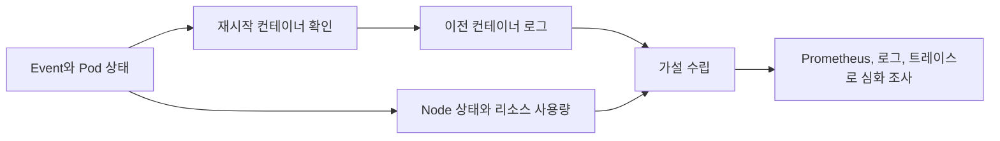

Kubernetes를 운영할 때 `kubectl` 명령을 매번 조합하면, 장애 초기에 필요한 기본 정보를 확인하는 속도가 느려지기 쉽습니다. Kubernetes Monitoring Tool(KMP)은 이벤트, 재시작, 이전 컨테이너 로그, Pod와 Node 상태, 리소스 사용량을 한 메뉴에 모아 빠르게 조회하려고 만든 Python CLI입니다.

GitHub: <https://github.com/KKamJi98/monitoring-kubernetes>

> **TL;DR**  
> - KMP는 Kubernetes 상태를 빠르게 확인하는 읽기 전용 운영 보조 도구입니다.  
> - `kubectl top` 기반 CPU와 메모리 값은 Metrics API가 제공하는 현재 사용량이며, 장기 추세 분석을 대체하지 않습니다.  
> - 실행 전 대상 context와 최소 RBAC 권한을 확인하고, 발견한 증상은 이벤트와 이전 컨테이너 로그로 이어서 조사합니다.  
{: .prompt-info}

---

## 1. 이 도구가 다루는 질문

KMP는 전체 관측 플랫폼이 아니라 초기 확인을 빠르게 하는 CLI입니다. Prometheus 같은 시계열 모니터링은 추세와 경보를 담당하고, KMP는 특정 시점의 Kubernetes API 정보와 로그를 모아 다음 질문에 답합니다.

| 질문 | 확인하는 정보 | 해석할 때 주의할 점 |
| --- | --- | --- |
| 최근에 무엇이 바뀌었는가 | Event | Event는 보존 기간이 제한될 수 있어 장기 이력의 원본이 아님 |
| 어떤 컨테이너가 다시 시작됐는가 | container restart count, Pod 상태 | 재시작 횟수만으로 원인을 판단하지 않음 |
| 직전 프로세스는 왜 종료됐는가 | 이전 컨테이너 로그 | 로그가 남아 있지 않거나 권한이 없을 수 있음 |
| 트래픽을 받을 수 있는 Pod는 무엇인가 | Pod phase, condition, Ready 상태 | `Running`만으로 준비 완료를 뜻하지 않음 |
| 자원이 어느 노드에 몰렸는가 | Node와 Pod CPU, memory 사용량 | `kubectl top`은 용량이나 장기 추세가 아님 |



---

## 2. 주요 기능

```shell
===== Kubernetes Monitoring Tool =====
1) Event Monitoring (Normal, !=Normal)
2) Error Pod Catch (가장 최근에 재시작된 컨테이너 N개 확인)
3) Error Log Catch (가장 최근에 재시작된 컨테이너 N개 확인 후 이전 컨테이너의 로그 확인)
4) Pod Monitoring (생성된 순서) [옵션: Pod IP 및 Node Name 표시]
5) Pod Monitoring (Running이 아닌 Pod) [옵션: Pod IP 및 Node Name 표시]
6) Pod Monitoring (전체/정상/비정상 Pod 개수 출력)
7) Node Monitoring (생성된 순서) [AZ, NodeGroup 표시 및 필터링 가능]
8) Node Monitoring (Unhealthy Node 확인) [AZ, NodeGroup 표시 및 필터링 가능]
9) Node Monitoring (CPU/Memory 사용량 높은 순 정렬) [NodeGroup 필터링 가능]
Q) Quit
Select an option:
```

기능 2와 3은 재시작된 컨테이너를 먼저 찾고 이전 인스턴스의 로그를 조회하는 흐름입니다. `CrashLoopBackOff`는 상태가 아니라 재시작 대기 동작이므로, 종료 코드, 이벤트, 현재 로그와 이전 로그를 함께 봐야 원인을 구분할 수 있습니다.

기능 9는 Kubernetes Metrics API에서 제공하는 CPU와 메모리 데이터를 사용합니다. 이 API는 자동 확장과 `kubectl top`을 위한 최소한의 리소스 지표를 제공하며, CPU는 누적 카운터에서 계산한 평균 사용량, 메모리는 수집 시점의 working set 추정치입니다. 따라서 노드 용량 계획이나 성능 회귀 판단에는 Prometheus 등 별도의 시계열 데이터가 필요합니다.

---

## 3. 실행 전 확인

이 도구는 현재 kubeconfig context를 사용하므로, 조회 대상 클러스터를 먼저 확인해야 합니다. 특히 여러 환경을 사용하는 경우에는 context 이름만 보고 운영 환경이라고 가정하지 않습니다.

```bash
kubectl config current-context
kubectl auth can-i list pods --all-namespaces
kubectl auth can-i list events --all-namespaces
kubectl auth can-i get nodes
kubectl auth can-i get pods/log --all-namespaces
```

최소 권한 원칙에 따라 필요한 namespace와 리소스에만 `get`, `list`, `watch` 권한을 부여합니다. 모든 namespace에서 이전 컨테이너 로그까지 조회하려면 `pods/log` 권한이 필요할 수 있으므로, 운영용 ServiceAccount나 사용자 권한을 과도하게 넓히지 않습니다.

### 3.1. 설치 및 실행

사전 요구 사항은 Python 3.10 이상, `kubectl`, 대상 클러스터에 연결된 kubeconfig입니다. 메뉴 9를 사용하려면 Metrics Server 또는 Metrics API를 제공하는 대체 구현이 필요합니다.

```bash
git clone https://github.com/KKamJi98/monitoring-kubernetes.git
cd monitoring-kubernetes

uv venv
source .venv/bin/activate
uv pip install -r requirements.txt

python main.py
```

실행 후 메뉴와 프롬프트에 따라 namespace, 출력 개수, NodeGroup 필터를 지정합니다. 자세한 옵션과 현재 지원 범위는 [프로젝트 README](https://github.com/KKamJi98/monitoring-kubernetes)에서 확인합니다.

---

## 4. 운영 시 해석 순서

1. 영향을 받은 namespace와 시간 범위를 정하고 Event와 Pod condition을 확인합니다.
2. 재시작된 컨테이너가 있으면 종료 이유, 현재 로그, 이전 로그를 함께 확인합니다.
3. `Running` 상태와 `Ready` condition을 구분하고, Service endpoint에서 제외된 Pod가 있는지 확인합니다.
4. `kubectl top` 값은 같은 시점의 Pod, Node와 비교해 자원 편중 가설을 세우는 데 사용합니다.
5. 가설은 배포 이력, 애플리케이션 메트릭, 트레이스, 영속 로그로 검증합니다.

이 순서는 빠른 조회 결과를 결론으로 오해하지 않게 합니다. KMP는 원인을 자동으로 판정하는 도구가 아니라, 다음 조사를 위한 근거를 짧은 시간에 모으는 도구입니다.

---

## 5. 마무리

반복되는 Kubernetes 조회를 CLI로 묶으면 온콜 초기 대응의 마찰을 줄일 수 있습니다. 다만 Event, Pod 상태, 순간 리소스 사용량은 모두 제한된 단서입니다. 대상 context와 권한을 확인하고, KMP의 출력은 장기 메트릭과 로그를 연결하는 출발점으로 사용하는 것이 안전합니다.

---

## 6. Reference

- [Kubernetes - Resource metrics pipeline](https://kubernetes.io/docs/tasks/debug/debug-cluster/resource-metrics-pipeline/)
- [Kubernetes - Resource metrics API](https://kubernetes.io/docs/reference/external-api/metrics.v1beta1/)
- [Kubernetes - Using RBAC Authorization](https://kubernetes.io/docs/reference/access-authn-authz/rbac/)
- [Kubernetes - Pod lifecycle](https://kubernetes.io/docs/concepts/workloads/pods/pod-lifecycle/)
- [Kubernetes Monitoring Tool repository](https://github.com/KKamJi98/monitoring-kubernetes)

---

> **궁금하신 점이나 추가해야 할 부분은 댓글이나 아래의 링크를 통해 문의해주세요.**  
> **Written with [KKamJi](https://www.linkedin.com/in/taejikim/)**  
{: .prompt-info}
