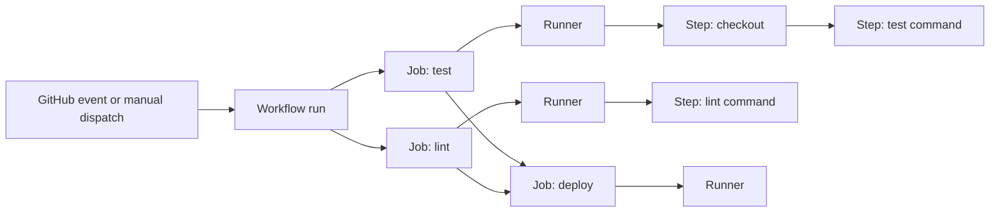

GitHub Actions는 저장소 안에 YAML로 자동화 절차를 정의하고 GitHub 이벤트, 수동 실행, 일정에 따라 실행하는 자동화 플랫폼이다. CI뿐 아니라 배포, 이슈 처리, 릴리스 준비처럼 GitHub의 변경 흐름과 연결된 작업에 사용할 수 있다. 중요한 것은 Workflow 파일을 작성하는 일보다, 어떤 이벤트가 신뢰할 수 있는 입력인지와 어떤 권한으로 어떤 runner에서 실행되는지 명확히 하는 일이다.

> **TL;DR**  
> - Workflow는 `.github/workflows`의 YAML 파일이며, 이벤트가 발생하면 하나 이상의 Job을 실행한다. Job은 runner에서 Step을 순서대로 실행한다.  
> - Job은 기본적으로 병렬 실행되며, `needs`로 선행 Job을 명시한다. Job 간 파일은 자동으로 공유되지 않으므로 artifact, cache, output을 목적에 맞게 사용한다.  
> - Workflow는 권한과 비밀 정보를 다루는 코드다. `permissions`를 최소화하고, 외부 Action은 검토한 전체 commit SHA로 고정한다.  
{: .prompt-info}

---

## 1. 실행 모델부터 이해하기

Workflow는 구성 가능한 자동화 프로세스다. 저장소의 `.github/workflows`에 `.yml` 또는 `.yaml` 파일로 저장하며, `push`, `pull_request`, `workflow_dispatch`, 일정 같은 트리거를 `on`에 선언한다. 하나의 저장소에는 목적이 다른 Workflow를 여러 개 둘 수 있다.

실행은 이벤트에 연결된 commit SHA와 Git ref를 기준으로 시작된다. GitHub는 그 ref에 존재하는 Workflow 파일을 찾아 트리거 조건과 일치하는 것을 실행한다. 따라서 Workflow 변경도 일반 코드 변경처럼 리뷰해야 하며, 기본 브랜치에 파일이 있어야 하는 이벤트 조건도 별도로 확인해야 한다.



이 그림의 `deploy`처럼 선행 작업이 필요한 Job은 `needs`로 의존성을 선언한다. `needs`가 없으면 Job은 서로 독립적으로 실행될 수 있다.

---

## 2. 구성 요소와 실행 경계

### 2.1. Event와 Workflow

**Event**는 Workflow 실행을 시작하는 신호다. 저장소 안의 이벤트 외에 `repository_dispatch`, 예약 실행, 수동 실행도 사용할 수 있다. 이벤트별 payload, 실행 ref, fork에서 온 pull request의 권한 모델은 다르므로, 같은 `push`처럼 보이는 자동화라도 트리거별 보안 경계를 구분해야 한다.

**Workflow**는 Event, 권한, Job을 묶는 최상위 정의다. `concurrency`를 사용하면 같은 배포 대상에 대한 중복 실행을 제어할 수 있고, 환경별 승인은 GitHub Environments로 별도 설계할 수 있다. 이 글의 기본 예제는 테스트 Workflow이므로 배포 권한을 포함하지 않는다.

### 2.2. Job과 Step

**Job**은 runner에서 실행되는 작업 단위다. 한 Job 안의 **Step**은 정의한 순서대로 실행되며, 각 Step은 `run`으로 셸 명령을 실행하거나 `uses`로 Action을 호출한다. 같은 Job의 Step은 작업 디렉터리와 앞 Step이 만든 파일을 이어서 사용할 수 있다.

Job은 별도 실행 환경이다. GitHub-hosted runner를 사용하면 각 Job은 `runs-on`으로 지정한 runner 이미지의 새 인스턴스에서 실행된다. 그러므로 Job 사이에 빌드 결과를 전달해야 한다면 파일이 우연히 남아 있다고 기대하지 말고 artifact, cache, Job output 중 목적에 맞는 방법을 명시한다.

### 2.3. Action과 Runner

**Action**은 재사용 가능한 자동화 단위다. JavaScript, Docker, composite Action 형태로 만들 수 있으며, `uses`에서 호출한다. Action은 편리하지만 Workflow 권한, workspace, 환경 변수와 비밀 정보에 접근할 수 있으므로 일반 의존성과 같은 공급망 검토 대상이다.

**Runner**는 Job을 처리하는 실행 머신이다. `runs-on`으로 GitHub-hosted runner, larger runner, self-hosted runner를 선택한다. GitHub-hosted runner는 관리 부담이 낮고 Job마다 새 인스턴스를 제공한다. self-hosted runner는 사설 네트워크나 특수 하드웨어에 접근할 수 있지만, 작업 간 잔여 파일, 권한, 네트워크 접근, runner 업데이트를 운영자가 책임져야 한다.

---

## 3. 최소 권한의 테스트 Workflow

다음 예시는 push와 pull request에서 테스트 스크립트를 실행하는 최소 구조다. `contents: read`는 checkout에 필요한 읽기 권한만 선언한다. 실제 저장소에서는 사용 언어의 패키지 설치와 테스트 명령으로 `./scripts/test.sh`를 바꾼다.

```yaml
name: test

on:
  push:
  pull_request:

permissions:
  contents: read

jobs:
  test:
    runs-on: ubuntu-latest
    steps:
      - name: Check out source
        uses: actions/checkout@v6
      - name: Run tests
        run: ./scripts/test.sh
```

예제의 `actions/checkout@v6`는 읽기 편의를 위한 태그 표기다. 운영 Workflow에서 외부 Action을 사용할 때는 검토한 전체 commit SHA로 고정해, 태그가 다른 코드로 이동해도 실행 내용이 바뀌지 않게 한다. Action 버전을 갱신할 때는 SHA가 가리키는 코드와 필요한 권한을 다시 검토한다.

배포 Job을 추가할 때는 `test` Job 성공을 `needs: test`로 요구하고, 배포에 필요한 권한만 Job 또는 Workflow 수준에 선언한다. pull request의 사용자 제공 코드와 배포 credential을 같은 신뢰 경계에서 실행하지 않는 것이 안전하다.

---

## 4. 운영 시 자주 놓치는 경계

### 4.1. 권한과 비밀 정보

`GITHUB_TOKEN`의 권한은 `permissions`로 명시적으로 최소화한다. 비밀 정보는 GitHub Secrets나 외부 secret manager에서 주입하고, `run` 명령과 로그에 출력하지 않는다. `pull_request`와 `pull_request_target`은 실행 코드와 권한의 조합이 다르므로, fork의 변경을 다루는 Workflow에서는 특히 이벤트 선택을 검토해야 한다.

### 4.2. runner 선택

GitHub-hosted runner는 ephemeral 환경이 필요한 일반 CI에 적합하다. self-hosted runner는 내부 네트워크 접근이 필요한 경우에만 최소 범위로 사용하고, 신뢰하지 않는 pull request를 같은 runner에서 실행하지 않는다. `runs-on` label은 실행 위치를 결정하는 보안 경계이므로, self-hosted label을 넓게 공유하지 않는다.

### 4.3. 재현성과 관측성

`ubuntu-latest` 같은 이동 태그는 환경 업데이트를 따라간다. 안정적인 재현성이 더 중요하면 특정 runner 이미지를 선택하고, 사용 도구의 버전도 Workflow에서 고정한다. 실패 분석에는 Workflow run의 commit SHA, runner 정보, Step 로그와 artifact를 함께 보관한다. 로그에는 토큰, 인증 헤더, 구성 파일의 비밀 값이 남지 않게 주의한다.

GitHub Actions를 안정적으로 운영하는 기준은 "실행된다"가 아니다. 각 이벤트가 어떤 코드와 입력을 실행하는지, 어느 권한을 얻는지, 어떤 runner에서 실행되는지를 코드 리뷰에서 설명할 수 있어야 한다.

---

## 5. Reference

- [GitHub Docs - Workflows](https://docs.github.com/en/actions/concepts/workflows-and-actions/workflows)
- [GitHub Docs - Workflow syntax for GitHub Actions](https://docs.github.com/en/actions/reference/workflows-and-actions/workflow-syntax)
- [GitHub Docs - Choosing the runner for a job](https://docs.github.com/en/actions/how-tos/write-workflows/choose-where-workflows-run/choose-the-runner-for-a-job)
- [GitHub Docs - Protecting against security threats](https://docs.github.com/en/enterprise-cloud@latest/code-security/tutorials/secure-your-organization/protect-against-threats)

> **궁금하신 점이나 추가해야 할 부분은 댓글이나 아래의 링크를 통해 문의해주세요.**  
> **Written with [KKamJi](https://www.linkedin.com/in/taejikim/)**  
{: .prompt-info}
