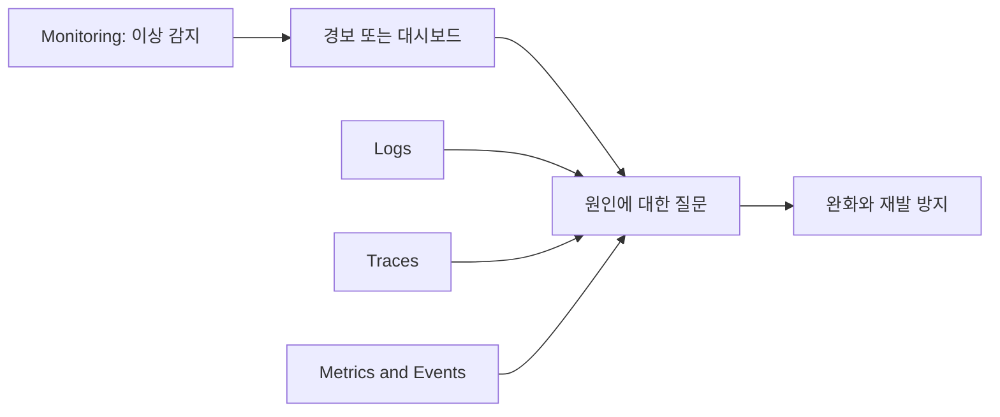

운영 데이터가 많다고 해서 서비스 상태를 잘 이해하는 것은 아닙니다. 먼저 사용자에게 중요한 결과를 정의하고, 그 결과가 나빠졌을 때 빠르게 알리며, 필요한 신호를 연결해 원인을 조사할 수 있어야 합니다. 이 글은 Monitoring과 Observability의 관계, 그리고 이를 서비스 목표로 바꾸는 SLI, SLO, SLA를 정리합니다.

> **TL;DR**  
> - Monitoring은 정해진 질문을 지속적으로 측정하고 알리는 활동이며, Observability는 외부 신호로 시스템 상태를 설명할 수 있는 성질입니다.  
> - SLI는 실제 서비스 품질의 측정값, SLO는 평가 기간 안에 달성하려는 목표, SLA는 고객과 약속한 서비스 수준입니다.  
> - 사용자 여정에서 good events와 total events를 정의하면 SLI, 오류 예산, 경보 정책을 같은 기준으로 연결할 수 있습니다.  
{: .prompt-info}

---

## 1. Monitoring과 Observability

Monitoring은 시스템의 정량 데이터를 수집, 처리, 집계, 표시해 상태를 계속 확인하는 활동입니다. 대시보드와 경보는 이 활동의 결과물입니다. 예를 들어 요청 오류율이 높아졌는지, 특정 노드의 메모리 사용량이 증가하는지를 정해진 질의로 계속 확인합니다.

Observability는 시스템이 낸 출력만으로 내부 상태를 얼마나 설명할 수 있는지를 뜻합니다. 운영에서는 로그, 메트릭, 트레이스, 이벤트를 서로 연결해 예상하지 못했던 질문에도 답할 수 있는 정도로 이해하면 실용적입니다. Observability는 Monitoring을 대체하지 않습니다. 경보가 이상을 알려주고, 충분한 관측 신호가 조사와 복구를 가능하게 합니다.

| 구분 | Monitoring | Observability |
| --- | --- | --- |
| 중심 질문 | 이미 정한 조건이 나빠졌는가 | 새로 발견한 문제를 설명할 단서가 충분한가 |
| 주된 사용 | 대시보드, 추세 확인, 경보 | 임시 질의, 상관관계 분석, 가설 검증 |
| 필요한 설계 | 의미 있는 지표와 경보 기준 | 신호 간 공통 식별자, 적절한 맥락, 탐색 가능성 |
| 관계 | 운영 활동 | 그 활동과 디버깅의 품질을 높이는 시스템 성질 |



---

## 2. 신호를 역할에 맞게 사용하기

흔히 메트릭, 로그, 트레이스를 대표 신호로 묶지만, 세 신호가 모든 문제를 해결하는 것은 아닙니다. 중요한 것은 각 신호가 답할 질문과 연결 기준을 정하는 일입니다.

| 신호 | 잘 답하는 질문 | 설계 시 주의점 |
| --- | --- | --- |
| 메트릭 | 오류율과 지연 시간의 추세가 변했는가 | 라벨 값이 무제한으로 늘어나지 않게 제한 |
| 로그 | 어떤 오류와 입력 조건이 있었는가 | 요청 ID, 서비스, 배포 버전처럼 검색 가능한 맥락 기록 |
| 트레이스 | 어느 호출 구간이 느리거나 실패했는가 | 서비스 경계에서 trace context 전파 |
| 이벤트 | 배포, 설정 변경, Kubernetes 상태 변화가 있었는가 | 시간, 대상, 변경 주체를 함께 남김 |

온라인 서비스는 클라이언트와 서버 양쪽에서 요청 수, 오류, 지연 시간을 관찰할 때 진단력이 높아집니다. 두 지점의 관찰값이 다르면 네트워크 경로나 재시도, 프록시 계층을 조사할 단서가 됩니다. Cilium이나 Kubernetes의 네트워크 흐름 데이터도 이때 서비스, Pod, 정책 변경과 연결할 수 있어야 의미가 있습니다.

---

## 3. SLI, SLO, SLA를 구분하기

| 용어 | 의미 | 예시 |
| --- | --- | --- |
| SLI | 사용자가 경험한 서비스 수준을 나타내는 측정값 | 300 ms 안에 성공한 결제 요청 수 / 전체 유효 결제 요청 수 |
| SLO | 평가 기간 안에 SLI가 달성해야 하는 목표 | 최근 28일 동안 위 비율 99.9% 이상 |
| SLA | 고객 또는 파트너와 합의한 서비스 수준과 책임 | 월 가용성 기준과 미달 시 서비스 크레딧 조건 |

SLA가 항상 특정한 법적 형식을 뜻하는 것은 아니지만, 외부 약속에는 측정 방법, 제외 조건, 책임과 보상 조건을 명확히 해야 합니다. 반면 SLO는 팀이 신뢰성과 기능 개발의 균형을 결정하는 내부 운영 목표로 사용할 수 있습니다.

### 3.1. SLI는 명세와 구현을 함께 적는다

좋은 SLI는 먼저 사용자 관점의 성공을 문장으로 정의합니다. 이를 SLI 명세라고 합니다. 다음으로 그 결과를 어떤 데이터로 계산할지 정합니다. 이것이 SLI 구현입니다.

```text
SLI 명세: 로그인 요청이 300 ms 안에 성공한다.
SLI 구현: 300 ms 이하이며 성공한 로그인 요청 수 / 전체 유효 로그인 요청 수
```

분모와 분자를 명확히 하면 재시도, 취소 요청, 점검 시간, 잘못된 요청을 어떤 쪽에 넣을지 합의할 수 있습니다. 서버 로그만 사용하면 백엔드에 도달하지 못한 요청을 놓칠 수 있으므로, 사용자 여정에 맞는 측정 지점을 선택해야 합니다.

### 3.2. 오류 예산은 의사결정 기준이다

평가 기간이 정해진 SLO에서 오류 예산은 `100% - SLO 목표`입니다. 예를 들어 28일 SLO가 99.9%이고 대상 요청이 1,000,000건이면, 허용되는 bad event는 1,000건입니다. 예산이 빠르게 줄어들면 기능 배포보다 완화, 복구, 재발 방지에 우선순위를 둘 근거가 생깁니다.

경보는 단순히 현재 오류율이 SLO 목표보다 높다는 이유만으로 만들기보다, 단기간에 오류 예산의 의미 있는 비율을 소모하는 사건을 알리도록 설계합니다. 이 방식은 작은 일시 오류와 지속적인 사용자 영향을 구분하는 데 도움이 됩니다.

---

## 4. 사용자 여정에서 시작하는 적용 순서

1. 로그인, 검색, 결제처럼 실패 비용이 큰 사용자 여정을 선택합니다.
2. 성공과 bad event의 기준, 분자와 분모, 평가 기간을 문서화합니다.
3. SLI 구현에 필요한 메트릭을 계측하고, 로그와 트레이스에 공통 요청 맥락을 남깁니다.
4. SLO와 오류 예산을 정한 뒤, 빠른 예산 소모에만 긴급 경보를 연결합니다.
5. 경보가 울렸을 때 볼 대시보드와 조사 절차를 연결하고, 실제 사고 뒤 기준을 갱신합니다.

처음부터 모든 지표를 수집하려고 하면 비용과 운영 복잡도만 커지기 쉽습니다. 한 개의 중요한 여정을 끝까지 측정하고 대응하는 흐름을 먼저 만든 뒤 범위를 넓히는 편이 좋습니다.

---

## 5. 마무리

Monitoring은 정해진 이상을 놓치지 않게 하고, Observability는 낯선 문제의 원인을 설명할 수 있게 합니다. SLI, SLO, SLA는 이 기술적 신호를 사용자 품질과 조직의 약속으로 연결합니다. 핵심은 도구 목록이 아니라 사용자가 기대하는 결과와 이를 측정하는 일관된 정의입니다.

---

## 6. Reference

- [Google SRE Book - Monitoring Distributed Systems](https://sre.google/sre-book/monitoring-distributed-systems/)
- [Google SRE Book - Service Level Objectives](https://sre.google/sre-book/service-level-objectives/)
- [Google SRE Workbook - Implementing SLOs](https://sre.google/workbook/implementing-slos/)
- [Google SRE Workbook - Alerting on SLOs](https://sre.google/workbook/alerting-on-slos/)
- [Prometheus - Instrumentation](https://prometheus.io/docs/practices/instrumentation/)
- [Cilium Docs - Hubble observability](https://docs.cilium.io/en/stable/observability/hubble/)

---

> **궁금하신 점이나 추가해야 할 부분은 댓글이나 아래의 링크를 통해 문의해주세요.**  
> **Written with [KKamJi](https://www.linkedin.com/in/taejikim/)**  
{: .prompt-info}
