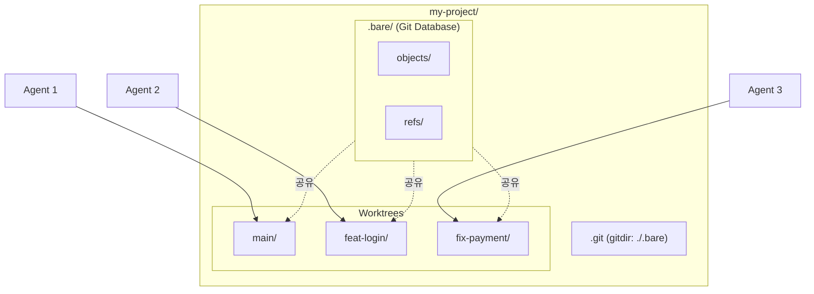

AI 코딩 에이전트(Claude Code, Cursor 등)를 활용한 개발이 보편화되면서, **여러 에이전트가 동시에 작업할 때 발생하는 충돌과 컨텍스트 오염 문제**가 새로운 과제로 떠오르고 있습니다. 이 글에서는 Git Worktree를 활용하여 **병렬 Multi-Agent 개발 환경**을 구축하는 방법을 다룹니다.

> **TL;DR**
> - **Git Worktree**: 하나의 저장소에서 여러 브랜치를 동시에 체크아웃하여 독립된 폴더에서 작업
> - **Bare Repository 방식**: `.bare/` 폴더에 Git DB를 두고, 모든 브랜치를 worktree로 관리
> - **Multi-Agent 활용**: 각 AI 에이전트에게 독립된 worktree 할당 → 충돌 없는 병렬 작업
{: .prompt-info}

---

## 1. Quick Start

### 1.1. Bare Repository 초기 설정

```shell
# 프로젝트 디렉토리 생성
mkdir my-project && cd my-project

# Bare repository clone
git clone --bare https://github.com/user/repo.git .bare

# Git이 .bare를 인식하도록 설정
echo "gitdir: ./.bare" > .git

# 원격 브랜치 추적 활성화
git config remote.origin.fetch "+refs/heads/*:refs/remotes/origin/*"

# 원격 브랜치 정보 가져오기
git fetch origin

# main 브랜치 worktree 생성
git worktree add main main
```

### 1.2. Worktree 생성/삭제

```shell
# 기존 원격 브랜치 기반 worktree 생성 (로컬 브랜치 생성 + upstream 추적)
git worktree add staging -b staging origin/staging

# 새 브랜치 생성과 동시에 worktree 생성
git worktree add feat-login -b feat/login main

# worktree 삭제
git worktree remove feat-login

# 브랜치도 함께 삭제 (merge 완료 후)
git branch -d feat/login
```

### 1.3. 최종 디렉토리 구조

```
my-project/
├── .bare/              # Git 데이터베이스 (순수 저장소)
├── .git                # gitdir: ./.bare (포인터 파일)
├── main/               # main 브랜치 작업 공간
├── staging/            # staging 브랜치 작업 공간
└── feat-login/         # feat/login 브랜치 작업 공간
```

---

## 2. 왜 Bare Repository인가?

### 2.1. 기본 방식의 한계

일반 `git clone`은 메인 디렉토리가 특정 브랜치에 묶입니다.

```shell
# 기본 방식
git clone https://github.com/user/project.git
cd project
git worktree add ../feat feature-branch

# 문제: project/ 디렉토리의 main 브랜치는 다른 worktree에서 체크아웃 불가
```

### 2.2. Bare Repository 방식

Bare Repository는 **작업 디렉토리 없이 Git 데이터만 보관**합니다. 모든 브랜치를 동등하게 worktree로 관리할 수 있습니다.



---

## 3. 실무 워크플로우

### 3.1. 시나리오: 긴급 버그 수정

**상황:** feature 브랜치 작업 중 긴급 production 버그 수정 요청

#### 기존 방식 (stash 필요)

```shell
git stash save "feature work in progress"
git checkout main && git pull
git checkout -b hotfix/critical-bug
# ... 수정 ...
git commit && git push
git checkout feature-branch
git stash pop  # 충돌 가능
```

#### Worktree 방식 (컨텍스트 유지)

```shell
# 현재 작업 유지한 채 hotfix worktree 생성
git worktree add hotfix-critical -b hotfix/critical-bug main

# 새 터미널에서 수정
cd hotfix-critical
# ... 수정 ...
git commit && git push

# 정리
git worktree remove hotfix-critical
```

### 3.2. 시나리오: Multi-Agent 병렬 작업

```shell
# 작업 분리: UI 수정 + 버그 수정
git worktree add feat-ui -b feat/ui-update main
git worktree add fix-payment -b fix/payment-bug main

# 터미널 1: Agent A (UI 작업)
cd feat-ui && claude

# 터미널 2: Agent B (버그 수정)
cd fix-payment && claude

# 각 에이전트는 독립된 파일 시스템에서 작업
# 충돌 없음, 컨텍스트 분리됨
```

### 3.3. Pull/Fetch 방법

```shell
# 방법 1: worktree 내에서 직접 (upstream 설정 필요)
cd main
git pull origin main

# 방법 2: fetch 후 merge (권장)
git fetch origin              # 프로젝트 루트 또는 아무 worktree에서
cd main && git merge origin/main

# 방법 3: 프로젝트 루트에서 -C 옵션 사용
git -C main pull origin main
```

---

## 4. 트러블슈팅

### 4.1. `git pull` 시 "현재 어떤 브랜치 위에도 있지 않습니다"

**원인:** Bare repository에서 생성한 로컬 브랜치가 upstream을 추적하지 않음

```shell
# 현재 상태 확인
git branch -vv
# staging  abc1234 [origin/staging이 없음] commit message

# 해결: upstream 설정
git branch --set-upstream-to=origin/staging staging
git pull
```

**예방:** worktree 생성 시 `-b` 옵션으로 로컬 브랜치 생성

```shell
# 로컬 브랜치 생성 + 원격 브랜치 추적 (권장)
git worktree add staging -b staging origin/staging
```

> **주의:** `git worktree add staging origin/staging` (without `-b`)은 **detached HEAD** 상태가 됩니다. 반드시 `-b` 옵션으로 로컬 브랜치를 생성하세요.
{: .prompt-warning}

### 4.2. 같은 브랜치 중복 체크아웃 불가

```shell
git worktree add main2 main
# fatal: 'main' is already checked out at '/path/to/main'
```

**해결:** 하나의 브랜치는 하나의 worktree에서만 체크아웃 가능 (Git 설계상 제한)

### 4.3. Dependency 디렉토리 (node_modules, venv 등)

각 worktree는 독립된 파일 시스템이므로 **각각 설치 필요**

```shell
cd main && npm install
cd ../feat-login && npm install
```

> **Tip:** pnpm, yarn berry 등 링크 기반 패키지 매니저를 사용하면 디스크 공간 절약 가능
{: .prompt-tip}

### 4.4. IDE에서 여러 Worktree 열기

```shell
# VS Code: 멀티 루트 워크스페이스
code main feat-login fix-payment
```

---

## 5. 명령어 치트시트

| 작업                         | 명령어                                            |
| :--------------------------- | :------------------------------------------------ |
| Worktree 목록 확인           | `git worktree list`                               |
| 기존 브랜치로 Worktree 생성  | `git worktree add <path> <branch>`                |
| 새 브랜치로 Worktree 생성    | `git worktree add <path> -b <new-branch> <base>`  |
| 원격 브랜치로 Worktree 생성  | `git worktree add <path> -b <branch> origin/<branch>` |
| Worktree 삭제                | `git worktree remove <path>`                      |
| 강제 삭제 (uncommitted 있을 때) | `git worktree remove --force <path>`           |
| 삭제된 Worktree 메타데이터 정리 | `git worktree prune`                           |
| Upstream 설정                | `git branch --set-upstream-to=origin/<branch>`   |

---

## 6. 마무리

Git Worktree + Bare Repository 조합은 **Multi-Agent 개발 환경의 핵심 인프라**입니다.

| 관점       | 이점                                           |
| :--------- | :--------------------------------------------- |
| **격리**   | 각 작업이 독립된 공간에서 진행, 충돌 원천 차단 |
| **병렬성** | 여러 에이전트가 동시 작업 가능                 |
| **안전**   | 실패한 작업만 폐기, main 브랜치 보호           |
| **단순**   | stash/switch 없이 폴더 이동으로 브랜치 전환    |

---

## 7. Reference

- [Git Docs - git-worktree](https://git-scm.com/docs/git-worktree)
- [Atlassian - Git Worktree](https://www.atlassian.com/git/tutorials/git-worktree)
- [GitHub Blog - Working with multiple worktrees](https://github.blog/open-source/git/highlights-from-git-2-42/#working-with-multiple-worktrees)

---

> **궁금하신 점이나 추가해야 할 부분은 댓글이나 아래의 링크를 통해 문의해주세요.**
> **Written with [KKamJi](https://www.linkedin.com/in/taejikim/)**
{: .prompt-info}
