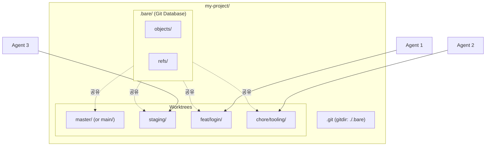

AI 코딩 에이전트(Claude Code, Cursor 등)를 활용한 개발이 보편화되면서, **여러 에이전트가 동시에 작업할 때 발생하는 충돌과 컨텍스트 오염 문제**가 새로운 과제로 떠오르고 있습니다. 이 글에서는 Git Worktree를 활용하여 **병렬 Multi-Agent 개발 환경**을 구축하는 방법을 다룹니다.

> **TL;DR**
> - **Git Worktree**: 하나의 저장소에서 여러 브랜치를 동시에 체크아웃하여 독립된 폴더에서 작업
> - **Bare Repository 방식**: `.bare/` 폴더에 Git DB를 두고, 모든 브랜치를 worktree로 관리
> - **Multi-Agent 활용**: 각 AI 에이전트에게 독립된 worktree 할당 → 컨텍스트 분리 및 충돌 위험 감소
> - **wt CLI 도구**: `wt init` 한 줄로 bare repo + worktree 자동 설정 ([GitHub](https://github.com/KKamJi98/kkamji-lab/tree/main/tools/git-worktree-tool))
{: .prompt-info}

---

## 1. Quick Start

> **환경 기준:** Git 2.52.0
{: .prompt-info}

### 1.1. Bare Repository 초기 설정

```shell
# 프로젝트 디렉토리 생성
mkdir my-project && cd my-project

# Bare repository clone
git clone --bare https://github.com/user/repo.git .bare

# Git이 .bare를 인식하도록 설정
echo "gitdir: ./.bare" > .git

# 원격 브랜치 추적 활성화 (이미 설정되어 있으면 생략)
git config remote.origin.fetch "+refs/heads/*:refs/remotes/origin/*"

# 원격 브랜치 정보 가져오기
git fetch origin

# 기본 브랜치 확인 (main/master 등)
BASE_BRANCH=$(git remote show origin | sed -n 's/.*HEAD branch: //p')
# HEAD 정보가 비어 있으면 갱신 후 재확인
[ -z "$BASE_BRANCH" ] && git remote set-head origin -a
BASE_BRANCH=$(git remote show origin | sed -n 's/.*HEAD branch: //p')
# 출력이 비어있다면 기본 브랜치를 수동 지정
# BASE_BRANCH=main

# 기본 브랜치 worktree 생성 (로컬 브랜치 + start-point 명시)
git worktree add "$BASE_BRANCH" -b "$BASE_BRANCH" "origin/$BASE_BRANCH"

# 필요 시 upstream 명시 (환경에 따라 자동 추적이 안 될 수 있음)
git -C "$BASE_BRANCH" branch --set-upstream-to="origin/$BASE_BRANCH" "$BASE_BRANCH"
```

> **Note:** 루트 디렉토리는 컨트롤 영역이며 실제 작업은 각 worktree 디렉토리에서 수행합니다.
{: .prompt-tip}

### 1.2. Worktree 생성/삭제

```shell
# (선택) 카테고리 루트 준비 (non-flat 경로용)
mkdir -p feat chore fix hotfix

# 기존 원격 브랜치 기반 worktree 생성 (로컬 브랜치 생성)
git worktree add staging -b staging origin/staging
# (선택) upstream 명시
git -C staging branch --set-upstream-to=origin/staging staging

# 새 브랜치 생성과 동시에 worktree 생성 (non-flat 브랜치 예시)
# BASE_BRANCH는 1.1에서 확인한 기본 브랜치
git worktree add feat/login -b feat/login "$BASE_BRANCH"

# worktree 삭제
git worktree remove feat/login

# 브랜치도 함께 삭제 (merge 완료 후)
git branch -d feat/login
```

### 1.3. 최종 디렉토리 구조

```
my-project/
├── .bare/              # Git 데이터베이스 (순수 저장소)
├── .git                # gitdir: ./.bare (포인터 파일)
├── master/             # 기본 브랜치 (main 또는 master)
├── staging/
├── feat/
│   └── login/           # feat/login 브랜치 작업 공간 (non-flat)
└── chore/
    └── tooling/         # chore/tooling 브랜치 작업 공간 (non-flat)
```

---

## 2. 왜 Bare Repository인가?

### 2.1. 기본 방식의 한계

일반 `git clone`은 메인 디렉토리가 특정 브랜치에 묶입니다.

```shell
# 기본 방식
git clone https://github.com/user/project.git
cd project
git worktree add ../feat feature-branch

# 문제: project/ 디렉토리의 기본 브랜치는 다른 worktree에서 체크아웃 불가
```

### 2.2. Bare Repository 방식

Bare Repository는 **작업 디렉토리 없이 Git 데이터만 보관**합니다. 모든 브랜치를 동등하게 worktree로 관리할 수 있습니다.



---

## 3. 실무 워크플로우

### 3.1. 시나리오: 긴급 버그 수정

**상황:** feature 브랜치 작업 중 긴급 production 버그 수정 요청

#### 3.1.1. 기존 방식 (stash 필요)

```shell
git stash save "feature work in progress"
git checkout main && git pull  # main/master
git checkout -b hotfix/critical-bug
# ... 수정 ...
git commit && git push
git checkout feature-branch
git stash pop  # 충돌 가능
```

#### 3.1.2. Worktree 방식 (컨텍스트 유지)

```shell
# 현재 작업 유지한 채 hotfix worktree 생성
# BASE_BRANCH는 1.1에서 확인한 기본 브랜치
git worktree add hotfix/critical-bug -b hotfix/critical-bug "$BASE_BRANCH"

# 새 터미널에서 수정
cd hotfix/critical-bug
# ... 수정 ...
git commit && git push

# 정리
git worktree remove hotfix/critical-bug
```

### 3.2. 시나리오: Multi-Agent 병렬 작업

```shell
# 작업 분리: UI 수정 + 버그 수정
git worktree add feat/ui-update -b feat/ui-update "$BASE_BRANCH"
git worktree add fix/payment-bug -b fix/payment-bug "$BASE_BRANCH"

# 터미널 1: Agent A (UI 작업)
cd feat/ui-update && claude

# 터미널 2: Agent B (버그 수정)
cd fix/payment-bug && claude

# 각 에이전트는 독립된 파일 시스템에서 작업
# 작업 디렉토리 충돌은 줄어들지만, 병합 충돌은 여전히 가능
```

### 3.3. Pull/Fetch 방법

```shell
# 방법 1: worktree 내에서 직접 (upstream 설정 필요)
# BASE_BRANCH는 1.1에서 확인한 기본 브랜치
cd "$BASE_BRANCH"
git pull origin "$BASE_BRANCH"

# 방법 2: fetch 후 merge (권장)
git fetch origin              # 프로젝트 루트 또는 아무 worktree에서
cd "$BASE_BRANCH" && git merge "origin/$BASE_BRANCH"

# 방법 3: 프로젝트 루트에서 -C 옵션 사용
git -C "$BASE_BRANCH" pull origin "$BASE_BRANCH"
```

### 3.4. 브랜치 이름과 Worktree 경로 규칙

브랜치 이름과 worktree 경로를 동일하게 맞추면 **추적성과 자동화**가 좋아집니다. 다만 `feat/login`처럼 슬래시가 있는 브랜치는 디렉토리가 **non-flat(중첩)**으로 생성됩니다.

**권장 규칙**
- 기본은 동일 경로 사용: `<branch>` (루트 기준)
- 중첩이 부담되면 `/`를 `-`로 치환한 flat 경로 사용 (단, 타입 디렉토리 분리는 포기)
- 어떤 규칙이든 문서화하여 모든 에이전트가 동일하게 적용

**예시**
- 동일 경로: `feat/login` → `feat/login`
- Flat 매핑: `feat/login` → `feat-login` (규칙 문서화)

### 3.5. Multi-Agent 컨텍스트 공유 & 충돌 방지

worktree는 작업 디렉토리를 분리하지만, **최종 통합 충돌은 여전히 발생**합니다. 아래 운영 규칙을 함께 두면 효과가 커집니다.

- 역할별 브랜치/워크트리 명확화 (예: `feat/ui-agent-a`, `fix/payment-agent-b`)
- 공통 컨텍스트 문서에 목표/결정/파일 범위를 짧게 기록 (예: 이슈/PR/공유 문서)
- 파일/컴포넌트 소유권을 합의해 중복 수정 최소화
- 주기적 `git fetch` 후 rebase/merge로 충돌을 조기 발견
- 큰 변경은 기능 플래그/인터페이스 분리로 격리

---

## 4. 트러블슈팅

### 4.1. `git pull` 시 "현재 어떤 브랜치 위에도 있지 않습니다"

**원인:** 원격 브랜치를 직접 worktree로 추가하여 **detached HEAD** 상태가 됨

```shell
git worktree add staging origin/staging
```

**해결:** 로컬 브랜치를 생성하고 원격을 추적하도록 변경

```shell
git worktree add staging -b staging origin/staging
# 또는 이미 생성된 worktree라면
git -C staging switch -c staging --track origin/staging
```

> **주의:** `git worktree add worktrees/staging origin/staging` (without `-b`)은 **detached HEAD** 상태가 됩니다. 반드시 `-b` 옵션으로 로컬 브랜치를 생성하세요.
{: .prompt-warning}

### 4.2. `git pull` 시 "There is no tracking information for the current branch"

**원인:** 로컬 브랜치가 upstream을 추적하지 않음

```shell
# 현재 상태 확인
git branch -vv
# staging  abc1234 [origin/staging이 없음] commit message

# 해결: upstream 설정
git branch --set-upstream-to=origin/staging staging
git pull
```

### 4.3. 같은 브랜치 중복 체크아웃 불가

```shell
git worktree add main2 main
# fatal: 'main' is already checked out at '/path/to/main'
```

**해결:** 하나의 브랜치는 하나의 worktree에서만 체크아웃 가능 (Git 설계상 제한)

### 4.4. Dependency 디렉토리 (node_modules, venv 등)

각 worktree는 독립된 파일 시스템이므로 **각각 설치 필요**

```shell
# BASE_BRANCH는 1.1에서 확인한 기본 브랜치
cd "$BASE_BRANCH" && npm install
cd feat/login && npm install
```

> **Tip:** pnpm, yarn berry 등 링크 기반 패키지 매니저를 사용하면 디스크 공간 절약 가능
{: .prompt-tip}

### 4.5. IDE에서 여러 Worktree 열기

```shell
# VS Code: 멀티 루트 워크스페이스
# BASE_BRANCH는 1.1에서 확인한 기본 브랜치
code "$BASE_BRANCH" feat/login fix/payment-bug
```

### 4.6. 새 브랜치 생성 후 `git push` 실패

**원인:** `wt add -c` 또는 `wt add -c --base`로 생성한 새 브랜치는 remote에 없어서 upstream이 설정되지 않음

```shell
git push
# fatal: The upstream branch of your current branch does not match
# the name of your current branch.
```

**해결:** 첫 push 시 `-u` 옵션으로 upstream 설정

```shell
git push -u origin HEAD
```

---

## 5. 명령어 치트시트

| 작업                         | 명령어                                            |
| :--------------------------- | :------------------------------------------------ |
| Worktree 목록 확인           | `git worktree list`                               |
| 기존 브랜치로 Worktree 생성  | `git worktree add <path> <branch>`                |
| 새 브랜치로 Worktree 생성    | `git worktree add <path> -b <new-branch> <base>`  |
| 원격 브랜치로 Worktree 생성  | `git worktree add <path> -b <branch> origin/<branch>` |
| Worktree 삭제                | `git worktree remove <path>`                      |
| 강제 삭제 (uncommitted 있을 때) | `git worktree remove --force <path>`           |
| 삭제된 Worktree 메타데이터 정리 | `git worktree prune`                           |
| Upstream 설정                | `git branch --set-upstream-to=origin/<branch>`   |

---

## 6. wt CLI 도구로 자동화하기

지금까지 수동으로 bare repository와 worktree를 설정하는 방법을 알아보았습니다. 하지만 매번 이런 명령어들을 입력하는 것은 번거롭습니다. **wt(git-worktree-tool)**는 이 과정을 자동화해주는 CLI 도구입니다.

### 6.1. 설치

[wt 도구](https://github.com/KKamJi98/kkamji-lab/tree/main/tools/git-worktree-tool)는 Python 3.9+ 환경에서 `uv`를 통해 설치할 수 있습니다.

```bash
# uv가 없다면 먼저 설치
curl -LsSf https://astral.sh/uv/install.sh | sh

# wt 도구 설치
uv tool install git+https://github.com/KKamJi98/kkamji-lab.git#subdirectory=tools/git-worktree-tool
```

### 6.2. 빠른 시작: wt init

앞서 설명한 복잡한 초기 설정 과정을 **한 줄**로 완료할 수 있습니다.

```bash
# 수동 설정 (기존 방식)
mkdir my-project && cd my-project
git clone --bare https://github.com/user/repo.git .bare
echo "gitdir: ./.bare" > .git
git config remote.origin.fetch "+refs/heads/*:refs/remotes/origin/*"
git fetch origin
git worktree add main -b main origin/main
git -C main branch --set-upstream-to=origin/main main

# wt init 사용 (자동화)
wt init https://github.com/user/repo.git my-project
```

추가 브랜치 worktree도 함께 생성할 수 있습니다.

```bash
wt init https://github.com/user/repo.git my-project -w staging,develop
```

**생성 결과:**

```
my-project/
├── .bare/       # bare repository (fetch refspec 자동 설정)
├── main/        # 기본 브랜치 worktree
├── staging/     # 추가 worktree
└── develop/     # 추가 worktree
```

### 6.3. Worktree 관리

```bash
# 기존 브랜치로 worktree 추가
wt add staging

# 새 브랜치 생성하면서 worktree 추가
wt add feat/my-feature -c

# 특정 브랜치 기반으로 새 브랜치 생성 (예: staging에서 분기)
wt add chore/test123 -c --base staging

# 새 브랜치는 remote에 없으므로 첫 push 시 -u 옵션 필요
cd chore-test123
git push -u origin HEAD

# worktree 삭제
wt remove staging

# 강제 삭제 (uncommitted 변경이 있어도)
wt remove staging -f
```

### 6.4. 상태 확인 및 동기화

```bash
# 모든 worktree 상태 확인
wt status

# 출력 예시:
# STATUS   BRANCH      SYNC           PATH
# -------- ----------- -------------- ---------------------------
# CLEAN    main        =              /path/to/repo/main
# CLEAN    staging     ↓3             /path/to/repo/staging
# DIRTY    feat/login  ↑2             /path/to/repo/feat-login
#
# Summary: total=3 clean=2 dirty=1
```

```bash
# 원격에서 fetch (bare repo에서 실행)
wt fetch

# fetch + 모든 worktree 동기화 (ff-only)
wt pull

# rebase 모드로 동기화
wt pull --rebase
```

### 6.5. 명령어 요약

| 명령어 | 별칭 | 설명 |
| :----- | :--- | :--- |
| `wt init <url> [path]` | - | 새 bare repo + worktree 초기화 |
| `wt add <branch>` | `a` | worktree 추가 |
| `wt add <branch> -c` | `a -c` | 새 브랜치 생성하며 worktree 추가 |
| `wt add <branch> -c -b <base>` | `a -c -b` | 특정 브랜치 기반으로 새 브랜치 생성 |
| `wt remove <branch>` | `rm` | worktree 삭제 |
| `wt status` | `st` | 모든 worktree 상태 확인 |
| `wt fetch` | `f` | `git fetch --all --prune` |
| `wt pull` | `p` | fetch + ff-only (기본) |
| `wt pull -r` | `p -r` | fetch + rebase |
| `wt list` | `ls` | worktree 목록 |
| `wt upstream` | `up` | upstream 자동 설정 |

---

## 7. 마무리

Git Worktree + Bare Repository 조합은 **Multi-Agent 개발 환경의 핵심 인프라**입니다.

| 관점       | 이점                                           |
| :--------- | :--------------------------------------------- |
| **격리**   | 각 작업이 독립된 공간에서 진행, 작업 디렉토리 충돌 감소 |
| **병렬성** | 여러 에이전트가 동시 작업 가능                 |
| **안전**   | 실패한 작업만 폐기, 기본 브랜치 보호           |
| **단순**   | stash/switch 없이 폴더 이동으로 브랜치 전환    |

수동 설정이 부담스럽다면 `wt init` 명령어로 간편하게 시작하세요!

---

## 8. Reference

- [Git Docs: git-worktree](https://git-scm.com/docs/git-worktree)
- [Atlassian: Git Worktree](https://www.atlassian.com/git/tutorials/git-worktree)
- [GitHub Blog: Working with Multiple Worktrees](https://github.blog/open-source/git/highlights-from-git-2-42/#working-with-multiple-worktrees)

---

> **궁금하신 점이나 추가해야 할 부분은 댓글이나 아래의 링크를 통해 문의해주세요.**  
> **Written with [KKamJi](https://www.linkedin.com/in/taejikim/)**  
{: .prompt-info}
