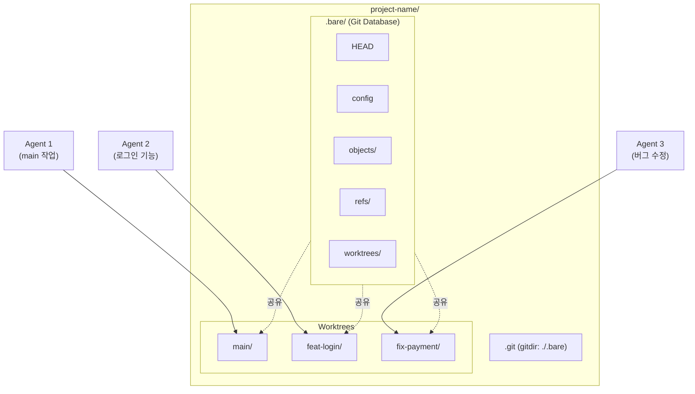
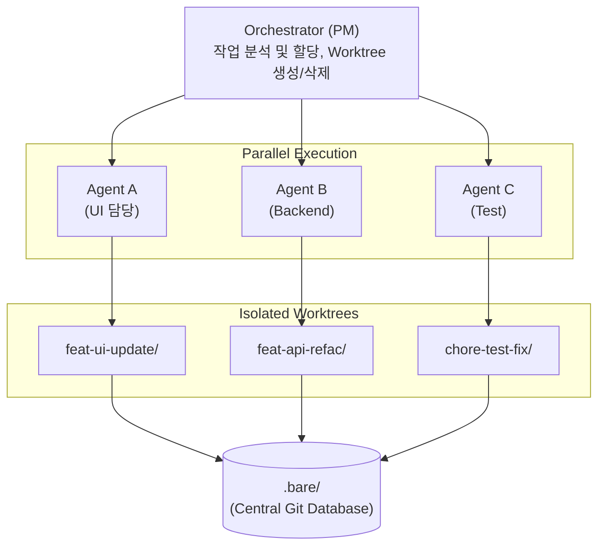

AI 코딩 에이전트(Claude Code, Cursor 등)를 활용한 개발이 보편화되면서, **여러 에이전트가 동시에 작업할 때 발생하는 충돌과 컨텍스트 오염 문제**가 새로운 과제로 떠오르고 있습니다. 이 글에서는 Git Worktree를 활용하여 이러한 문제를 해결하고, **병렬 Multi-Agent 개발 환경**을 구축하는 방법을 다룹니다.

> **TL;DR**
> - **Git Worktree**: 하나의 저장소에서 여러 브랜치를 동시에 체크아웃하여 독립된 폴더에서 작업
> - **Bare Repository 방식**: `.bare/` 폴더에 Git DB를 두고, 모든 브랜치를 worktree로 관리
> - **Multi-Agent 활용**: 각 AI 에이전트에게 독립된 worktree 할당 → 충돌 없는 병렬 작업, 토큰 비용 절감
> - **핵심 명령어**: `git worktree add <path> -b <branch> <base>`, `git worktree remove <path>`
{: .prompt-info}

---

## 1. Git Worktree란?

Git Worktree는 **하나의 Git 저장소에서 여러 개의 작업 디렉토리(Working Directory)를 동시에 관리**할 수 있게 해주는 기능입니다. 각 Worktree는 독립적인 브랜치를 체크아웃하여 작업할 수 있으며, 모든 Worktree는 동일한 `.git` 데이터베이스를 공유합니다.

### 1.1. 기본 방식 vs Bare Repository 방식

Git Worktree를 사용하는 방법에는 **기본 방식**과 **Bare Repository 방식** 두 가지가 있습니다.

#### 기본 방식 (Standard Clone + Worktree)

일반적인 `git clone` 후 worktree를 추가하는 방식입니다.

```
project-name/
├── .git/                    # Git 데이터베이스
├── src/                     # main 브랜치의 소스 코드
├── README.md
└── ...
```

```shell
# 기본 clone 후 worktree 추가
git clone https://github.com/user/project.git
cd project
git worktree add ../project-feature feature-branch
```

이 방식의 단점은 **메인 디렉토리가 특정 브랜치에 묶여 있다**는 것입니다. 메인 디렉토리에서 작업 중인 브랜치는 다른 worktree에서 체크아웃할 수 없습니다.

#### Bare Repository 방식 (권장)

Bare Repository는 **작업 디렉토리 없이 `.git` 데이터만 보관**하는 저장소입니다. 모든 브랜치를 worktree로 관리하여 **완전한 대칭성**을 확보합니다.

```
project-name/
├── .bare/                   # Bare repository (순수 Git 데이터베이스)
├── .git                     # .bare를 가리키는 파일 (gitdir: ./.bare)
├── main/                    # main 브랜치 worktree
│   ├── src/
│   ├── README.md
│   └── ...
├── staging/                 # staging 브랜치 worktree
│   ├── src/
│   └── ...
├── feat-login/              # feat/login 브랜치 worktree
│   ├── src/
│   └── ...
├── fix-payment/             # fix/payment 브랜치 worktree
│   ├── src/
│   └── ...
└── chore-docs/              # chore/docs 브랜치 worktree
    ├── src/
    └── ...
```

```shell
# Bare Repository 방식으로 설정
git clone --bare https://github.com/user/project.git .bare
echo "gitdir: ./.bare" > .git

# remote fetch 설정 (push 시 기본 브랜치 설정)
git -C .bare config remote.origin.fetch "+refs/heads/*:refs/remotes/origin/*"

# main 브랜치 worktree 생성
git worktree add main main

# feature 브랜치 worktree 생성 (브랜치명: feat/login, 경로: feat-login)
git worktree add feat-login -b feat/login main
```

> **Bare Repository 방식의 장점:**
> - 모든 브랜치가 동등한 위치에서 관리됨
> - 특정 브랜치가 "잠기는" 문제 없음
> - Multi-Agent 환경에서 각 에이전트에게 독립된 작업 공간 제공
{: .prompt-tip}

### 1.2. Worktree 구조 시각화



---

## 2. Git Worktree의 장점

### 2.1. Stash 지옥 탈출

기존 방식에서는 브랜치를 전환할 때마다 `git stash`로 작업 내용을 저장해야 했습니다.

```shell
# 기존 방식: stash의 반복
git stash                    # 현재 작업 저장
git checkout other-branch    # 브랜치 전환
# ... 작업 ...
git checkout original-branch # 원래 브랜치로 복귀
git stash pop                # 저장했던 작업 복원
```

**문제점:**
- `stash list`가 쌓이면서 어떤 stash가 어떤 작업인지 혼란
- `git stash pop` 시 충돌 발생 가능
- 작업 컨텍스트 손실

**Worktree 방식:**
```shell
# 별도의 worktree에서 작업 - stash 불필요
cd ../feat-login     # 다른 worktree로 이동
# ... 작업 ...
cd ../main           # 원래 worktree로 복귀 (작업 내용 그대로 유지)
```

### 2.2. 브랜치 전환 없이 코드 참조

기존에 다른 브랜치의 코드를 참조하려면 `git switch`로 브랜치를 전환해야 했습니다.

```shell
# 기존 방식: 브랜치 전환 필요
git switch feature-branch    # 코드 확인을 위해 전환
# ... 코드 확인 ...
git switch main              # 다시 원래 브랜치로
```

**Worktree 방식:**
```shell
# 파일 시스템에서 직접 참조 가능
cat ../feat-login/src/auth.js    # 다른 worktree의 파일 직접 확인
diff main/src/app.js feat-login/src/app.js  # 브랜치 간 파일 비교
```

### 2.3. 동시 다중 작업

여러 기능을 동시에 개발하면서 각각의 빌드/테스트 환경을 유지할 수 있습니다.

```shell
# 터미널 1: main에서 빌드 서버 실행 (포트 3000)
cd main && npm run dev

# 터미널 2: feature 브랜치에서 테스트 (포트 3001)
cd ../feat-login && PORT=3001 npm run dev

# 터미널 3: 버그 수정 브랜치에서 디버깅
cd ../fix-payment && npm run debug
```

### 2.4. 안전한 실험 환경

Worktree는 독립된 작업 공간이므로, 실험적인 코드 변경이 다른 작업에 영향을 주지 않습니다.

```shell
# 실험용 worktree 생성
git worktree add experiment-crazy-idea -b experiment/crazy-idea

# 실험 실패 시 깔끔하게 삭제
git worktree remove experiment-crazy-idea
git branch -D experiment/crazy-idea
```

---

## 3. 기존 Git 사용법 vs Git Worktree 사용법 비교

### 3.1. 시나리오: 긴급 버그 수정 요청

**상황:** feature 브랜치에서 작업 중 긴급한 production 버그 수정 요청이 들어옴

#### 기존 방식

```shell
# 1. 현재 작업 저장
git stash save "feature work in progress"

# 2. main 브랜치로 전환
git checkout main
git pull origin main

# 3. hotfix 브랜치 생성 및 수정
git checkout -b hotfix/critical-bug
# ... 버그 수정 ...
git commit -m "fix: critical bug"
git push origin hotfix/critical-bug

# 4. 원래 작업으로 복귀
git checkout feature-branch
git stash pop

# 문제: stash 충돌, 컨텍스트 전환 비용, 빌드 캐시 무효화
```

#### Worktree 방식

```shell
# 1. hotfix worktree 생성 (현재 작업 유지)
git worktree add hotfix-critical-bug -b hotfix/critical-bug main

# 2. 새 터미널에서 버그 수정
cd hotfix-critical-bug
# ... 버그 수정 ...
git commit -m "fix: critical bug"
git push origin hotfix/critical-bug

# 3. worktree 정리
git worktree remove hotfix-critical-bug
git branch -d hotfix/critical-bug  # merge 후 삭제

# 기존 작업은 그대로 유지됨 - 컨텍스트 전환 비용 없음
```

### 3.2. 주요 Worktree 명령어

| 작업 | 명령어 |
|:-----|:-------|
| Worktree 목록 확인 | `git worktree list` |
| 새 Worktree 생성 (기존 브랜치) | `git worktree add <path> <branch>` |
| 새 Worktree 생성 (새 브랜치) | `git worktree add <path> -b <new-branch> <base>` |
| Worktree 삭제 | `git worktree remove <path>` |
| 삭제된 Worktree 정리 | `git worktree prune` |
| Worktree 잠금 (삭제 방지) | `git worktree lock <path>` |
| Worktree 잠금 해제 | `git worktree unlock <path>` |

### 3.3. Bare Repository 초기 설정

#### 수동 설정 (Step by Step)

```shell
# 1. 프로젝트 디렉토리 생성 및 이동
mkdir my-project
cd my-project

# 2. Bare repository clone (.bare 폴더에)
git clone --bare https://github.com/user/repo.git .bare

# 3. .git 파일 생성 (bare repo를 가리키도록)
echo "gitdir: ./.bare" > .git

# 4. remote fetch 설정 (원격 브랜치 추적 활성화)
git config remote.origin.fetch "+refs/heads/*:refs/remotes/origin/*"

# 5. 원격 브랜치 정보 가져오기
git fetch origin

# 6. main 브랜치 worktree 생성
git worktree add main main

# 7. 필요한 브랜치 worktree 추가 생성
git worktree add feat-login -b feat/login main
git worktree add fix-payment -b fix/payment main

# 8. 작업 시작
cd main
```

#### 자동화 스크립트

```shell
#!/bin/bash
# setup-bare-repo.sh

REPO_URL=$1
PROJECT_NAME=$2

if [ -z "$REPO_URL" ] || [ -z "$PROJECT_NAME" ]; then
    echo "Usage: ./setup-bare-repo.sh <repo-url> <project-name>"
    exit 1
fi

# 프로젝트 디렉토리 생성
mkdir -p "$PROJECT_NAME"
cd "$PROJECT_NAME"

# Bare repository clone
git clone --bare "$REPO_URL" .bare

# .git 파일 생성 (bare repo 참조)
echo "gitdir: ./.bare" > .git

# remote fetch 설정
git config remote.origin.fetch "+refs/heads/*:refs/remotes/origin/*"

# 원격 브랜치 정보 가져오기
git fetch origin

# 기본 브랜치 확인 및 worktree 생성
DEFAULT_BRANCH=$(git symbolic-ref --short HEAD 2>/dev/null || echo "main")
git worktree add "$DEFAULT_BRANCH" "$DEFAULT_BRANCH"

echo "Setup complete! cd $PROJECT_NAME/$DEFAULT_BRANCH to start working."
```

```shell
# 사용 예시
./setup-bare-repo.sh https://github.com/user/repo.git my-project
```

### 3.4. Bare Repository에서 Pull/Fetch

Bare Repository 구조에서는 **각 worktree 내에서 일반적인 git 명령어를 그대로 사용**할 수 있습니다.

```shell
# 방법 1: worktree 내에서 직접 pull
cd main
git pull origin main

# 방법 2: fetch 후 merge/rebase (권장)
cd main
git fetch origin
git merge origin/main  # 또는 git rebase origin/main

# 방법 3: 프로젝트 루트에서 특정 worktree pull
git -C main pull origin main
git -C feat-login pull origin feat/login
```

```shell
# 모든 worktree의 변경사항을 한 번에 fetch
git fetch origin

# 이후 각 worktree에서 merge/rebase
cd main && git merge origin/main
cd ../feat-login && git merge origin/feat/login
```

> **Tip:** `git fetch origin`은 모든 원격 브랜치 정보를 가져오므로, 프로젝트 루트나 아무 worktree에서 한 번만 실행하면 됩니다. 이후 각 worktree에서 `git merge` 또는 `git rebase`로 반영합니다.
{: .prompt-tip}

### 3.5. 주의사항 및 한계점

#### 같은 브랜치 중복 체크아웃 불가

하나의 브랜치는 **동시에 하나의 worktree에서만** 체크아웃할 수 있습니다.

```shell
# main worktree가 이미 있는 상태에서
git worktree add main2 main
# error: 'main' is already checked out at '/path/to/main'
```

#### Dependency 디렉토리 처리

각 worktree는 독립된 파일 시스템이므로, `node_modules`, `venv`, `.venv` 등의 dependency 디렉토리도 **각각 설치**해야 합니다.

```shell
# 각 worktree에서 별도로 dependency 설치 필요
cd main && npm install
cd ../feat-login && npm install
cd ../fix-payment && npm install
```

> **Tip:** pnpm, yarn berry 등 링크 기반 패키지 매니저를 사용하면 디스크 공간을 절약할 수 있습니다.
{: .prompt-tip}

#### IDE/Editor 설정

일부 IDE는 worktree를 별도의 프로젝트로 인식합니다. 각 worktree를 개별 창에서 열거나, 멀티 루트 워크스페이스로 설정하세요.

```shell
# VS Code에서 여러 worktree를 한 번에 열기
code main feat-login fix-payment
```

---

## 4. Multi-Agent Coding에서 기존 Git 사용의 문제점

AI 코딩 에이전트(Claude Code, Cursor, Copilot 등)를 활용한 개발에서 기존 Git 방식은 여러 한계를 가집니다.

### 4.1. 컨텍스트 오염 (Context Pollution)

단일 작업 디렉토리에서 여러 작업을 수행하면 **에이전트가 불필요한 파일까지 읽어 토큰을 낭비**합니다.

```
# 문제 상황
User: "로그인 기능의 버그를 수정해줘"

Agent: (프로젝트 전체 탐색 시작)
- 결제 모듈 코드 읽음 → 불필요한 토큰 소비
- 테스트 파일 전체 읽음 → 불필요한 토큰 소비
- 설정 파일들 읽음 → 불필요한 토큰 소비
- 결국 로그인 코드에 도달

# 토큰 사용량: 100k+ (대부분 불필요)
```

### 4.2. 파일 충돌 (File Conflicts)

**여러 에이전트가 동시에 같은 파일을 수정**하면 충돌이 발생합니다.

```
# Agent A: UI 수정 작업
src/components/Button.jsx 수정 중...

# Agent B: 스타일 리팩토링 작업 (동시에)
src/components/Button.jsx 수정 시도...

# 결과: 충돌 또는 작업 덮어쓰기
```

### 4.3. 롤백의 어려움

에이전트가 코드를 망쳤을 때 **특정 작업만 되돌리기 어렵습니다**.

```shell
# 에이전트가 잘못된 수정을 함
git status
# modified: src/auth.js (의도한 수정)
# modified: src/database.js (의도하지 않은 수정)
# modified: src/config.js (의도하지 않은 수정)

# 선택적 롤백이 번거로움
git checkout -- src/database.js src/config.js
# 또는 복잡한 git reset 조합 필요
```

### 4.4. 직렬 처리의 비효율

단일 작업 공간에서는 **한 번에 하나의 작업만 수행** 가능합니다.

```
# 기존 방식의 작업 흐름
Task A (UI 수정) 시작 → 완료 → Task B (API 개발) 시작 → 완료
총 소요: Task A 시간 + Task B 시간

# 원하는 방식
Task A (UI 수정) ─────────────→
Task B (API 개발) ────────────→
총 소요: max(Task A 시간, Task B 시간)
```

---

## 5. Git Worktree를 사용한 Multi-Agent Coding

Git Worktree를 활용하면 **각 에이전트에게 독립된 작업 공간(Sandbox)**을 제공하여 위의 문제들을 해결할 수 있습니다.

### 5.1. 아키텍처: 1 Agent = 1 Worktree



### 5.2. Multi-Agent 워크플로우

#### Step 1: 작업 분석 및 Worktree 생성

```shell
# Orchestrator가 작업을 분석하고 독립된 공간 생성
User: "로그인 페이지 디자인 바꾸고, 결제 모듈 버그도 잡아줘"

# Task 분리 및 Worktree 생성 (브랜치명에 /가 있어도 경로는 -로 대체)
git worktree add feat-login-redesign -b feat/login-redesign main
git worktree add fix-payment-bug -b fix/payment-bug main
```

#### Step 2: 병렬 작업 실행

```shell
# Agent A: feat-login-redesign 에서 작업
cd feat-login-redesign
# UI 수정 작업 수행...
# 이 에이전트의 컨텍스트: 로그인 관련 파일만

# Agent B: fix-payment-bug 에서 작업 (동시에)
cd fix-payment-bug
# 버그 수정 작업 수행...
# 이 에이전트의 컨텍스트: 결제 관련 파일만
```

#### Step 3: 커밋 및 통합

```shell
# 각 에이전트가 작업 완료 후 커밋
# Agent A
cd feat-login-redesign
git add . && git commit -m "feat(ui): redesign login page"
git push origin feat/login-redesign

# Agent B
cd fix-payment-bug
git add . && git commit -m "fix(payment): resolve calculation bug"
git push origin fix/payment-bug

# PR 생성 및 코드 리뷰 후 main에 merge
```

#### Step 4: 정리

```shell
# 작업 완료된 Worktree 삭제
git worktree remove feat-login-redesign
git worktree remove fix-payment-bug

# 원격에서 merge된 브랜치 삭제 (선택)
git branch -d feat/login-redesign
git branch -d fix/payment-bug
```

### 5.3. 토큰 비용 절감 효과

| 구분 | 기존 방식 | Worktree 방식 |
|:-----|:----------|:--------------|
| 컨텍스트 범위 | 전체 프로젝트 | 해당 작업 관련 파일만 |
| 예상 토큰 (입력) | ~100k tokens | ~5-20k tokens |
| 절감률 | - | **70-95% 절감** |
| 환각 발생률 | 높음 (불필요한 정보 혼입) | 낮음 (집중된 컨텍스트) |

### 5.4. 안전한 실패 (Fail-Safe)

에이전트가 코드를 망쳐도 **해당 Worktree만 삭제**하면 됩니다.

```shell
# Agent가 작업을 망친 경우
git worktree remove --force feat-broken-feature
git branch -D feat/broken-feature

# main 브랜치는 전혀 영향 없음 - 안전하게 재시작 가능
git worktree add feat-retry-feature -b feat/retry-feature main
```

### 5.5. Claude Code에서의 활용 예시

```shell
# 프로젝트 구조
my-project/
├── .bare/
├── main/           # 읽기 전용 참조용
├── agent-1/        # Claude Code 세션 1
└── agent-2/        # Claude Code 세션 2

# 터미널 1: Agent 1 작업 공간
cd my-project/agent-1
claude  # Claude Code 시작

# 터미널 2: Agent 2 작업 공간 (동시에)
cd my-project/agent-2
claude  # 다른 Claude Code 세션 시작

# 각 에이전트는 독립된 파일 시스템에서 작업
# 충돌 없음, 컨텍스트 분리됨
```

---

## 6. 마무리

Git Worktree는 단순한 편의 기능을 넘어, **AI 시대의 새로운 개발 패러다임**을 가능하게 합니다.

### 핵심 정리

| 관점 | 이점 |
|:-----|:-----|
| **격리** | 각 작업이 독립된 공간에서 진행, 충돌 원천 차단 |
| **병렬성** | 여러 작업을 동시에 수행, 개발 속도 향상 |
| **효율** | 에이전트별 컨텍스트 최소화, 토큰 비용 절감 |
| **안전** | 실패한 작업만 폐기 가능, 메인 브랜치 보호 |
| **단순** | 복잡한 stash/switch 없이 폴더 이동만으로 브랜치 전환 |

### 권장 도입 단계

1. **PoC**: 로컬 환경에서 Bare Repository 설정 후 Worktree 2-3개 생성해보기
2. **MVP**: 실제 프로젝트에 적용, Multi-Agent 작업 테스트
3. **Scale**: CI/CD 파이프라인 통합, 자동화 스크립트 작성

> **"복잡한 코딩은 나누고, 격리하고, 동시에 해결하라."**
>
> Git Worktree는 AI 에이전트의 **컨텍스트 제한(Context Window)**과 **환각(Hallucination)** 문제를 물리적 작업 공간 분리로 해결하는 전략입니다.
{: .prompt-tip}

---

## 7. Reference

- [Git Docs - git-worktree](https://git-scm.com/docs/git-worktree)
- [Atlassian - Git Worktree](https://www.atlassian.com/git/tutorials/git-worktree)
- [GitHub Blog - Working with multiple worktrees](https://github.blog/open-source/git/highlights-from-git-2-42/#working-with-multiple-worktrees)

---

> **궁금하신 점이나 추가해야 할 부분은 댓글이나 아래의 링크를 통해 문의해주세요.**
> **Written with [KKamJi](https://www.linkedin.com/in/taejikim/)**
{: .prompt-info}
