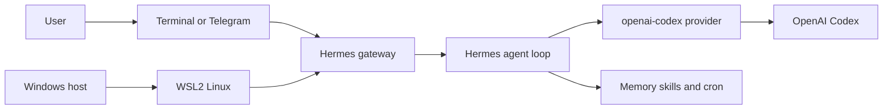

Hermes Agent는 터미널과 메시징 환경에서 동작하는 self-hosted open-source agent입니다. Command-line interface(CLI) 대화만 제공하는 도구가 아니라 memory, `SOUL.md` persona, skills, cron, messaging gateway를 조합할 수 있습니다. 이 글은 Windows Subsystem for Linux 2(WSL2) 위에 Hermes를 설치하고, `openai-codex` provider를 선택한 뒤, gateway로 검증하는 흐름을 다룹니다.

> **TL;DR**  
> - Hermes Agent는 `github.com/NousResearch/hermes-agent`에서 제공되는 self-hosted open-source agent입니다.  
> - WSL2에서는 공식 installer로 Hermes를 설치하고, `hermes doctor`로 실행 환경을 확인합니다.  
> - provider는 모델과 인증 경로를, runtime은 turn을 처리하는 실행 방식을 정합니다. 둘은 별도로 선택하고 검증해야 합니다.  
> - OpenAI Codex는 ChatGPT 요금제에서 사용할 수 있지만, 실제 사용 한도와 Hermes 연동 가능 여부는 계정, 요금제, 제품 설정에 따라 확인해야 합니다.  
> - systemd는 WSL 내부 서비스를 관리하지만 WSL 인스턴스를 영구 실행 상태로 보장하지 않습니다. gateway 접근성은 Windows 재로그인과 유휴 시간 이후에 별도로 검증합니다.  
{: .prompt-info}

---

## 1. 목표 아키텍처

목표는 WSL2 안에 Hermes Agent를 설치하고, 개인 ChatGPT 구독을 LLM provider로 사용하며, Telegram 같은 messaging gateway를 통해 언제든 접근 가능한 개인 agent를 만드는 것입니다.

구성 요소는 다음과 같이 나눌 수 있습니다.

| 구성 요소 | 역할 |
| :--- | :--- |
| WSL2 | Windows 위에서 Linux 환경을 제공하는 실행 기반 |
| Hermes Agent | memory, skills, cron, gateway를 갖춘 self-hosted agent |
| `openai-codex` provider | OpenAI Codex 인증과 모델 경로를 사용하는 provider |
| Hermes standard runtime | Hermes가 직접 turn과 tool loop를 처리하는 기본 실행 경로 |
| Telegram gateway | 터미널 밖에서도 agent에 접근하기 위한 messaging gateway |
| systemd service | WSL 안에서 gateway process를 감독하는 service |

provider와 runtime은 같은 설정이 아닙니다. provider는 Large Language Model(LLM)의 인증과 호출 경로를 정하고, runtime은 Hermes standard chat loop 또는 선택적 Codex app-server 중 어느 경로가 turn을 처리할지 정합니다. 먼저 필요한 기능과 권한 모델을 정한 뒤 조합을 선택해야 합니다.



---

## 2. WSL2 사전 준비

gateway를 service로 관리하려면 WSL2에서 systemd가 동작하는지 먼저 확인합니다. Microsoft는 WSL 0.67.6 이상에서 `/etc/wsl.conf`의 설정으로 systemd를 활성화하는 방법을 안내합니다.

`/etc/wsl.conf`에 다음 내용을 둡니다.

```ini
[boot]
systemd=true
```

설정 뒤에는 PowerShell에서 `wsl.exe --shutdown`으로 WSL 인스턴스를 종료한 다음 다시 시작하고, `systemctl status`로 systemd가 실행 중인지 확인합니다.

> systemd service는 WSL 안에서 process를 관리할 뿐, WSL 인스턴스를 계속 실행 상태로 유지하지는 않습니다. 개인 PC의 재부팅, 로그아웃, 유휴 상태까지 gateway가 응답해야 한다면 Windows 쪽 시작 조건 또는 별도 상시 실행 host를 설계하고 실제 메시지 왕복으로 확인해야 합니다.  
{: .prompt-warning}

---

## 3. Hermes Agent 설치

WSL2 환경에서 설치는 공식 installer를 사용합니다.

```bash
curl -fsSL https://hermes-agent.nousresearch.com/install.sh | bash
```

설치가 끝나면 먼저 다음 명령으로 설치 결과와 누락된 의존성을 확인합니다.

```bash
hermes doctor
```

installer의 세부 의존성 설치 내용은 release에 따라 달라질 수 있으므로, 특정 도구가 설치되었다고 가정하지 말고 `hermes doctor` 결과를 기준으로 다음 단계를 진행합니다.

---

## 4. Provider와 runtime을 분리해서 이해하기

이 글의 핵심입니다. Hermes에서 provider와 runtime은 독립적인 개념입니다.

| 구분 | 의미 | 이번 구성의 선택 |
| :--- | :--- | :--- |
| Provider | 어떤 계정과 모델 경로로 LLM을 호출할지 결정 | `openai-codex` provider |
| Runtime | agent loop와 tool 실행 방식을 결정 | 기본 Hermes runtime |

`hermes model`에서 `openai-codex` provider를 선택합니다.

```bash
hermes model
```

Hermes는 `openai-codex`를 `codex_responses` 경로로 해석하며, Codex app-server runtime은 별도 옵션입니다. OpenAI는 Codex가 ChatGPT 요금제에 포함될 수 있다고 안내하지만 사용 한도는 요금제별로 다릅니다. Hermes에서 이 인증 경로가 현재 계정과 환경에서 동작하는지는 interactive login과 짧은 test turn으로 확인해야 합니다.

`/codex-runtime`은 provider 선택과 독립적으로 Codex app-server runtime을 조정합니다. `auto`는 Hermes standard chat path를 사용하고, `codex_app_server`는 `codex app-server` subprocess로 turn을 전달합니다. 이 글의 목적이 Hermes 중심의 memory와 gateway 흐름을 검증하는 것이라면 먼저 `auto`로 시작하고, Codex native shell 또는 plugin 동작이 필요한 경우에만 별도 workspace에서 app-server runtime을 시험하는 편이 안전합니다.

---

## 5. API mode와 reasoning effort

`api_mode`는 provider가 요청을 보내는 Application Programming Interface(API) 경로를 나타내고, runtime은 local turn 실행 방식을 나타냅니다. Hermes의 provider runtime 문서에 따르면 `openai-codex`는 `codex_responses` 경로를 사용합니다.

reasoning effort는 모델과 provider가 지원하는 범위 안에서 조정해야 합니다. 고정된 값 목록이나 quota 소모량을 전제로 구성하지 말고, 현재 Hermes session의 `/reasoning` 안내와 OpenAI 요금제의 사용 한도를 확인한 뒤 짧은 task부터 적용합니다.

> 개인 구독 기반 구성에서는 "더 높은 reasoning effort가 항상 더 좋다"가 아닙니다. quota와 latency를 함께 고려해야 합니다.  
{: .prompt-tip}

---

## 6. Memory, SOUL.md, skills, cron으로 agent화하기

Hermes Agent를 단순한 LLM wrapper가 아니라 개인 agent로 만드는 핵심은 상태와 절차를 누적하는 기능입니다.

### 6.1. Memory

memory는 세션을 넘어 유지되는 사용자 정보, 환경 정보, 선호를 저장하는 기능입니다. memory write approval을 사용한다면 저장 후보를 검토한 뒤 승인하고, 재시작한 session에서 허용한 정보가 필요한 범위에서만 다시 활용되는지 확인합니다. 내부 저장 경로는 release와 설정에 따라 달라질 수 있으므로 고정 경로를 검증 기준으로 삼지 않습니다.

### 6.2. SOUL.md persona

`SOUL.md`는 agent의 persona를 정의하는 파일입니다. memory가 사실과 선호를 저장한다면, `SOUL.md`는 agent가 어떤 정체성과 톤으로 동작할지를 정합니다.

### 6.3. Skills

skills는 반복 가능한 절차를 문서화해 agent가 다음 세션에서도 재사용할 수 있게 합니다. 예를 들어 블로그 작성, 배포 점검, incident triage 같은 작업은 skills로 만들면 agent의 작업 품질이 누적됩니다.

### 6.4. Cron

cron은 정해진 시각이나 주기에 agent 작업을 실행하는 기능입니다. 개인 agent를 "질문을 받으면 답하는 도구"에서 "주기적으로 상태를 확인하고 보고하는 도구"로 확장하는 축입니다.

---

## 7. Telegram gateway와 항상 켜짐 구성

개인 agent의 사용성을 높이려면 터미널에 붙어 있을 필요가 없어야 합니다. Hermes는 messaging gateway를 제공하므로 Telegram을 연결해 모바일에서도 agent에게 작업을 맡길 수 있습니다.

gateway 설정은 다음 명령으로 시작합니다.

```bash
hermes gateway setup
```

접근성을 검증하는 순서는 다음과 같습니다.

1. `hermes gateway setup`으로 Telegram 같은 messaging platform을 설정합니다.
2. `hermes gateway start`로 gateway를 시작하고, 허용된 계정에서 test message를 보냅니다.
3. service로 운영할 경우 service status와 log를 확인합니다.
4. Windows 재로그인과 WSL 유휴 상태 이후에도 gateway가 응답하는지 외부 message로 재검증합니다.

마지막 단계가 실패하면 systemd나 `loginctl` 설정을 더하는 것으로 해결된다고 가정하지 않습니다. WSL이 멈추는 조건과 host 시작 방식을 분리해 진단해야 합니다.

---

## 8. 검증 체크리스트

구성이 끝났다면 다음 항목을 순서대로 확인합니다.

### 8.1. Headless run 확인

interactive CLI에서 짧고 비파괴적인 task를 실행해 provider 인증, tool approval, 응답을 확인합니다.

### 8.2. Memory write 확인

memory write approval을 켠 경우 pending write를 검토하고 승인한 항목만 새 session에서 필요한 범위로 재사용되는지 확인합니다. memory 동작만으로 runtime 상태를 단정하지 말고 `/codex-runtime`과 session configuration을 함께 확인합니다.

### 8.3. 핵심 tool 유지 확인

개인 agent 구성에서 반드시 유지해야 하는 기능은 다음과 같습니다.

- memory
- session_search
- delegate_task
- todo

필요 기능과 예상 동작을 한 줄씩 적은 뒤, 실제 버전에서 각각을 별도 test turn으로 확인합니다. provider와 runtime을 바꾼 뒤에는 같은 checklist를 다시 실행합니다.

---

## 9. 운영 거버넌스와 guardrails

Hermes Agent는 사용자의 계정으로 실행됩니다. 따라서 WSL2 안에서 사용자가 접근 가능한 파일과 shell 권한을 agent도 사용할 수 있습니다. 이는 강력한 자동화 능력이지만 동시에 운영 리스크입니다.

특히 다음 성질을 명확히 인식해야 합니다.

- agent는 사용자의 shell 권한으로 명령을 실행할 수 있습니다.
- agent는 자신의 config를 수정할 수 있습니다.
- agent는 self-upgrade를 수행할 수 있습니다.
- gateway를 연결하면 터미널 밖에서도 작업 요청이 들어올 수 있습니다.

따라서 개인 agent라도 guardrails가 필요합니다. destructive command 승인, config 변경 범위, self-upgrade 정책, Telegram 접근 권한, memory에 저장할 정보의 범위를 명확히 정해야 합니다.

> 자율 AI agent의 핵심은 "자동으로 많이 하게 만들기"만이 아니라 "어디까지 자동으로 하게 둘지 정하기"입니다. Hermes는 강력한 shell access를 갖기 때문에 운영 규칙을 먼저 정해 두는 편이 안전합니다.  
{: .prompt-warning}

---

## 10. 마치며

WSL2 위의 Hermes Agent는 개인 개발 환경에서 CLI와 messaging gateway를 한곳에 모으는 선택지입니다. 설치보다 중요한 것은 provider, runtime, process lifetime을 서로 다른 결정으로 다루는 일입니다.

`openai-codex` provider를 선택했다면 먼저 계정 인증과 현재 사용 한도를 확인합니다. 이어서 Hermes standard runtime과 Codex app-server runtime 중 필요한 tool, 권한, 운영 방식을 만족하는 경로를 test workspace에서 비교합니다. 특정 runtime이 모든 Hermes 기능을 보장하거나 제거한다고 가정하지 않는 것이 안전합니다.

마지막으로 gateway를 service로 등록했더라도 WSL이 계속 실행된다고 가정해서는 안 됩니다. host 재시작과 유휴 상태를 포함한 실제 message round trip, 최소 권한, destructive command 승인, memory write 검토까지 통과해야 개인 agent를 운영 가능한 상태라고 볼 수 있습니다.

---

## 11. References

- [NousResearch - Hermes Agent GitHub](https://github.com/NousResearch/hermes-agent)
- [NousResearch - Hermes Agent Installer](https://hermes-agent.nousresearch.com/install.sh)
- [NousResearch - Provider Runtime Resolution](https://github.com/NousResearch/hermes-agent/blob/main/website/docs/developer-guide/provider-runtime.md)
- [NousResearch - Slash Commands](https://github.com/NousResearch/hermes-agent/blob/main/website/docs/reference/slash-commands.md)
- [Microsoft Learn - Use systemd to manage Linux services with WSL](https://learn.microsoft.com/en-us/windows/wsl/systemd)
- [OpenAI Help Center - Using Codex with your ChatGPT plan](https://help.openai.com/en/articles/11369540-using-codex-with-your-chatgpt-plan)

> **궁금하신 점이나 추가해야 할 부분은 댓글이나 아래의 링크를 통해 문의해주세요.**  
> **Written with [KKamJi](https://www.linkedin.com/in/taejikim/)**  
{: .prompt-info}
