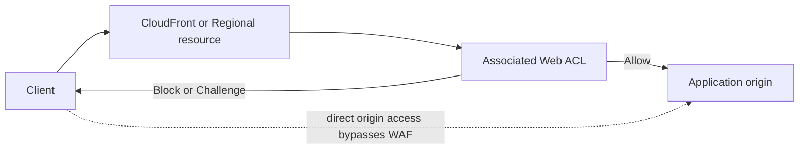

웹 애플리케이션은 Structured Query Language(SQL) injection, cross-site scripting(XSS), 취약점 스캔, credential stuffing, 악성 bot, Hypertext Transfer Protocol(HTTP) flood처럼 HTTP 요청의 내용을 이용하는 공격에 계속 노출됩니다. Security Group이나 Network Access Control List(ACL)는 Internet Protocol(IP)와 port 수준의 접근 제어에는 적합하지만, Uniform Resource Identifier(URI) path, query string, header, cookie, body에 담긴 공격 pattern까지 판별하지는 못합니다.

**Amazon Web Services(AWS) WAF(AWS Web Application Firewall)** 는 이런 Layer 7 요청을 AWS 서비스 앞단에서 검사하고 허용, 차단, 관찰하는 관리형 웹 애플리케이션 방화벽입니다. 이번 글에서는 AWS WAF가 무엇을 보호하고 어떤 구조로 요청을 평가하는지, Managed Rules와 bot 방어 기능은 어떻게 다른지, 그리고 실제 비용을 어떻게 계산하는지까지 정리합니다.

---

## 1. TL;DR

> - AWS WAF는 HTTP(S) 요청의 IP, header, cookie, URI, query string, body 등을 검사하는 Layer 7 방화벽입니다. 애플리케이션의 인증, 입력 검증, 보안 patch를 대신하지는 않습니다.  
> - CloudFront용 Web ACL은 `Global (CloudFront)`, 즉 `us-east-1`에서 생성하지만 요청 검사는 전 세계 CloudFront edge에서 수행됩니다. Regional Web ACL은 보호 대상과 같은 Region에 생성합니다.  
> - 핵심 구성 요소는 Web ACL, Rule, Statement, Action, Rule Group, WCU입니다. Rule은 priority가 작은 순서부터 평가됩니다.  
> - 운영은 `Count -> log/metric 분석 -> 예외 조정 -> Block/Challenge` 순서가 안전합니다. Managed Rule Group 전체의 `OverrideAction: Count`와 개별 rule의 `RuleActionOverrides: Count`는 관측 범위가 다릅니다.  
> - 기본 비용은 Web ACL 수, 추가한 rule 또는 rule group 수, 처리 요청 수로 계산합니다. `Count`도 요청을 검사하므로 `Block`과 동일한 기본 WAF 비용이 발생합니다.  
{: .prompt-info}

---

## 2. AWS WAF란?

AWS WAF는 보호 대상 AWS resource가 받은 HTTP(S) 요청을 **Web ACL(Web Access Control List)** 의 rule로 검사하고, 일치한 요청에 action을 적용하는 서비스입니다. 현재 새 AWS WAF 콘솔은 Web ACL을 `protection pack`이라는 이름으로도 표시하지만, API와 IaC의 기반 resource는 계속 `WebACL`입니다.

Web ACL은 resource에 연결하는 최상위 정책이고, rule group은 여러 rule을 재사용하기 위한 묶음입니다. 둘을 구분하면 policy를 읽기 쉽습니다. 하나의 Web ACL 안에서 rule과 rule group은 priority 순서로 평가되며, rule group 내부의 평가 순서와 Web ACL의 평가 순서는 별도입니다.

AWS WAF가 주로 다루는 영역은 다음과 같습니다.

- 알려진 web exploit pattern: SQL injection, XSS, local file inclusion, remote code execution 등
- 요청 속성: source IP, country, Autonomous System Number(ASN), HTTP method, URI path, query string, header, cookie, body
- 비정상 요청량: IP, forwarded IP, header, label 같은 key별 rate limit
- 평판 기반 traffic: 악성 IP, anonymous IP, hosting provider, proxy, Virtual Private Network(VPN) 등
- 자동화 traffic: 일반 bot, scraping, credential stuffing, fake account creation, Layer 7 DDoS

반대로 AWS WAF가 애플리케이션 보안 전체를 해결하는 것은 아닙니다. business authorization, server-side input validation, dependency patch, secret 관리, network segmentation은 애플리케이션과 플랫폼에서 별도로 수행해야 합니다. WAF는 공격 surface 앞에 놓는 **defense in depth**의 한 계층입니다.

### 2.1. AWS WAF, Shield, Firewall Manager의 차이

| 서비스 | 주 역할 | 대표 보호 범위 |
| :--- | :--- | :--- |
| AWS WAF | HTTP(S) 요청 내용과 행위에 대한 Layer 7 제어 | SQLi, XSS, bot, rate limit, credential abuse |
| AWS Shield Standard | 기본 제공되는 network/transport DDoS 방어 | 일반적인 Layer 3/4 DDoS |
| AWS Shield Advanced | 고급 DDoS 탐지, 비용 보호, SRT 지원 | Layer 3/4 및 일부 Layer 7 DDoS 운영 대응 |
| AWS Firewall Manager | 여러 account와 resource에 보안 policy 중앙 배포 | Organization 단위 WAF, Shield, network firewall policy |

WAF와 Shield는 경쟁 관계가 아닙니다. Shield가 대규모 DDoS 방어를 담당하고, WAF가 HTTP request의 내용과 client 행위를 세밀하게 제어하는 조합이 일반적입니다.

---

## 3. AWS WAF는 어디에 연결할 수 있을까?

AWS WAF는 임의의 server나 IP에 직접 설치하는 host firewall이 아닙니다. AWS가 지원하는 front door resource에 Web ACL을 **associate**하는 방식입니다.

| Scope | 보호 대상 | Web ACL 위치 |
| :--- | :--- | :--- |
| Global | Amazon CloudFront distribution | `us-east-1`, 콘솔 표기는 `Global (CloudFront)` |
| Regional | Application Load Balancer | ALB와 같은 Region |
| Regional | Amazon API Gateway REST API | API와 같은 Region |
| Regional | AWS AppSync GraphQL API | API와 같은 Region |
| Regional | Amazon Cognito user pool | user pool과 같은 Region |
| Regional | AWS App Runner service | service와 같은 Region |
| Regional | Amazon Bedrock AgentCore Gateway | gateway와 같은 Region |
| Regional | AWS Verified Access instance | instance와 같은 Region |
| Global 예외 | AWS Amplify | `Global (CloudFront)` |

CloudFront용 Web ACL과 그 Web ACL이 참조하는 IP set, regex pattern set, custom rule group은 모두 `us-east-1`에 생성해야 합니다. 이는 **control plane resource의 위치**입니다. 실제 요청 검사는 CloudFront의 global edge network에서 수행되므로, `us-east-1`을 거쳐 origin으로 우회 전송한다는 뜻은 아닙니다.

한 AWS resource에는 Web ACL 하나만 연결할 수 있고, Web ACL 하나는 조건을 만족하는 여러 resource에 연결할 수 있습니다. 다만 CloudFront distribution에 연결한 Web ACL은 다른 resource type과 함께 사용할 수 없습니다.

### 3.1. 직접 연결할 수 없는 대상

Amazon Elastic Compute Cloud(EC2) instance, Network Load Balancer(NLB), Kubernetes Service, Amazon Elastic Kubernetes Service(EKS) Pod에는 WAF를 직접 연결할 수 없습니다. 이런 workload는 CloudFront, Application Load Balancer(ALB), API Gateway 같은 지원 resource를 entry point로 두고 그 앞단에 WAF를 연결해야 합니다.

또한 public origin이 CloudFront를 우회해 직접 접근 가능하면 공격자도 WAF를 우회할 수 있습니다. CloudFront Virtual Private Cloud(VPC) origins, origin-facing Security Group, secret custom header 검증 등으로 **WAF가 연결된 진입점만 허용**해야 방어가 완성됩니다.



---

## 4. Web ACL은 요청을 어떻게 평가할까?

AWS WAF의 object model을 이해하면 복잡한 policy도 단순하게 읽을 수 있습니다.

| 구성 요소 | 역할 |
| :--- | :--- |
| Web ACL | rule 집합과 default action을 담아 resource에 연결하는 최상위 정책 |
| Rule | 어떤 요청을 찾을지와 일치했을 때의 action 정의 |
| Statement | match 조건. IP, byte, regex, SQLi, XSS, geo, label, rate 등을 표현 |
| Action | `Allow`, `Block`, `Count`, `CAPTCHA`, `Challenge`, `Monetize` |
| Rule Group | 여러 rule을 재사용 가능한 단위로 묶은 resource |
| Label | 앞 rule의 분류 결과를 뒤 rule이 다시 사용할 수 있게 붙이는 metadata |
| WCU | rule 평가에 필요한 계산 capacity를 나타내는 단위 |

요청은 `priority` 숫자가 작은 rule부터 평가됩니다. `Allow`, `Block`, `Monetize`는 평가를 끝내는 terminating action입니다. `Count`는 metric과 log를 남기고 다음 rule 평가를 계속하는 non-terminating action입니다. 어떤 rule도 평가를 종료하지 않으면 Web ACL의 default action이 적용되며, default action은 `Allow` 또는 `Block` 중 하나입니다.

`CAPTCHA`와 `Challenge`는 token 상태에 따라 달라집니다. 유효하고 만료되지 않은 token이 있으면 `Count`처럼 다음 rule로 진행하지만, token이 없거나 유효하지 않으면 browser에 puzzle 또는 silent challenge를 반환하고 평가를 종료합니다. JavaScript와 HTTPS secure context를 전제로 하므로 일반 browser가 아닌 server-to-server API에 무작정 적용하면 정상 client를 차단할 수 있습니다.

`Monetize`는 CloudFront 전용 terminating action입니다. HTTP `402 Payment Required` 응답으로 Artificial Intelligence(AI) bot이나 agent의 content 접근에 과금할 수 있으며 Web ACL에 `MonetizationConfig`가 필요합니다. 일반적인 보안 차단 action이 아니라 AI traffic 정책의 특수 기능으로 보고, live 적용 전에는 AWS가 권장하는 Test mode로 분류 결과를 확인해야 합니다.

### 4.1. Statement와 논리 조합

Statement는 `AND`, `OR`, `NOT`으로 조합할 수 있습니다. 예를 들어 `/login`에 대한 `POST` 요청 중 특정 country를 제외하고 rate limit을 적용하거나, Managed Rule이 붙인 label과 URI 조건을 함께 검사할 수 있습니다. 이때 **scope-down statement**를 사용하면 rule group이나 rate-based rule이 평가할 traffic 자체를 줄일 수 있습니다.

```text
AND
  URI path starts with /login
  HTTP method equals POST
  NOT source IP is in trusted-office-ip-set
```

IP set과 regex pattern set은 여러 rule에서 재사용할 수 있는 별도 resource입니다. forwarded IP를 사용할 때는 header가 신뢰할 수 있는 proxy에서만 덮어써지는지 확인해야 합니다. 공격자가 임의의 `X-Forwarded-For`를 주입할 수 있다면 IP match와 rate aggregation이 우회될 수 있습니다.

### 4.2. Rate-based rule은 정확한 quota가 아니다

Rate-based rule은 최근 evaluation window 동안 aggregation key별 요청 수를 계산합니다. window는 60, 120, 300, 600초 중에서 선택하며 기본값은 300초입니다. source IP 외에도 forwarded IP 또는 여러 custom key를 조합할 수 있고 scope-down statement로 특정 path만 집계할 수 있습니다.

다만 AWS WAF의 rate limiting은 **근사치 기반 탐지**입니다. propagation delay 때문에 rate limit이 적용되기까지 보통 30초 미만, 경우에 따라 수 분이 걸릴 수 있습니다. 설정을 변경하면 counter가 초기화되어 최대 1분 동안 rate limiting이 멈출 수도 있습니다. 따라서 결제 API의 정확한 호출 quota처럼 요청 N개를 엄밀하게 보장해야 하는 용도는 application 또는 API Gateway usage plan 같은 별도 장치로 처리해야 합니다.

### 4.3. Body inspection과 oversize handling

WAF가 request body 전체를 항상 읽는 것은 아닙니다.

- ALB와 AppSync: body 앞 8 KB까지 고정 검사
- Bedrock AgentCore Gateway: 기본 16 KB, 16 KB 단위로 최대 64 KB까지 확대 가능
- CloudFront, API Gateway, Cognito, App Runner, Verified Access: 기본 16 KB, 16 KB 단위로 최대 64 KB까지 확대 가능
- header 또는 cookie 전체 검사: 앞 8 KB 및 처음 200개까지

검사 한도를 넘은 요청에 대해 `CONTINUE`, `MATCH`, `NO_MATCH` 중 어떤 oversize handling을 적용할지 결정해야 합니다. 큰 body를 무조건 정상으로 통과시키면 공격 payload가 검사 범위 밖에 숨을 수 있고, 무조건 match로 처리하면 정상 upload가 차단될 수 있습니다. upload path를 별도 rule로 분리하고 application validation을 병행하는 것이 안전합니다.

CloudFront와 ALB의 gRPC traffic은 request body inspection rule을 지원하지 않습니다. gRPC 요청에서는 body rule을 건너뛰고 다른 WAF rule만 평가하므로, gRPC message validation을 WAF에 의존해서는 안 됩니다.

---

## 5. Managed Rules와 고급 방어 기능

직접 SQLi나 XSS pattern을 모두 작성하고 최신 상태로 유지하기는 어렵습니다. AWS Managed Rules와 AWS Marketplace Managed Rule Group은 공급자가 rule을 작성하고 갱신하는 방식으로 이 부담을 줄입니다.

대표적인 AWS Managed Rule Group은 다음과 같습니다.

- `AWSManagedRulesCommonRuleSet`: 널리 쓰이는 취약점과 비정상 request pattern
- `AWSManagedRulesKnownBadInputsRuleSet`: 알려진 악성 input pattern
- `AWSManagedRulesSQLiRuleSet`: SQL injection pattern
- `AWSManagedRulesAmazonIpReputationList`: AWS threat intelligence 기반 악성 IP
- `AWSManagedRulesAnonymousIpList`: VPN, proxy, Tor, hosting provider 등 anonymous source
- application-specific group: Linux, Unix, Windows, Hypertext Preprocessor(PHP), WordPress 등

Bot Control, Account Takeover Prevention(ATP), Account Creation Fraud Prevention(ACFP)은 추가 요금이 있는 intelligent threat mitigation 기능입니다.

| 기능 | 주요 목적 | 운영 시 주의점 |
| :--- | :--- | :--- |
| Bot Control Common | self-identifying bot과 일반적인 bot 분류 | verified bot과 business-allowed bot 예외 필요 |
| Bot Control Targeted | browser signal, behavior, fingerprinting 기반 고급 bot 탐지 | 더 높은 request 분석 비용, token 기반 동작 검증 필요 |
| ATP | login endpoint의 credential stuffing과 takeover 시도 완화 | login path, username field, 성공/실패 response 설정 필요 |
| ACFP | sign-up endpoint의 fake account 대량 생성 완화 | account creation flow와 response inspection 설정 필요 |
| Anti-DDoS managed rules | Layer 7 DDoS pattern 자동 탐지와 완화 | traffic baseline과 Count mode 관찰 필요 |

AWS Managed Rule Group 대부분은 별도 subscription 비용이 없지만, Web ACL, rule group, request에 대한 기본 WAF 비용은 그대로 발생합니다. Bot Control, ATP, ACFP, Anti-DDoS와 Marketplace rule group은 별도 요금이 추가됩니다. 즉 "free managed rules"는 **WAF 전체가 무료**라는 뜻이 아닙니다.

### 5.1. Version 관리

versioned managed rule group에서 `Default` version을 사용하면 AWS가 권장 version을 바꿀 때 동작이 달라질 수 있습니다. 변경 통제를 중시하면 static version을 pin하고 Amazon Simple Notification Service(SNS) update notification과 expiry metric을 감시하는 방식이 적합합니다.

다만 static version도 영구 보존되는 것은 아닙니다. 만료된 version은 default version으로 전환될 수 있고, 만료 상태에서는 Web ACL update가 막힐 수 있습니다. IaC에 version만 고정하고 update process를 만들지 않으면 오히려 운영 위험이 커집니다.

---

## 6. WCU는 request 처리량이 아니다

**WCU(Web ACL Capacity Unit)** 는 rule, rule group, Web ACL을 평가하는 데 필요한 계산 복잡도를 표현합니다. traffic TPS나 초당 request 처리 한도를 뜻하지 않습니다.

- Web ACL 기본 allocation: 1,500 WCU
- Web ACL 최대 capacity: 5,000 WCU
- 1,500 WCU 초과: 추가 500 WCU 단위로 request 요금 가산

단순 IP match는 적은 WCU를 쓰고, regex나 JSON body transformation 같은 복잡한 inspection은 더 많은 WCU를 사용합니다. 논리적으로 같은 text transformation을 연속 rule이 재사용하면 AWS WAF가 일부 계산을 최적화할 수 있으므로, 실제 capacity는 `CheckCapacity` API나 IaC plan 전에 확인하는 편이 안전합니다.

Web ACL이 1,500 WCU를 넘는다고 곧바로 성능이 느려지는 것은 아닙니다. 다만 비용이 증가하고 5,000 WCU quota를 넘으면 구성을 추가할 수 없으므로, broad rule을 scope-down하고 중복 transformation을 줄이는 설계가 필요합니다.

### 6.1. 알아둘 만한 주요 quota

| 항목 | 기본 또는 고정 quota |
| :--- | :--- |
| Web ACL | account와 Region당 기본 100개, 증가 요청 가능 |
| Regional Web ACL 처리량 | Web ACL당 기본 100,000 RPS, 증가 요청 가능 |
| IP set | set당 CIDR 10,000개 |
| Regex pattern set | set당 pattern 10개, pattern당 200자 |
| Rate-based rule | Web ACL당 10개, rule group당 4개 |
| Rate-based rule 최소 threshold | 10 requests per evaluation window |
| Reference statement | Web ACL 또는 rule group당 50개 |

CloudFront에 연결한 WAF의 RPS는 CloudFront quota를 따릅니다. quota와 Managed Rule Group의 WCU는 변경될 수 있으므로 실제 설계 시 Service Quotas와 `DescribeManagedRuleGroup` 결과를 다시 확인해야 합니다.

---

## 7. 관측 가능성 - metric, sample, full log

WAF를 안전하게 운영하려면 차단 기능보다 먼저 **무엇이 왜 match했는지** 볼 수 있어야 합니다.

### 7.1. CloudWatch metric

Web ACL과 rule별로 `AllowedRequests`, `BlockedRequests`, `CountedRequests`, `CaptchaRequests`, `ChallengeRequests` 같은 metric을 제공합니다. alarm은 단순 block 건수뿐 아니라 전체 요청 대비 비율, 평시 baseline, 특정 rule의 갑작스러운 증가를 함께 봐야 합니다.

### 7.2. Sampled requests

sampled requests는 최근 요청의 일부를 console에서 빠르게 확인하는 기능입니다. 조사 시작점으로는 편리하지만 전체 traffic을 대표하거나 감사 log를 대신하지는 않습니다. 민감 정보가 포함될 수 있으므로 data protection 설정을 함께 검토해야 합니다.

### 7.3. Full logging

WAF log는 Amazon CloudWatch Logs, Amazon Simple Storage Service(S3), Amazon Data Firehose로 전송할 수 있습니다. log에는 terminating rule, non-terminating match, label, request header, source IP 등의 정보가 들어가므로 false positive 분석과 incident investigation에 유용합니다.

운영 전에는 다음을 함께 설계해야 합니다.

- authorization, cookie, query parameter 같은 민감 field redaction 또는 data protection
- 필요한 action/rule만 남기는 log filtering
- retention, lifecycle, query 비용
- metric과 log를 이용한 false positive dashboard와 alarm
- 여러 account의 log를 모으는 Security Lake 또는 중앙 S3 구조

WAF request 100만 건마다 CloudWatch Logs Standard/Infrequent Access(IA) 또는 Vended Logs ingestion 500 MB가 기본 WAF 요금에 포함되며, 초과분은 CloudWatch의 WAF-specific Vended Logs 요금으로 청구됩니다.

---

## 8. AWS WAF 가격은 어떻게 계산할까?

아래 단가는 2026년 7월 기준 Global WAF의 대표 가격입니다. Region과 고급 기능에 따라 달라질 수 있으므로 실제 도입 전에는 마지막 Reference의 AWS WAF Pricing과 AWS Pricing Calculator를 확인해야 합니다.

| 기본 항목 | 대표 단가 |
| :--- | :--- |
| Web ACL | 월 $5.00 |
| Web ACL에 추가한 rule 또는 rule group | 월 $1.00 |
| 처리 request | 100만 건당 $0.60 |
| 1,500 WCU 초과 | 추가 500 WCU마다 100만 request당 $0.20 |
| 기본 body inspection 초과 | 추가 16 KB마다 100만 request당 $0.30 |
| CAPTCHA attempt | 1,000회당 $0.40 |
| Challenge response | 100만 회당 $0.40 |

직접 만든 custom rule group은 group 자체의 월 $1뿐 아니라 그 안에 만든 각 rule에도 월 $1가 부과됩니다. 반면 Managed Rule Group은 group 하나에 대한 월 $1를 내며, 공급자가 group 안에 구성한 개별 rule 수를 따로 과금하지 않습니다.

월 비용의 기본 형태는 다음과 같습니다.

```text
monthly WAF cost
= Web ACL cost
+ rule and rule group cost
+ inspected request cost
+ WCU and body inspection surcharge
+ optional feature cost
+ excess logging cost
```

### 8.1. 기본 Managed Rule Group 2개, 월 3,000만 request

별도 유료 subscription이 없는 AWS Managed Rule Group 2개를 Web ACL 하나에 추가했다고 가정합니다.

```text
Web ACL        = $5
Rule groups    = 2 x $1 = $2
Requests       = 30 x $0.60 = $18
Total          = $25/month
```

두 rule group을 모두 `Count`로 운영해도 합계는 같습니다. `Count`는 차단하지 않을 뿐, WAF가 request를 검사하고 rule을 평가하는 작업은 동일하기 때문입니다.

### 8.2. Bot Control Common을 함께 사용한다면

Bot Control Common은 Web ACL당 월 $10이며, 매월 처음 1,000만 request를 넘는 분석 traffic에 100만 건당 $1가 추가됩니다. 전체 3,000만 request가 Bot Control을 통과한다면 다음과 같습니다.

```text
Base WAF       = $5 + $1 + (30 x $0.60) = $24
Bot Control    = $10 + (20 x $1) = $30
Total          = $54/month
```

Bot Control rule group에 scope-down statement를 적용해 실제 분석 대상을 1,500만 건으로 줄이면 Bot Control의 초과 request는 500만 건이 됩니다. 기본 WAF request 요금은 전체 Web ACL traffic 기준으로 계속 발생하지만, Bot Control의 별도 분석 비용은 줄일 수 있습니다.

Bot Control Targeted는 처음 100만 request가 포함되고 이후 100만 건당 $10이므로 Common보다 훨씬 비쌉니다. ATP, ACFP, Anti-DDoS도 각자의 subscription과 request 분석 요금이 있습니다. 고급 기능은 이름만 보고 전체 traffic에 바로 적용하기보다, 보호할 endpoint와 대상 traffic을 먼저 좁히고 비용을 추정해야 합니다.

### 8.3. 유료 Managed Protection 요약

| 기능 | 월 subscription | 분석 request 요금 |
| :--- | :--- | :--- |
| Bot Control Common | Web ACL당 $10 | 첫 1,000만 건 포함, 이후 100만 건당 $1 |
| Bot Control Targeted | Web ACL당 $10 | 첫 100만 건 포함, 이후 100만 건당 $10 |
| Fraud Control ATP | Web ACL당 $10 | 첫 1만 건 포함, 이후 volume tier별 100만 건당 $1,000부터 $50 |
| Fraud Control ACFP | Web ACL당 $10 | 첫 1만 건 포함, 이후 volume tier별 100만 건당 $1,000부터 $400 |
| Anti-DDoS Managed Rules | Web ACL당 $20 | 100만 건당 $0.15 |

ATP와 ACFP의 초반 request tier가 매우 비싸므로 login과 sign-up path로 정확히 scope-down해야 합니다. Anti-DDoS의 별도 request 요금에서는 DDoS로 탐지되어 실제로 완화된 request가 제외되는 조건이 있으므로, 예산 산정 시 최신 pricing 설명을 함께 확인해야 합니다. AWS Marketplace Managed Rule Group은 판매자가 정한 subscription과 request 요금이 별도로 적용됩니다.

---

## 9. 안전한 배포 전략

WAF의 가장 큰 운영 위험은 공격을 놓치는 것만이 아니라 **정상 사용자를 차단하는 false positive**입니다. 다음 순서가 안전합니다.

1. 보호 resource, Web ACL association, origin 우회 경로를 확인합니다. CloudFront distribution이나 regional resource에 실제 Web ACL ARN이 연결됐는지 IaC state와 API에서 확인합니다.
2. Web ACL과 logging, metric, alarm을 IaC로 구성합니다.
3. 새 custom rule과 Managed Rule Group의 개별 rule을 `Count`로 시작합니다.
4. 실제 traffic에서 URI, client, country, label별 match를 충분히 관찰합니다.
5. false positive는 narrow scope-down, IP set, label match로 예외 처리합니다.
6. 영향이 명확한 rule부터 `Block`, `Challenge`, `CAPTCHA`로 단계 전환합니다.
7. 변경 후 block rate, origin error, conversion, login success 같은 service metric을 함께 확인합니다.
8. 문제가 생기면 action을 `Count`로 되돌리거나 Web ACL association을 제거합니다.

### 9.1. Managed Rule Group의 Count 설정 함정

Managed Rule Group을 테스트하는 방법에는 두 가지가 있으며 결과가 같지 않습니다.

- `OverrideAction: Count`: rule group이 최종 반환한 action만 Count로 바꿉니다. 내부의 terminating rule이 match하면 group 내부의 뒤 rule은 평가되지 않을 수 있습니다.
- `RuleActionOverrides: Count`: 지정한 개별 rule의 action을 Count로 바꿉니다. 여러 내부 rule의 match를 계속 관찰하려면 이 방식이 더 적합합니다.

따라서 단순히 Web ACL을 attach/detach할 수 있는지 확인하는 PoC라면 group-level override도 충분할 수 있지만, 실제 traffic으로 모든 내부 rule의 false positive를 조사하려면 **개별 rule action override**를 사용해야 합니다.

### 9.2. IaC와 rollback

Web ACL, rule priority, Managed Rule version, association, log destination은 Terraform이나 CloudFormation으로 관리하면 review와 rollback이 쉬워집니다. 그러나 apply 전에 다음 항목은 별도로 확인해야 합니다.

- CloudFront Web ACL과 referenced resource가 모두 `us-east-1` provider를 사용하는가?
- 기존 distribution이나 regional resource에 연결된 Web ACL이 있는가?
- rule priority가 의도한 terminating order를 만드는가?
- logging destination policy와 encryption이 준비됐는가?
- association 제거와 action rollback 중 어느 경로가 더 빠르고 안전한가?

---

## 10. 자주 하는 오해

| 오해 | 실제 동작 |
| :--- | :--- |
| CloudFront console에 WAF 메뉴가 보이면 보호 중이다 | 기능 메뉴가 있다는 뜻일 뿐입니다. distribution의 Web ACL association ARN 또는 `WebACLId`를 확인해야 합니다. |
| CloudFront WAF가 `us-east-1`에 있으니 traffic도 그 Region을 거친다 | control plane resource 위치만 `us-east-1`이며 검사는 global edge에서 수행됩니다. |
| `Count`는 무료 monitoring mode다 | 차단하지 않을 뿐 동일한 기본 request inspection 비용이 발생합니다. |
| WCU는 초당 처리 가능한 request 수다 | rule 계산 복잡도와 capacity를 표현하며 throughput 단위가 아닙니다. |
| Rate-based rule은 정확히 N번째 request부터 차단한다 | 주기적으로 갱신되는 근사치 기반 rate detection입니다. |
| AWS Managed Rules를 붙이면 바로 안전하다 | application traffic에 맞는 Count 관찰, 예외, version 관리가 필요합니다. |
| WAF가 있으면 origin 보안은 필요 없다 | origin 직접 접근을 막지 않으면 WAF를 우회할 수 있습니다. |
| WAF가 application validation을 대신한다 | WAF는 보조 방어선이며 인증, 권한, 입력 검증, patch는 application 책임입니다. |

---

## 11. 마무리

AWS WAF의 핵심은 rule을 많이 추가하는 것이 아니라, **지원되는 진입점에 Web ACL을 정확히 연결하고, 실제 traffic을 관찰해 false positive를 통제하며, 비용과 version을 지속적으로 운영하는 것**입니다.

처음에는 IP reputation과 common exploit Managed Rule Group을 개별 `Count`로 적용하고 full log와 service metric을 함께 관찰하는 것이 좋습니다. 이후 application의 위험도에 따라 rate-based rule, Bot Control, ATP, ACFP, Anti-DDoS를 endpoint 단위로 좁혀 적용하면 방어 효과와 비용을 함께 관리할 수 있습니다. 배포의 완료 조건은 rule 생성이 아니라 association 확인, Count 결과 검토, service level indicator(SLI) 확인, rollback 경로 검증까지 통과하는 것입니다.

---

## 12. Reference

- [AWS Docs - What is AWS WAF?](https://docs.aws.amazon.com/waf/latest/developerguide/what-is-aws-waf.html)
- [AWS Docs - How AWS WAF works](https://docs.aws.amazon.com/waf/latest/developerguide/how-aws-waf-works.html)
- [AWS Docs - Resources that you can protect with AWS WAF](https://docs.aws.amazon.com/waf/latest/developerguide/how-aws-waf-works-resources.html)
- [AWS Docs - Using rule actions in AWS WAF](https://docs.aws.amazon.com/waf/latest/developerguide/waf-rule-action.html)
- [AWS Docs - Rate-based rule statement](https://docs.aws.amazon.com/waf/latest/developerguide/waf-rule-statement-type-rate-based.html)
- [AWS Docs - Managing body inspection limits](https://docs.aws.amazon.com/waf/latest/developerguide/web-acl-setting-body-inspection-limit.html)
- [AWS Docs - Handling oversize web request components](https://docs.aws.amazon.com/waf/latest/developerguide/waf-oversize-request-components.html)
- [AWS Docs - Using managed rule groups](https://docs.aws.amazon.com/waf/latest/developerguide/waf-managed-rule-groups.html)
- [AWS Docs - AWS Managed Rules rule groups list](https://docs.aws.amazon.com/waf/latest/developerguide/aws-managed-rule-groups-list.html)
- [AWS Docs - Testing and tuning AWS WAF protections](https://docs.aws.amazon.com/waf/latest/developerguide/web-acl-testing.html)
- [AWS Docs - Overriding rule group actions](https://docs.aws.amazon.com/waf/latest/developerguide/web-acl-rule-group-override-options.html)
- [AWS Docs - AWS WAF web ACL capacity units](https://docs.aws.amazon.com/waf/latest/developerguide/aws-waf-capacity-units.html)
- [AWS Docs - Logging AWS WAF traffic](https://docs.aws.amazon.com/waf/latest/developerguide/logging.html)
- [AWS Docs - AI traffic monetization](https://docs.aws.amazon.com/waf/latest/developerguide/waf-ai-traffic-monetization.html)
- [AWS Blog - Introducing the AWS WAF application layer DDoS protection](https://aws.amazon.com/blogs/networking-and-content-delivery/introducing-the-aws-waf-application-layer-ddos-protection/)
- [AWS WAF Pricing](https://aws.amazon.com/waf/pricing/)

---

> **궁금하신 점이나 추가해야 할 부분은 댓글이나 아래의 링크를 통해 문의해주세요.**  
> **Written with [KKamJi](https://www.linkedin.com/in/taejikim/)**  
{: .prompt-info}
