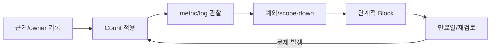

이전 글 [AWS WAF 알아보기 - Web ACL, Rule, Managed Rules, 비용 구조](/posts/aws-waf/)에서는 AWS WAF의 전체 구조와 Managed Rule Group, 비용 계산 방식을 정리했습니다. Managed Rule Group은 SQL injection이나 XSS 같은 널리 알려진 공격 pattern을 AWS와 공급자가 대신 작성하고 갱신해 주므로 초기 도입 부담을 크게 줄여 줍니다. 다만 Managed Rule Group만으로 모든 정책을 덮을 수는 없습니다. 특정 hosting network에서만 반복되는 abuse, 회사가 직접 근거를 관리하고 만료시켜야 하는 임시 차단, 특정 고비용 endpoint의 요청량 완화처럼 조직이 직접 정의하고 설명할 수 있어야 하는 조건이 있기 때문입니다.

이번 글에서는 이런 조건을 다루는 **self-managed rule**을 `AsnMatchStatement`, IP set match, rate-based rule 세 가지를 중심으로 살펴봅니다. 각 수단의 선택 기준, ASN Match의 동작과 비용, Count에서 Block까지의 안전한 전환 절차, 그리고 ASN 차단이 만능이 아닌 이유까지 정리합니다. 모든 예시는 일반화한 가상 값과 AWS 공식 문서만 사용합니다.

---

## 1. TL;DR

> - Self-managed rule은 AWS Managed Rules를 **대체하는 것이 아니라 보완**합니다. Managed Rule Group으로 공통 공격을 막고, 조직이 직접 근거를 관리해야 하는 좁은 조건만 self-managed rule로 다루는 조합이 안전합니다.  
> - `AsnMatchStatement`는 요청 IP가 속한 network 조직(ASN)을 기준으로 검사합니다. datacenter/hosting network 차단에 적합하며, bot 여부나 악성 의도를 증명하는 수단이 아닙니다.  
> - IP set match는 좁은 CIDR이나 긴급 임시 예외에, rate-based rule은 특정 고비용 path의 aggregate abuse 완화에 적합합니다. rate limit은 엄밀한 quota가 아니라 근사치 기반 탐지입니다.  
> - ASN Match는 rule당 최대 100개 ASN, 1 WCU이며 기본적으로 요청 origin IP를 사용합니다. forwarded IP 사용은 신뢰할 수 있는 proxy 전제에서만 안전합니다.  
> - 기존 Web ACL에 일반 custom ASN rule 하나를 추가하는 증분 비용은 rule당 월 $1이며, 그 rule 때문에 별도의 per-request 요금이 추가되지는 않습니다. 다만 Web ACL 단위 request 요금, WCU 초과, logging, Bot Control/CAPTCHA/Challenge 같은 유료 기능은 별개입니다.  
> - 안전한 전개 순서는 `Count -> 근거/metric/log 수집 -> 예외 조정 -> Block`이며, 명시적 만료일과 빠른 Count rollback을 항상 함께 둡니다.  
{: .prompt-info}

---

## 2. Self-managed rule은 언제 필요한가?

AWS WAF 공식 문서는 ASN matching을 설명하면서 "ASN matching supplements, but doesn't replace, standard authentication and authorization controls"라고 명시합니다. 이 문장은 self-managed rule 전체를 이해하는 출발점입니다. self-managed rule은 애플리케이션 인증, 권한 검사, 입력 검증, origin 보호를 대신하지 않으며, Managed Rule Group을 대체하지도 않습니다.

Managed Rule Group과 self-managed rule의 역할은 다음과 같이 나뉩니다.

| 구분 | Managed Rule Group | Self-managed rule |
| :--- | :--- | :--- |
| 작성/갱신 주체 | AWS 또는 Marketplace 공급자 | 조직 본인 |
| 주 대상 | 공통 exploit, 알려진 악성 input, IP 평판, bot | 조직 고유 조건, 임시 차단, 특정 path 완화 |
| 근거 관리 | 공급자가 rule 내부 관리 | 조직이 근거와 만료를 직접 기록 |
| 변경 통제 | version pin과 update 감시 | priority, scope, action을 직접 소유 |
| 설명 책임 | 공급자 문서 참조 | 조직이 차단 사유를 설명 가능해야 함 |

self-managed rule이 필요한 대표적인 상황은 다음과 같습니다.

- Managed Rule Group의 IP 평판 목록에는 없지만, 로그상 특정 hosting/datacenter network에서만 반복되는 abuse가 관찰될 때
- 긴급하게 특정 좁은 IP 대역을 임시로 차단하거나, 반대로 신뢰하는 partner 대역을 예외 처리해야 할 때
- 로그인, 검색, 대량 조회처럼 origin 부하가 큰 특정 path에 대해 aggregate 요청량을 완화해야 할 때

이런 조건들은 공통 pattern이 아니라 조직 고유의 traffic 근거에 의존하므로, 근거와 만료 기준을 직접 관리해야 합니다. 그래서 Managed Rule Group에 맡기기보다 self-managed rule로 다루는 편이 적절합니다.

---

## 3. 세 가지 핵심 수단 비교

self-managed rule에서 가장 자주 쓰는 세 가지 statement는 목적과 정책 단위가 서로 다릅니다. 하나로 모든 문제를 풀기보다 조건에 맞는 수단을 고르는 것이 중요합니다.

| 항목 | ASN Match | IP set match | Rate-based rule |
| :--- | :--- | :--- | :--- |
| 정책 단위 | network 조직(ASN) | 개별 IP 또는 CIDR | 시간당 aggregate 요청량 |
| 적합한 용도 | datacenter/hosting network 차단, partner network 허용 | 좁은 CIDR 상시 차단, 긴급 임시 예외 | 특정 고비용 path의 abuse 완화 |
| 안정성 | ASN은 IP 대역보다 덜 바뀜 | IP는 자주 바뀌어 유지보수 필요 | window 기반 근사치, 주기적 갱신 |
| False positive 위험 | 대역이 넓어 collateral damage 큼 | 좁게 쓰면 낮음, 넓으면 높음 | threshold가 낮으면 정상 사용자 영향 |
| Lifecycle | 근거 기반으로 좁게, 만료 필요 | 임시 항목은 만료 필수 | threshold 재조정 주기 필요 |

ASN Match는 IP 대역을 일일이 관리하지 않고도 network 조직 단위로 제어할 수 있어 유지보수가 상대적으로 단순합니다. IP set은 대상 범위가 좁고 명확할 때 결과를 예측하기 쉽고, 긴급 대응에서 빠르게 적용하고 회수하기 좋습니다. rate-based rule은 특정 IP나 network를 겨냥하는 것이 아니라 "짧은 시간에 지나치게 많은 요청"이라는 행위 자체를 완화하는 수단입니다.

세 수단은 배타적이지 않습니다. 예를 들어 rate-based rule의 scope-down statement에 특정 path 조건을 넣어 집계 대상을 좁히고, 동시에 ASN Match로 알려진 hosting network를 별도 rule에서 관찰하는 식으로 함께 사용할 수 있습니다.

---

## 4. ASN Match Deep Dive

### 4.1. ASN이란 무엇인가

**ASN(Autonomous System Number)** 는 internet service provider, 대기업, 대학, 정부기관처럼 대규모 network를 운영하는 조직에 부여되는 고유 식별자입니다. AWS WAF의 ASN Match는 요청 IP가 어떤 ASN에 속하는지 판별해, 개별 IP를 관리하지 않고도 network 조직 단위로 traffic을 허용하거나 차단합니다. IP 대역보다 ASN이 덜 바뀌기 때문에 IP 기반 rule보다 안정적이고 효율적으로 운영할 수 있습니다.

대표적인 활용은 알려진 문제 network 차단과 신뢰하는 partner network 허용입니다. 다만 뒤에서 다루듯 ASN이 곧 "악성"을 뜻하지는 않으므로, 근거가 뒷받침되는 datacenter/hosting network에 좁게 적용해야 합니다.

### 4.2. 동작 방식과 forwarded IP 주의점

AWS WAF는 요청의 IP 주소로 ASN을 판별하며, **기본적으로 web request origin의 IP**를 사용합니다. CDN이나 reverse proxy 뒤에 있어 실제 client IP가 `X-Forwarded-For` 같은 header에 담기는 구성이라면, forwarded IP configuration을 켜서 header의 first, last, any 중 어떤 주소를 쓸지 지정할 수 있습니다.

forwarded IP를 사용할 때는 두 가지를 반드시 확인해야 합니다.

- **신뢰 경계**: header를 신뢰할 수 있는 proxy만 덮어쓰는지 확인해야 합니다. 공격자가 임의의 `X-Forwarded-For`를 주입할 수 있으면 ASN 판별과 다른 IP 기반 검사가 우회될 수 있습니다.
- **fallback behavior**: header의 IP가 malformed이거나 없을 때 적용할 결과를 `Match` 또는 `No match`로 지정합니다. `Match`로 두면 header가 깨진 요청이 모두 차단될 수 있고, `No match`로 두면 검사를 통과시키므로 정책 목적에 맞게 선택해야 합니다.

### 4.3. Unmapped ASN과 ASN 0

AWS WAF가 유효한 IP 주소에 대해 ASN을 판별하지 못하면 **ASN 0**을 할당합니다. 즉 ASN 0은 "매핑되지 않은 ASN"을 뜻하는 특수 값입니다. rule의 ASN list에 0을 포함하면 이런 unmapped 요청을 명시적으로 다룰 수 있습니다. 다만 unmapped라는 사실만으로 악성으로 단정할 수는 없으므로, ASN 0을 차단 대상에 넣을 때는 Count로 충분히 관찰한 뒤 결정해야 합니다.

### 4.4. 제약과 WCU

ASN Match statement의 특성은 다음과 같습니다.

| 항목 | 값 |
| :--- | :--- |
| ASN list 유효 범위 | 0 ~ 4294967295 |
| rule당 최대 ASN 수 | 100개 |
| WCU | 1 WCU |
| Nestable | 가능(다른 statement와 조합 가능) |
| 기본 IP 기준 | web request origin IP |
| forwarded IP | 선택, fallback behavior(`Match`/`No match`) 지정 |

rule당 ASN을 최대 100개까지만 지정할 수 있으므로, 차단 대상 network가 많다면 근거를 기준으로 우선순위를 정하거나 rule을 나눠야 합니다. 1 WCU로 매우 가벼운 statement이므로 WCU 예산 부담은 거의 없습니다.

### 4.5. Terraform 예시

다음은 이해를 돕기 위한 일반화된 예시입니다. ASN 값(`64496`, `64500`)은 문서 예약 대역의 placeholder이며, 실제 운영에서는 로그 근거로 확인한 network에 맞게 바꿔야 합니다. 처음에는 반드시 `count {}`로 시작합니다.

```hcl
resource "aws_wafv2_web_acl" "example" {
  name  = "example-web-acl"
  scope = "CLOUDFRONT" # CloudFront는 us-east-1 provider, Regional은 "REGIONAL"

  default_action {
    allow {}
  }

  rule {
    name     = "observe-hosting-asn"
    priority = 10

    # 최초 도입 시 count로 관찰, 근거 확보 후 block {} 으로 전환
    action {
      count {}
    }

    statement {
      asn_match_statement {
        # 예시 placeholder ASN. 실제 값은 근거 기반으로 교체
        asn_list = [64496, 64500]
      }
    }

    visibility_config {
      cloudwatch_metrics_enabled = true
      metric_name                = "observeHostingAsn"
      sampled_requests_enabled   = true
    }
  }

  visibility_config {
    cloudwatch_metrics_enabled = true
    metric_name                = "exampleWebAcl"
    sampled_requests_enabled   = true
  }
}
```

> `asn_match_statement`는 비교적 최근 AWS provider에 추가된 속성이므로, 적용 전 사용 중인 provider version과 schema에서 지원 여부를 확인해야 합니다. Terraform 예시는 개념 이해용이며 실제 account, distribution, ARN, hostname, 내부 ASN/IP를 포함하지 않습니다.  
{: .prompt-warning}

특정 path나 조건과 결합하려면 `asn_match_statement`를 `and_statement` 안에 nest해 scope를 좁힐 수 있습니다. 넓은 ASN 차단을 그대로 두기보다, 영향을 받는 path와 예외 대역을 함께 설계하는 편이 collateral damage를 줄입니다.

---

## 5. IP Set과 Rate-based Rule

### 5.1. IP set match

IP set은 여러 rule에서 재사용할 수 있는 별도 resource로, CIDR 목록을 담습니다. 대상이 명확하고 좁을 때 가장 예측 가능한 수단이며, 긴급 상황에서 빠르게 추가하고 제거하기 좋습니다. IP는 ASN보다 자주 바뀌므로, 넓은 대역을 상시 차단 목적으로 쌓아 두기보다 좁은 CIDR이나 임시 예외 중심으로 관리하는 것이 유지보수에 유리합니다.

임시로 넣은 IP set 항목은 반드시 만료 기준을 함께 기록해야 합니다. 근거 없이 오래 남은 차단 항목은 나중에 원인을 추적하기 어렵고 정상 사용자를 막을 위험이 커집니다.

WCU 관점에서 IP set match statement는 대부분의 사용에서 1 WCU입니다. 다만 forwarded IP를 사용하면서 header 내 position을 `ANY`로 지정하면 여기에 4 WCU가 추가됩니다.

### 5.2. Rate-based rule

rate-based rule은 최근 evaluation window 동안 aggregation key별 요청 수를 세어, threshold를 넘으면 action을 적용합니다. window는 60, 120, 300, 600초 중에서 선택하며 기본값은 300초입니다. source IP 외에 forwarded IP나 여러 custom key를 조합할 수 있고, scope-down statement로 특정 path만 집계할 수 있습니다.

중요한 점은 AWS WAF의 rate limiting이 **엄밀한 quota가 아니라 주기적으로 갱신되는 근사치 기반 탐지**라는 것입니다. counter는 일정 주기로 갱신되고 설정 변경 시 초기화될 수 있으므로, "정확히 N번째 요청부터 차단"을 보장하지 않습니다. 결제 API의 정확한 호출 한도처럼 엄격한 보장이 필요하면 애플리케이션 로직이나 API Gateway usage plan 같은 별도 장치로 처리해야 합니다.

다음은 특정 고비용 path에만 rate limit을 적용하는 일반화 예시입니다. `limit`과 path 값은 workload마다 반드시 재검증해야 하는 placeholder입니다.

```hcl
  rule {
    name     = "rate-limit-expensive-path"
    priority = 20

    action {
      count {} # 관찰 후 block {} 전환
    }

    statement {
      rate_based_statement {
        limit                 = 2000 # 예시 threshold, 실제 traffic으로 재조정
        aggregate_key_type    = "IP"
        evaluation_window_sec = 300

        scope_down_statement {
          byte_match_statement {
            search_string         = "/expensive-path" # 예시 path
            positional_constraint = "STARTS_WITH"

            field_to_match {
              uri_path {}
            }

            text_transformation {
              priority = 0
              type     = "NONE"
            }
          }
        }
      }
    }

    visibility_config {
      cloudwatch_metrics_enabled = true
      metric_name                = "rateLimitExpensivePath"
      sampled_requests_enabled   = true
    }
  }
```

scope-down으로 집계 대상을 좁히면 정상 traffic이 threshold 계산에 섞이는 것을 줄여 false positive를 낮출 수 있습니다.

WCU 관점에서 rate-based rule statement의 기본 비용은 2 WCU입니다. 여기에 scope-down statement를 사용하면 그 statement 자체의 WCU가 더해지고, custom aggregation key를 지정하면 key 하나당 30 WCU가 추가됩니다. 위 예시는 `aggregate_key_type = "IP"`처럼 aggregation key로 source IP만 사용하므로 key당 30 WCU 가산이 적용되지 않고, 기본 2 WCU에 scope-down으로 넣은 `byte_match_statement`의 WCU만 더해집니다. 여러 field를 조합한 custom key를 쓰는 경우에만 key 개수만큼 30 WCU씩 늘어난다는 점을 예산 계산 시 구분해야 합니다.

---

## 6. 비용 - 정확히 무엇이 늘어나는가

self-managed rule 도입을 검토할 때 가장 오해하기 쉬운 부분이 비용입니다. AWS WAF 요금은 생성한 Web ACL 수, Web ACL당 추가한 rule 수, 처리한 web request 수를 기준으로 계산합니다.

기존 Web ACL에 일반 custom ASN rule 하나를 추가할 때의 증분 비용은 다음과 같습니다.

- **rule 요금**: rule 하나당 월 $1.00(시간 단위 prorated)
- **추가 per-request 요금 없음**: request 요금은 Web ACL이 처리한 request에 대해 부과되며, 일반 custom rule을 하나 더 얹었다고 해서 그 rule 때문에 두 번째 per-request 요금이 붙지 않습니다. AWS WAF 공식 pricing 예시에서도 사용자가 직접 작성한 rule이 19개인 경우 rule 요금($1 * 19)과 Web ACL당 request 요금($0.60/백만)만 계산할 뿐, rule 개수만큼 request 요금을 곱하지 않습니다.
- **standard action은 무료**: `Allow`, `Block`, `Count`는 추가 요금 없이 사용합니다. 즉 `Count`로 관찰하는 것과 `Block`으로 차단하는 것의 기본 요금은 같습니다.

반면 아래 항목은 위의 "일반 custom rule 추가"와 **별개**로 청구되므로 혼동하면 안 됩니다.

| 별도 청구 항목 | 조건 |
| :--- | :--- |
| Web ACL 단위 request 요금 | Web ACL이 처리한 전체 request(100만 건당 $0.60) |
| WCU 초과 | 기본 1,500 WCU 초과 시 추가 500 WCU마다 100만 request당 $0.20 |
| body inspection 초과 | 기본 한도 초과 시 추가 16KB마다 100만 request당 $0.30 |
| CAPTCHA | CAPTCHA attempt 1,000건당 $0.40 |
| Challenge | Challenge response 100만 건당 $0.40 |
| logging 초과 | request 100만 건당 500MB 포함, 초과분은 CloudWatch Vended Logs 요금 |
| Bot Control/Fraud Control/DDoS Protection | 각 기능의 subscription과 분석 request 요금 |
| Marketplace managed rule group | 판매자가 정한 subscription과 request 요금 |

특히 CAPTCHA와 Challenge는 과금 단위가 서로 다릅니다. CAPTCHA는 **attempt 1,000건당 $0.40**, Challenge는 **response 100만 건당 $0.40**입니다. 단가 숫자는 같은 $0.40이지만 과금 단위가 1,000 대 100만으로 크게 달라 실제 비용 규모가 완전히 다릅니다.

정리하면, ASN Match rule 하나 추가의 직접 비용은 월 $1과 1 WCU 수준으로 작습니다. 비용이 크게 늘어나는 것은 rule 개수 자체가 아니라 Bot Control 같은 유료 기능, WCU 초과, logging 초과입니다. self-managed rule은 이런 유료 기능과 달리 가볍게 도입할 수 있지만, Web ACL 단위 request 요금과 WCU 예산은 여전히 전체 설계에서 함께 봐야 합니다.

---

## 7. 안전한 운영 - Count에서 Block까지

self-managed rule의 가장 큰 운영 위험은 공격을 놓치는 것보다 **정상 사용자를 차단하는 false positive**입니다. ASN 차단은 특히 대역이 넓어 한 번의 실수가 큰 범위에 영향을 줍니다. 다음 순서를 권장합니다.

1. **근거와 policy owner 기록**: 어떤 로그 근거로 어떤 network를 대상으로 하는지, 누가 이 정책을 소유하고 언제 재검토할지 먼저 문서화합니다.
2. **Count로 시작**: 새 rule을 `count {}`로 적용하고 CloudWatch metric과 full logging을 함께 켭니다. `Count`는 차단하지 않고 match를 기록만 하므로 실제 영향 범위를 안전하게 관찰할 수 있습니다.
3. **다각도로 false positive 평가**: path, country/geography, 로그인 성공률 같은 user/business signal, 예외 traffic 관점에서 match를 검토합니다. 단일 수치가 아니라 평시 baseline과 함께 봅니다.
4. **예외를 좁게 추가**: false positive가 확인되면 넓은 차단을 유지한 채 IP set 예외나 scope-down 조건으로 좁게 처리합니다.
5. **한 번에 하나씩 Block 전환**: 영향이 명확한 정책부터 `Block`으로 바꿉니다. 여러 rule을 동시에 전환하면 원인 분리가 어려워집니다.
6. **만료일과 빠른 rollback 유지**: 임시 정책에는 명시적 만료/재검토 날짜를 남기고, 문제가 생기면 즉시 `Count`로 되돌리거나 rule을 제거할 수 있는 경로를 준비합니다.

### 7.1. 전파 지연을 감안한다

Web ACL 변경은 즉시 전역에 반영되지 않습니다. 특히 CloudFront에 연결된 Web ACL은 전 세계 edge에 전파되는 데 시간이 걸리므로, action을 바꾼 직후의 metric만 보고 성급하게 결론짓지 말고 전파가 안정된 뒤 관찰해야 합니다. rollback 역시 즉시 반영되지 않을 수 있으므로, 긴급 상황에서는 전파 지연을 감안한 대응 시간을 미리 계산해 둬야 합니다.

### 7.2. 근거와 만료를 Git으로 관리한다

self-managed rule의 값(대상 ASN, IP set 항목, threshold)은 근거와 함께 IaC로 관리하면 review와 rollback이 쉬워집니다. commit message나 코드 주석에 "왜 이 network를 차단했는지", "언제 재검토할지"를 남기면 시간이 지나도 정책의 이유를 추적할 수 있습니다. 다만 실제 운영 근거가 되는 내부 로그나 트래픽 수치, 실제 ASN/IP 목록은 공개 저장소에 노출되지 않도록 주의해야 합니다.



---

## 8. 한계와 결합 전략

ASN Match는 강력하지만 오용하기 쉬운 수단입니다. 다음 한계를 분명히 이해해야 합니다.

- **ASN은 bot이나 악성 의도의 증거가 아니다**: 특정 ASN에서 왔다는 사실만으로 그 요청이 bot이거나 악의적이라고 단정할 수 없습니다. datacenter/hosting network에서도 정상적인 monitoring, 정당한 API client, 검색 엔진 crawler가 나올 수 있습니다. ASN Match는 "network 조직 단위 정책"이지 "identity 판별기"가 아닙니다.
- **residential, mobile, CGNAT, enterprise NAT 대역은 부적합하다**: 가정용 ISP, 모바일 통신망, CGNAT, 기업 NAT은 수많은 정상 사용자가 소수의 ASN과 IP를 공유합니다. 이런 대역을 ASN으로 넓게 차단하면 대규모 정상 사용자를 함께 막게 됩니다. ASN 차단은 근거가 뒷받침되는 datacenter/hosting network에 좁게 한정해야 합니다.
- **residential proxy를 막지 못한다**: 공격자가 residential proxy를 경유하면 정상 가정용 ASN으로 위장하므로 ASN Match만으로는 걸러지지 않습니다.

따라서 self-managed rule은 단독 방어선이 아니라 **defense-in-depth의 한 계층**으로 설계해야 합니다.

| 계층 | 역할 |
| :--- | :--- |
| AWS Managed Rules | 공통 exploit, 알려진 악성 input, IP 평판, bot 분류 |
| Self-managed rule | 근거 기반 network 정책, 좁은 IP 예외, 특정 path 완화 |
| Rate-based rule | aggregate 요청량 abuse 완화 |
| Bot Control 등 유료 기능 | behavior/fingerprint 기반 고급 bot, 계정 보호 |
| 애플리케이션 | 인증, 권한, 입력 검증, session/identity signal |
| Origin 보호 | WAF 우회 경로 차단, origin 직접 접근 제한 |

self-managed rule은 인증, 권한 검사, 입력 검증, origin 보호, 애플리케이션 수준 제한을 대체하지 않습니다. Managed Rules로 공통 위협을 막고, self-managed rule로 조직 고유 조건을 좁게 다루며, 애플리케이션과 origin에서 신원과 진입점을 통제하는 조합이 가장 견고합니다.

---

## 9. 마무리

Self-managed rule의 핵심은 rule을 많이 만드는 것이 아니라, **조직이 근거를 설명하고 만료시킬 수 있는 좁은 정책을 안전하게 운영하는 것**입니다. ASN Match는 network 조직 단위로 datacenter/hosting traffic을 다루기에 유용하고, IP set은 좁고 명확한 대상에, rate-based rule은 특정 path의 aggregate abuse 완화에 적합합니다.

세 수단 모두 Managed Rule Group을 대체하지 않으며 bot 여부를 증명하지도 않습니다. 근거를 기록하고 Count로 관찰한 뒤 예외를 좁혀 Block으로 전환하고, 명시적 만료와 빠른 rollback을 갖추는 절차가 도구 자체보다 중요합니다.

---

## 10. Reference

- [AWS Docs - Autonomous System Number (ASN) match rule statement](https://docs.aws.amazon.com/waf/latest/developerguide/waf-rule-statement-type-asn-match.html)
- [AWS Docs - AsnMatchStatement API](https://docs.aws.amazon.com/waf/latest/APIReference/API_AsnMatchStatement.html)
- [AWS Docs - IP set match rule statement](https://docs.aws.amazon.com/waf/latest/developerguide/waf-rule-statement-type-ipset-match.html)
- [AWS Docs - Rate-based rule statement](https://docs.aws.amazon.com/waf/latest/developerguide/waf-rule-statement-type-rate-based.html)
- [AWS Docs - Using forwarded IP addresses](https://docs.aws.amazon.com/waf/latest/developerguide/waf-rule-statement-forwarded-ip-address.html)
- [AWS Docs - Testing and tuning AWS WAF protections](https://docs.aws.amazon.com/waf/latest/developerguide/web-acl-testing.html)
- [AWS Docs - AWS WAF web ACL capacity units (WCU)](https://docs.aws.amazon.com/waf/latest/developerguide/aws-waf-capacity-units.html)
- [AWS Docs - AWS WAF quotas](https://docs.aws.amazon.com/waf/latest/developerguide/limits.html)
- [AWS - AWS WAF Pricing](https://aws.amazon.com/waf/pricing/)

---

> **궁금하신 점이나 추가해야 할 부분은 댓글이나 아래의 링크를 통해 문의해주세요.**  
> **Written with [KKamJi](https://www.linkedin.com/in/taejikim/)**  
{: .prompt-info}
